<!-- toc -->

## Administration

* [Users](#users)
* [Organisations](#organisations)
* [Roles](#roles)
* [Tools](#tools)
* [Server Settings](#server-settings)
* [Jobs](#jobs)
* [Scheduled Tasks](#scheduled-tasks)


> [warning] This page is under modification for updating the content. Current status:

- [x] Users - Reviewed/Updated on: ?
- [x] Organisations - Reviewed/Updated on: ?
- [x] Roles - Reviewed/Updated on: ?
- [x] Tools - Reviewed/Updated on: ?
- [ ] Server Settings - Reviewed/Updated on: ?
- [ ] Jobs aka. Background processing - Reviewed/Updated on: ?
- [ ] Scheduled Tasks aka. Background processing - Reviewed/Updated on: ?

- - -

### Users
As an admin (not to be confused with Org Admin), you can set up new accounts for users, edit user profiles, delete them, or just have a look at all the viewers' profiles. Organisation admins (Org Admin) are restricted to executing these actions exclusively within their own organisation’s users only.

#### Adding a new user

To add a new user, click on the Add User button in the administration menu to the left and populate the fields available the loaded view:

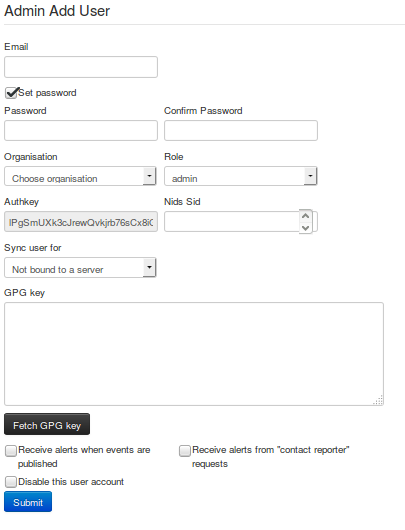

*   **Email:** The user's e-mail address, this will be used as his/her login name and as an address to send all automated e-mails as well as e-mails sent by contacting the user as the reporter of an event.
*   **Set password:** Tick the box if you want to define a temporary user-password for the user. If you don't, you should use the action button 'reset password' in the 'List Users' view to generate one and send it by email to the user.
*   **Password:** *This textbox is displayed only when 'Set password' is ticked.* A Temporary password for the user that he/she should change after the first login. Ensure that password pass the [MISP password policy](https://misp.gitbooks.io/misp-book/content/quick-start/#password-policy).
*   **Confirm Password:** *This textbox is displayed only when 'Set password' is ticked.* This should be an exact copy of the Password field.
*   **Organisation:** A drop-down list enables you to choose an organisation for the user. To learn more about organisation, [click here](#organisation).
*   **Roles:** A drop-down list allows you to select a role-group that the user should belong to. Roles define user privileges attributed to the user. To learn more about roles, [click here](#managing-the-roles).
*   **Authkey:** This is assigned automatically and is the unique authentication key of said user (he/she will be able to reset this and receive a new key). It is used for exports and for connecting one server to another, but it requires the user to be assigned to a role that has auth permission enabled.
*   **NIDS Sid:** ID of network intrusion detection systems.
*   **Sync user for:** Use this option for granting the user the right to synchronize the event between MISP server. This option is available for admin, Org Admin and Sync user role.
*   **Gpgkey:** The key used to encrypt e-mails sent through the system.
*   **Fetch GnuPG key:** Fetch GnuPG public key.
*   **Receive alerts when events are published:** This option will subscribe the new user to automatically generated e-mails whenever an event is published.
*   **Receive alerts from "contact reporter" requests:** This option will subscribe the new user to e-mails that are generated when another user tries to get in touch with an event's reporting organisation that matches that of the new user.
*   **Disable this user account:** Tick it if you want to disable this user account. (preferred to removing an account)

#### Listing all users

To list all current users of the system, just click on List Users under the administration menu to the left. A view will load containing a list of all users and the following columns of information:

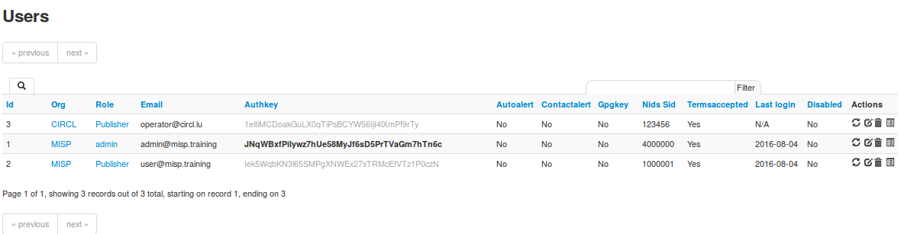

*   **Id:** The user's automatically assigned ID number.
*   **Org:** The organisation that the user belongs to.
*   **Email:** The e-mail address (and login name) of the user.
*   **Authkey:** Unique authentication key of the user.
*   **Autoalert:** Shows whether the user has subscribed to auto-alerts and is continuing to receive mass-emails regarding newly published events that he/she is eligible for.
*   **Contactalert:** Shows whether the user has the subscription to contact reporter e-mails directed at his/her organisation is turned on or off.
*   **Gpgkey:** Shows whether the user has entered a GnuPG key yet.
*   **Nids Sid:** Displays the currently assigned NIDS ID.
*   **Termsaccepted:** This flag indicates whether the user has accepted the terms of use or not.
*   **Last login:** Date of last login.
*   **Disabled:** Displays the user status. Enabled or disabled.
*   **Action Buttons:** There are 4 options available: reset the password, edit the user, delete the user or display a user's information. These options are also available on the left menu.
	*    **Reset Password:** Use this action to reset a password. If you've created a new user without A password, tick the 'First time registration' checkbox to send a welcome message. Otherwise a reset password message will be sent.
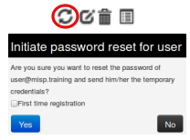
	*    **Edit the user:** Same options of create user's view. Only a few options are available here:
		*   **Terms accepted:** Indicates whether the user has accepted the terms of use already or not.
		*   **Change Password:** Setting this flag will require the user to change password after the next login.
		*   **Reset Auth Key:** Use this link for generate a new AuthKey.
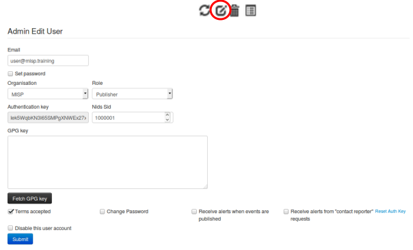
	*    **Delete the user:** If you want to delete a user. (Note: disabling is the preferred method)
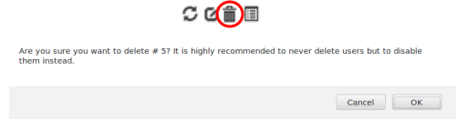
	*    **Display the user:** Display all user's information.<br />
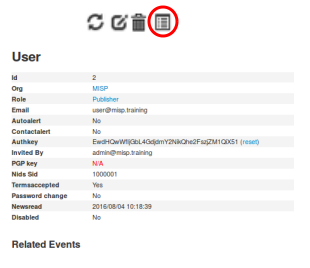

#### Contacting a user

Site admins can use the "Contact users" feature to send all or individual user an e-mail. Users that have a GnuPG key set will receive their e-mails encrypted. When clicking this button on the left, you'll be presented with a form that allows you to specify the type of the e-mail, who it should reach and what the content is using the following options:

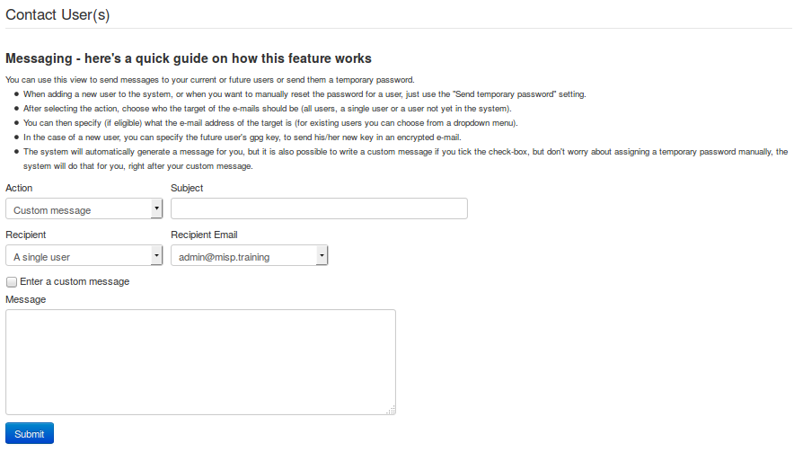

*   **Action:** This defines the e-mail type, which can be a custom message or a password reset. Password resets automatically include a new temporary password at the bottom of the message and will automatically change the user's password accordingly.
*   **Subject:** In the case of a custom e-mail, you can enter a subject line here.
*   **Recipient:** The recipient toggle lets you contact all your users, a single user (which creates a second drop-down list with all the e-mail addresses of the users) and potential future users (which opens up a text field for the e-mail address and a text area field for a GnuPG public key).
*   **Custom message checkbox:** This is available for password resets and for welcome messages. You can either write your own message (which will be appended with a temporary key and the signature), or let the system generate one automatically.

Keep in mind that all e-mails sent through this system, in addition to your own message, will be signed in the name of the instance's host organisation's support team, the e-mail will also include the e-mail address of the instance's support (if the contact field is set in the bootstrap file), and will include the instance's GnuPG signature for users that have a GnuPG key set (and thus are eligible for an encrypted e-mail).

:warning: GnuPG instance key is the GnuPG key used by the MISP instance and which is only used to sign notification. The GnuPG key used in the MISP instance must not be used anywhere else and should not be valuable.

- - -

### Organisations

Each users belongs to an organisation. As admin, you can manage these organisations.

#### Adding a new organisation

To add a new organisation, click on the "Add Organisation" button in the administration menu to the left and fill out the following fields in the view that is loaded:

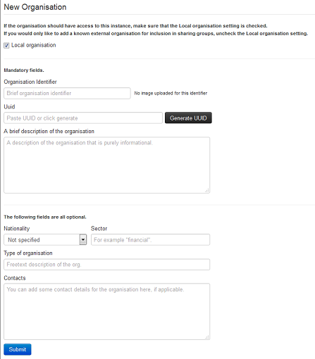

*   **Local organisation:** If the organisation should have access to this instance, tick the checkbox. If you would only like to add a known external organisation for inclusion in sharing groups, uncheck it.
*   **Organisation Identifier:** Name your organisation. If you want to add a picture, you should add a file on the webserver using the 'Server Settings menu'. Picture should have the same name. To learn more about server settings menu, [click here](#server-settings).
*   **Uuid:** Unique identifier. If you want to share organisation between MISP multi-instance, use the same Uuid.
*   **A brief description of the organisation:** A word for describing the organisation.
*   **Nationality:** A drop-down list for selecting the country of organisation.
*   **Sector:** Define the sector of organisation (financial, transport, telecom…)
*   **Type of organisation:** Define the type of the organisation.
*   **Contacts:** You can add some contact details for the organisation.

#### Listing all organisations

To list all current organisations of the system, just click on List Organisations under the administration menu to the left. There are 3 tabs in this view to filter local organisations, remote organisations or both. The default view displays local organisations. For all views the following columns of information are available:

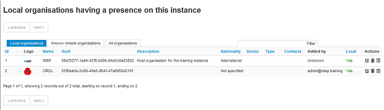

*   **Id:** The organisation's automatically assigned ID number.
*   **Logo:** Picture of the organisation.
*   **Name:** Name of the organisation.
*   **Uuid:** Unique identifier of organisation. Share this Uuid when using it between MISP's multi-instance.
*   **Description:** Description of the organisation.
*   **Nationality:** Country of the organisation.
*   **Sector:** Sector defined for the organisation.
*   **Type:** Type of organisation.
*   **Contacts:** Contacts of organisation.
*   **Added by:** Login of the user who added the organisation
*   **Local:** Flag defined if the organisation is local or remote.
*   **Users:** The amount of users on this instance belonging to the organisation.
*   **Actions:**  There are 3 options available: edit, delete or display an organisation's information. These options are also available on the left menu when you are on the display view.
	*    **Edit Organisation:** Same options of create organisation's view.
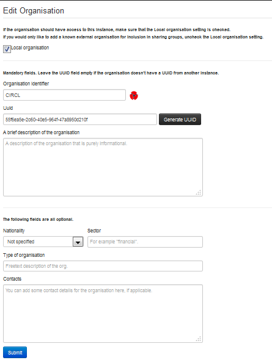
	*    **Delete Organisation:** Use this option for deleting organisation.<br />
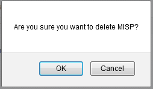
	*    **View Organisation:** Use this option to display information about the selected organisation. In this view, you can display the user belongs to this organisation and events published by organisation.
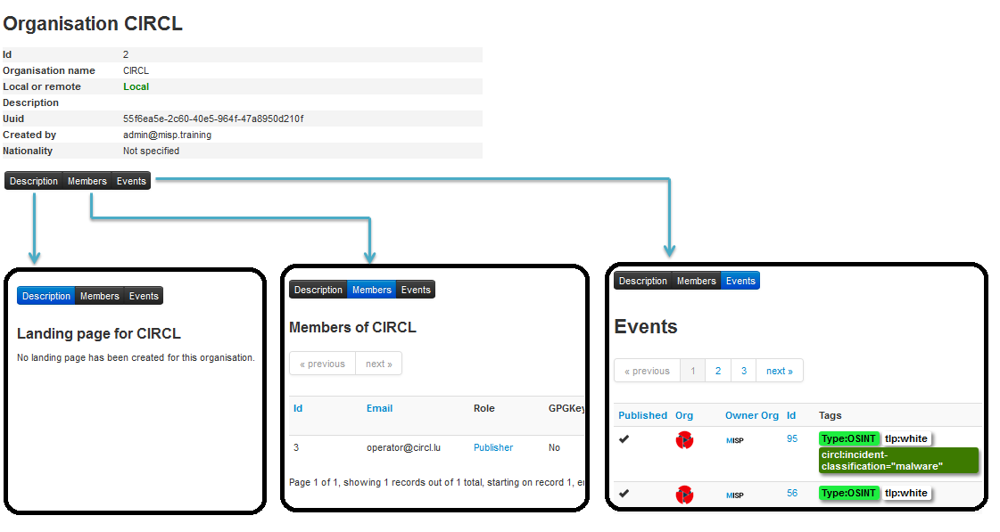

#### Merge organisations
Merge Organisation menu is available only in the organisation view, under the left menu. Merging one organisation into another will transfer all users and data from one organisation to a different one. The organisation of which the users and data will be transferred is displayed on the left, the target organisation is displayed on the right.

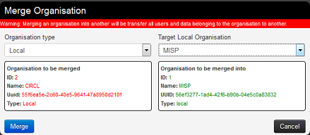

- - -

### Roles

Privileges are assigned to users by assigning them to rule groups. Rule groups use one of four options determining what they can do with events as well as four additional privilege elevation settings. These are the four options to edit the full options available in the Roles section: Read Only, Manage My Own Events, Manage Organisation Events, Manage & Publish Organisation Events. A short description is provided below:

*   **Read Only:** Allows a user to browse events that his organisation has access to, but doesn't allow any changes to be made to the database.
*   **Manage My Own Events:** Allows users to create, modify or delete their own events, but they cannot publish them.
*   **Manage Organization Events:** Allows users to create events or modify and delete events created by a member of their organisation.
*   **Manage & Publish Organisation Events:** Gives users the right to do all of the above and to publish the events of their organisation.

The extra permissions are defined below:

*   **Perm Admin:** Gives the user limited administrator privileges, this setting is used for an organisation's admins.
*   **Perm Audit:** Grants access to the logs. With the exception of site admins, only logs generated by the user's own org are visible.
*   **Perm Tagger:** Allows a user to assign tags to events.
*   **Perm Sharing Group:** Grant access to edit or create sharing groups.
*   **Perm Site Admin:** Gives the user full administrator privileges, this setting is used for site admins.
*   **Perm Auth:** This setting enables the authentication key of the role's users to be used for rest requests.
*   **Perm Tag Editor:** Grants access to edit or create tags.
*   **Perm Delegate:** Grant access to delegate the publication of an event to a third-party organization.
*   **Perm Sync:** This setting enables the users of the role to be used as a synchronisation user. The authentication key of this user can be handed out to the administrator of a remote MISP instance to allow the synchronisation features to work.
*   **Perm Regexp Access:** Allows users who have this permission enabled to edit the regular expression table. Be careful when giving out this permission, incorrect regular expressions can be very harmful (infinite loops, loss of data, etc.).
*   **Perm Template:** Grant access to create or modify templates.

#### Adding a new role

When creating a new role, you will have to enter a name for the role to be created and set up permissions (as described above) using the drop-down menu and related check-boxes.

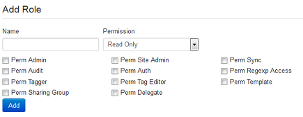

#### Listing roles

By clicking on the List Roles button, you can view a list of all currently registered roles and their enabled permissions. In addition, you can find buttons that allow you to edit and delete said roles. Keep in mind that you will need to first remove every member from a role before you can delete it.

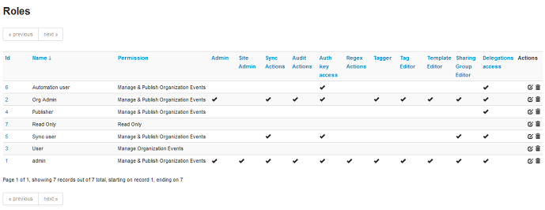

*   **Id:** The role's automatically assigned ID number.
*   **Name:** The name of role.
*   **Permission:** One of the 4 permissions: Read Only, Manage My Own Events, Manage Organization Events, Manage & Publish Organisation Events.
*   **Extra Permissions flag:** Flag for each extra permissions: Admin, Site Admin, Sync Actions, Audit Actions, Auth key access, Regex Actions, Tagger, Tag Editor, Template Editor, Sharing Group Editor, Delegations Access.
*   **Action Buttons:** There are 2 options available: Edit Role or Delete it.
	*    **Edit Role:** Same options of create role's view.<br />
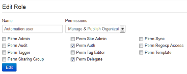
	*    **Delete Role:** Use this option to delete a role.<br />
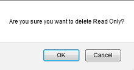

- - -

### Tools

MISP has a couple of administrative tools that help administrators keep their instance up to date and healthy. The list of these small tools can change rapidly with each new version, but they should be self-explanatory. Be sure to check this section after each upgrade to a new version, just in case there's a new upgrade script in there - though if this is the case it will be mentioned in the upgrade instructions.

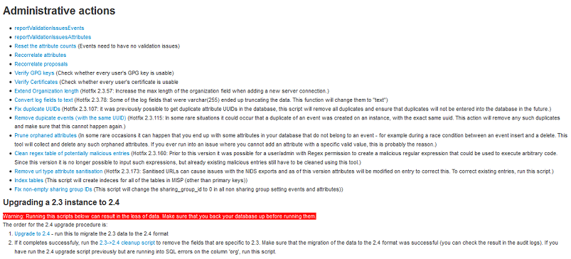

- - -

### Server Settings

Since version 2.3, MISP has a settings and diagnostics tool that allows site-admins to manage and diagnose their MISP installation. You can access this by navigating to Administration - Server settings.


### Server settings and diagnostics


The settings and diagnostics tool is split up into several aspects, all accessible via the tabs on top of the tool. For any unset or incorrectly set setting, or failed diagnostic a number next to the tab name will indicate the number and severity of the issues. If the number is written with a red font, it means that the issue is critical. First, let's look at the various tabs:
*   **Overview**: General overview of the current state of your MISP installation
*   **MISP settings**: Basic MISP settings. This includes the way MISP handles the default settings for distribution settings, whether background jobs are enabled, etc
*   **GnuPG settings**: GnuPG related settings.
*   **Proxy settings**: HTTP proxy related settings.
*   **Security settings**: Settings controlling brute-force protection and the application's salt key.
*   **Misc settings**: Settings controlling debug options, please ensure that debug is always disabled on a production system.
*   **Diagnostics**: The diagnostics tool checks if all directories that MISP uses to store data are writeable by the apache user. Also, the tool checks whether the STIX libraries and GnuPG are working as intended.
*   **Workers**: Shows the background workers (if enabled) and shows a warning if they are not running. Admins can also restart the workers here.
*   **Download report**: Download a report of all the settings visible in the tool, in JSON format.


Each of the setting pages is a table with each row representing a setting. Coloured rows indicate that the setting is incorrect / not set and the colour determines the severity (red = critical, yellow = recommended, green = optional). The columns are as follows:
*   **Priority**: The severity of the setting.
*   **Setting**: The setting name.
*   **Value**: The current value of the setting.
*   **Description**: A description of what the setting does.
*   **Error Message**: If the setting is incorrect / not set, this field will let the user know what is wrong.


The workers tab shows a list of the workers that MISP can use. You can restart workers using the "restart all workers" button. If the button doesn't work, make sure that the workers were started using the apache user. This can however only be done using the command line, refer to the INSTALL.txt documentation on how to let the workers automatically start on each boot.

*   **Worker Type**: The worker type is determined by the queue it monitors. MISP currently has 6 queues (cache, default, prio, email, update and a special _schdlr_ queue).
*   **Worker Id**: The ID is made up of the machine name, the PID of the worker and the queue it monitors.
*   **Status**: Displays OK if the worker is running. If the _schdlr_ worker is the only one not running, make sure that you copy the config file into the cakeresque directory as described in the INSTALL.txt documentation.

#### Worker types

**cache** 

  Role:
  Interdependence:


**default** 

  Role:
  Interdependence:


**email** 

  Role:
  Interdependence:


**update** 

  Role:
  Interdependence:


**prio** 

  Role:
  Interdependence:


**scheduler** 

  Role:
  Interdependence:


#### Workers dead

Even if the workers are dead, any actions related to them are on-hold. Nothing is lost.
Simply restarting the worker will resume any operations.

You can either relaunch them via the UI or manually by running **sudo -u www-data bash /var/www/MISP/app/Console/worker/start.sh
** on the CLI.
For reference, below is the script in question.



### Import Blacklist

It is possible to ban certain values from ever being entered into the system via an event info field or an attribute value. This is done by blacklisting the value in this section.

#### Adding and modifying entries

Administrators can add, edit or delete blacklisted items by using the appropriate functions in the list's action menu and the menu on the left.

### Import Regexp

The system allows administrators to set up rules for regular expressions that will automatically alter newly entered or imported events (from GFI Sandbox).

#### The purpose of Import Regexp entries

They can be used for several things, such as unifying the capitalisation of file paths for more accurate event correlation or to automatically censor the usernames and use system path variable names (changing C:\Users\UserName\Appdata\Roaming\file.exe to %APPDATA%\file.exe).
The second use is blocking, if a regular expression is entered with a blank replacement, any event info or attribute value containing the expression will not be added. Please make sure the entered regexp expression follows the preg_replace pattern rules as described [here](http://php.net/manual/en/function.preg-replace.php)

#### Adding and modifying entries

Administrators can add, edit or delete regular expression rules, these "expressions" are made up of a regex pattern that the system searches for and a replacement for the detected pattern.


### Managing the Signature whitelist

The signature whitelist view, accessible through the administration menu on the left, allows administrators to create and maintain a list of addresses that are whitelisted from ever being added to the NIDS signatures. Addresses listed here will be commented out when exporting the NIDS list.

#### Whitelisting an address

While in the whitelist view, click on New Whitelist on the left to bring up the "add whitelist" view to add a new address.

#### Managing the list

When viewing the list of whitelisted addresses, the following data is shown: The ID of the whitelist entry (assigned automatically when a new address is added), the address itself that is being whitelisted and a set of controls allowing you to delete the entry or edit the address.


### Using MISP logs

Users with audit permissions are able to browse or search logs that MISP automatically appends each time certain actions are taken (actions that modify data or if a user logs in and out).
Generally, the following actions are logged:

*   **User:** Creation, deletion, modification, Login / Logout
*   **Event:**Creation, deletion, modification, publishing
*   **Attribute:** Creation, deletion, modification
*   **ShadowAttribute:** Creation, deletion, Accept, Discard
*   **Roles:** Creation, deletion, modification
*   **Blacklist:** Creation, deletion, modification
*   **Whitelist:** Creation, deletion, modification
*   **Regexp:** Creation, deletion, modification


#### Browsing logs

Listing all the log entries will display the following columns generated by the users of your organisation (or all organisations in the case of site admins):


*   **Id:** The automatically assigned ID number of the entry.
*   **Email:** The e-mail address of the user whose actions triggered the entry.
*   **Org:** The organisation of the above mentioned user.
*   **Created:** The date and time when the entry originated.
*   **Action:** The action's type. This can include: login/logout for users, add, edit, delete for events, attributes, users and servers.
*   **Title:** The title of an event always includes the target type (Event, User, Attribute, Server), the target's ID and the target's name (for example: e-mail address for users, event description for events).
*   **Change:** This field is only populated for entries with "add" or "edit" actions. The changes are detailed in the following format:
   __variable (initial_value)_ => _(new_value)_,…
   When the entry is about the creation of a new item (such as adding a new event) then the change will look like this for example:
   _org()_ => _(ADMIN)_, _date()_ => _(20012-10-19)_,…


#### Searching Logs

Another way to browse the logs is to search it by filtering the results according to the following fields (the search is a sub-string search, the sub-string has to be an exact match for the entry in the field that is being searched for):

*   **Email:** By searching by Email, it is possible to view the log entries of a single user.
*   **Org:** Searching for an organisation allows you to see all actions taken by any member of the organisation.
*   **Action:** With the help of this drop down menu, you can search for various types of actions taken (such as logins, deletions, etc).
*   **Title:** There are several ways in which to use this field, since the title fields contain several bits of information and the search searches for any substrings contained within the field, it is possible to just search for the ID number of a logged event, the username / server's name / event's name / attributes name of the event target.
*   **Change:** With the help of this field, you can search for various specific changes or changes to certain variables (Ex.: using  "Published" as the search term for and find all log entries where an event has been "Published", ip-src will find all attributes where a source IP address has been entered / edited, etc).


### Background Processing

If enabled, MISP can delegate a lot of the time intensive tasks to the background workers. These will then be executed in sequence, allowing the users of the instance to keep using the system without a hiccup and without having to wait for the process to finish. It also allows for certain tasks to be scheduled and automated.

#### Command Line Tools for the Background Workers

The background workers are powered by [CakeResque](https://github.com/kamisama/Cake-Resque), so all of the CakeResque commands work.
To start all of the workers needed by MISP go to your `/var/www/MISP/app/Console/worker` (assuming a standard installation path) and execute `start.sh`.
To interact with the workers, here is a list of useful commands. Go to your `/var/www/MISP/app/Console` (assuming a standard installation path) and execute one of the following commands as a parameter to `./cake CakeResque` (for example: `./cake CakeResque tail`):

*   **start**:           Start a new worker.
*   **startscheduler**:  Start a new scheduler worker.
*   **stop**:            Stop a worker.
*   **pause**:           Pause a worker.
*   **resume**:          Resume a paused worker.
*   **cleanup**:         Terminate the job that a worker is working on with immediate effect. You will be presented with a choice of workers to choose from when executing this command.
*   **restart**:         Stop all Resque workers, and start a new one.
*   **clear**:           Clear all jobs inside a queue
*   **reset**:           Reset CakeResque internal worker's saved status
*   **stats**:           Display some statistics about your workers including the count of successful and failed jobs.
*   **tail**:            Tail the various (workers) log files that CakeResque creates, just choose the one from the list that you are interested in.
*   **track**:           Track a job status.
*   **load**:            Load a set of predefined workers.

The other commands should not be required, instead of starting / stopping or restarting workers use the supplied start.sh (it stops all workers and starts them all up again). For further instructions on how to use the console commands for the workers, visit the [CakeResque list of commands](http://cakeresque.kamisama.me/commands#cleanup).

#### Monitoring the Background Processes

The "Jobs" menu item within the Administration menu allows site admins to get an overview of all of the current and past scheduled jobs. Admins can see the status of each job, and what the queued job is trying to do. If a job fails, it will try to set an error message here too. The following columns are shown in the jobs table:

*   **Id**: The job's ID (this is the ID of the job's metadata stored in the default datastore, not to be confused with the process ID stored in the redis database and used by the workers)
*   **Process**: The process's ID.
*   **Worker**: The name of the worker queue. There are 3+1 workers running if background jobs are enabled: default, cache, email, and a special Scheduler (this should never show up in the jobs table).
*   **Job Type**: The name of the queued job.
*   **Input**: Shows a basic input handled by the job - such as "Event:50" for a publish email alert job for event 50.
*   **Message**: This will show what the job is currently doing or alternatively an error message describing why a job failed.
*   **Org**: The string identifier of the organisation that has scheduled the job.
*   **Status**: The status reported by the worker.
*   **Retries**: Currently unused, it is planned to introduced automatic delayed retries for the background processing and thus add resilience.
*   **Progress**: A progress bar showing how the job is coming along.

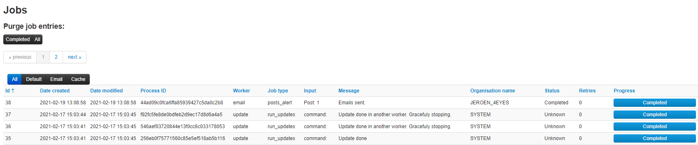

#### Scheduling Jobs and Recurring Jobs

Apart from off-loading long-lasting jobs to the background workers, there is a second major benefit of enabling the background workers: Site-administrators can schedule recurring tasks for the jobs that generally take the longest to execute. At the moment this includes pushing / pulling other instances and generating a full export cache for every organisation and export type. MISP comes with these 3 tasks pre-defined, but further tasks are planned. The following fields make up the scheduled tasks table:

*   **Id**: The ID of the task.
*   **Type**: The type of the task.
*   **Frequency (h)**: This number sets how often the job should be executed in hours. Setting this to 168 and picking the next execution on Sunday at 01:00 would execute the task every Sunday at 1 AM. Setting this value to 0 will make the task only run once on the scheduled date / time without rescheduling it afterwards.
*   **Scheduled Time**: The time (in 24h format) when the task should be executed the next time it runs (and all consecutive times if a multiple of 24 is chosen for frequency).
*   **Next Run**: The date on which the task should be executed.
*   **Description**: A brief description of the task.
*   **Message**: This field shows when the job was queued by the scheduler for execution.


### Various administration tips & tricks


#### Setting a Publish Alert Filter

To regulate the reception of e-mail from MISP it is possible to create filters. Each individual user account can apply such filter.

The filter can be configured by the user but also by the organization administrator.

After login goto Administration -> Set User Setting:

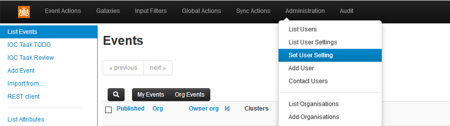

A new screen appears. Make sure the “Setting” drop down box shows “publish_alert_filter”:

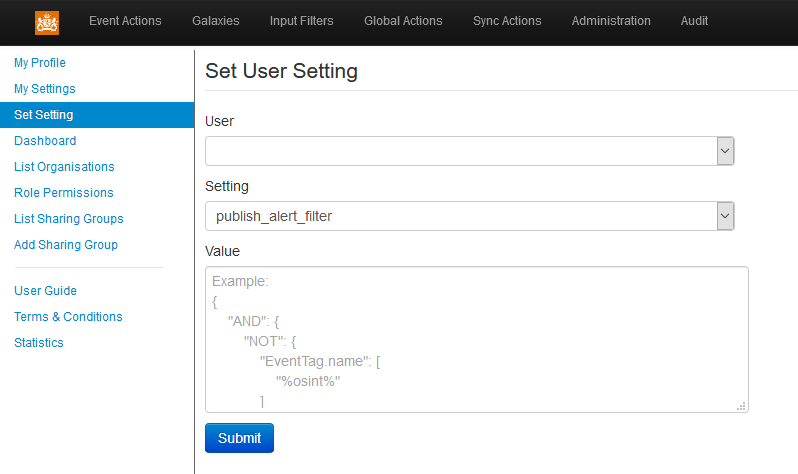

The text field “Value” contains the filter, which needs to be provided in JSON format. Important JSON-objects which can be used here go by the name AND”, “OR” and “NOT”. These should be structured in a logical tree.

The filtering can be applied to tags, the publishing organization and the threat level. Valid filters:

- AttributeTag.name
- EventTag.name
- Tag.name (checks against both event and attribute tags)
- Orgc.uuid (creator org uuid)
- Orgc.name (creator org name)
- ThreatLevel.name


In the following example, all notifications will be filtered which carry ‘tlp.white’ and ‘tlp.green’ in the name of the tag:

```
{

    "NOT": {

        "Tag.name" : [ "tlp.white", "tlp.green" ]

    }

}
```

The publish_alert_filter setting allows one filter definition to be active.

After applying the configuration, the filter will show up in the “My Settings” menu:

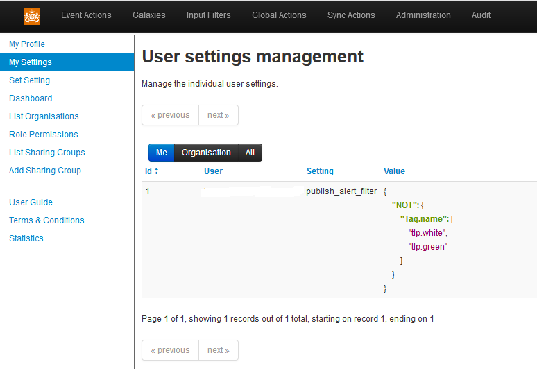


#### Default sharing level

Choose your default sharing level to match your usage scenario for MISP. The setting is named *default_event_distribution* and the values can be:

*   Your organisation only (default)
*   This community only
*   Connected communities
*   All communities

You can also set a default distribution level for attributes contained in an event with *default_attribute_distribution*, and it has the same values as the default sharing level for events plus an additional one that allows attributes to inherit the sharing level of the event.

#### Adding organisation logos

You can add a logo for your organisations in MISP by uploading them via the tab **Manage files** under the **Administration** menu & **Server Settings** sub-menu.
The filename must be exactly the same as the organisation name that you will use in MISP.
It is recommended to use PNG files of 48x48 pixels.

#### The \_schdlr\_ worker is not starting

If you already made sure that you copied the config file under the cakeresque directory, it might be due to the FQDN of the server hosting the instance has changed. A way to fix this is to flush temporary data stored in redis. This can be done by logging in redis, for example when logging in with redis-cli, and issuing a flushall command.

#### How to redirect HTTP to HTTPS

Here is a sample configuration for Apache webserver.
```
<VirtualHost *:80>
        ServerAdmin misp@misp.misp
        ServerName misp.misp.misp
        ServerAlias misp-int.misp.misp

        Redirect permanent / https://misp.misp.misp

        LogLevel warn
        ErrorLog /var/log/apache2/misp.local_error.log
        CustomLog /var/log/apache2/misp.local_access.log combined
        ServerSignature Off
</VirtualHost>

<VirtualHost *:443>
        ServerAdmin misp@misp.misp
        ServerName misp.misp.misp
        ServerAlias misp-int.misp.misp

        DocumentRoot /var/www/MISP/app/webroot
        <Directory /var/www/MISP/app/webroot>
                Options -Indexes
                AllowOverride all
                Order allow,deny
                allow from all
        </Directory>

        SSLEngine On
        SSLCertificateFile /etc/ssl/misp.misp.misp/misp.crt
        SSLCertificateKeyFile /etc/ssl/misp.misp.misp/misp.key
        SSLCertificateChainFile /etc/ssl/misp.misp.misp/mispCA.crt

        LogLevel warn
        ErrorLog /var/log/apache2/misp.local_error.log
        CustomLog /var/log/apache2/misp.local_access.log combined
        ServerSignature Off
</VirtualHost>
 ```
   Taken from [Koen Van Impe's blog](http://www.vanimpe.eu/2015/05/31/getting-started-misp-malware-information-sharing-platform-threat-sharing-part-3/)

#### Increase max size of Samples / other files

Trying to upload a large samples (>50M) might cause the following error:
```[!] 500 Server Error: Internal Server Error```

Or will give you an error page in browser.

The error logs on the system will display the following:

```
PHP Warning:  POST Content-Length of 57526024 bytes exceeds the limit of 8388608 bytes in Unknown on line 0, referer: https://XYZ/attributes/add_attachment/1948
```

And / Or

```
PHP Fatal error:  Allowed memory size of 134217728 bytes exhausted (tried to allocate 76705009 bytes) in /var/www/MISP/app/Lib/cakephp/lib/Cake/Network/CakeRequest.php on line 996
```

To fix that you need to adjust the php settings:
```
vi /etc/php5/apache2/php.ini
```

Increase to the following values (or more if you want to)
```
; Maximum size of POST data that PHP will accept.
; Its value may be 0 to disable the limit. It is ignored if POST data reading
; is disabled through enable_post_data_reading.
; http://php.net/post-max-size
post_max_size = 256M
[…]
; Maximum amount of memory a script may consume (128MB)
; http://php.net/memory-limit
memory_limit = 1024M
```

And then restart apache2

```
service apache2 restart
```

#### Support & feature requests

The preferred method for support & feature requests is to use the [GitHub ticketing system](https://github.com/MISP/MISP/issues).

If you want to discuss something related to MISP, want some help from the community, etc… You have
the [MISP Users mailing list](https://groups.google.com/forum/#!forum/misp-users) and the [MISP developers mailing list](https://groups.google.com/forum/#!forum/misp-devel).

A number of companies offer custom development, consulting, and support around MISP, please check [the support page of the MISP Project website](http://www.misp-project.org/#support).

#### More information in the notification emails about new events

The setting MISP.extended_alert_subject allows you to have an extended subject. One word of warning though. If you’re using encryption : the subject will not be encrypted. Be aware that you might leak some sensitive information this way. Below is an example how the two subject types look like. First with the option disabled, then with the option enabled.
```
Event 7 - Low - TLP Amber
Event 8 - OSINT - Dissecting  XXX… - Low - TLP Amber
```

   Taken from [Koen Van Impe's blog](http://www.vanimpe.eu/2015/05/31/getting-started-misp-malware-information-sharing-platform-threat-sharing-part-3/)

#### Get top API users

Enable the _log_auth_ setting in the server settings. Optionally enable _log_client_ip_ if you want to get stats per client ip.
Log into your mysql server and run the following query:
```
select ip,email,count(id) as c from logs WHERE ip IS NOT NULL group by ip,email order by c desc limit 10;
```

This will give you a top 10 table per ip and username:
```
+----------------+----------------------------------+------+
| ip             | email                            | c    |
+----------------+----------------------------------+------+
| 1.2.3.4        | bob@nsa.gov                      | 4124 |
| 5.6.7.8        | vladimir@kremlin.ru              | 1932 |
| 9.10.11.12     | fred@somewhere.eu                | 1317 |
| 13.14.15.16    | SYSTEM                           |   16 |
+----------------+----------------------------------+------+
```

#### MISP Logs

By default, MISP has several layers of logs that can be used to trouble-shoot and monitor the system. Let's walk through each of the available logs:

*   **Apache access logs**: Rotating logs generated by apache, logging each request, by default (on Ubuntu) they are found in /var/log/apache2/misp.local\_access.log. The location can be changed via the apache conf file
*   **Apache error logs**: Rotating logs generated by apache, logging error messages, by default (on Ubuntu) they are found in /var/log/apache2/misp.local\_error.log. This error log file will generally not be used by MISP, however, if there is a PHP level error that prevents MISP from functionining you might have relevant entries here.
*   **MISP error log**: Generated by MISP, logging any exceptions that occur during usage. These can be found in /var/www/MISP/app/tmp/logs/error.log (assuming default installation path). If you see errors in here and are stuck with an issue [let us know via GitHub](https://github.com/MISP/MISP/issues/)!
*   **MISP debug log**: Generated by MISP, any debug messages and Notice level messages will be sent to this file. Generally less interesting, but can be helpful during debugging sessions. It should not be necessary to monitor this under normal usage. The file can be found in /var/www/MISP/app/tmp/logs/debug.log (assuming default installation path).
*   **MISP worker error log**: Generated by MISP background workers, logging any exceptions generated during a background job. It is the equivalent of the MISP error log for background jobs, so if scheduled tasks, synchronisation or e-mailing with the workers enabled are causing issues, this is the place to check. It can normally be found at /var/www/MISP/app/tmp/logs/resque-worker-error.log
*   **MISP worker logs**: Rotating logs generated by MISP background workers, logging any jobs executed by workers. This is part of the normal operation of background workers and doesn't have to be monitored, though it can help when debugging issues. Normally found at /var/www/MISP/app/tmp/logs/resque-[current date].log
*   **MISP scheduler error log**: Generated by MISP scheduler worker, logging any exceptions generated during the scheduling of a background job. It is the equivalent of the MISP error log for scheduled jobs. It can normally be found at /var/www/MISP/app/tmp/logs/resque-scheduler-error.log
*   **MISP scheduler logs**: Rotating logs generated by MISP scheduler worker, logging any schedulings of jobs to be executed by workers. This is part of the normal operation of the scheduler worker and doesn't have to be monitored, though it can help when debugging issues. Normally found at /var/www/MISP/app/tmp/logs/resque-scheduler-[current date].log

#### Logging of failed authentication attempts

By default, MISP logs all failed login and authentication attempts in the built in Audit logs. To view any such failed attempts, simply log in as a site admin and navigate to Audit - List logs.

There are two types of entries that will be interesting if you are looking for failed authentication attempts, entries of action "auth\_fail" (for failed attempts to authenticate via the API key or the external authentication system) and login\_fail (for failed login attempts via the login page).

You can also search for any such entries using the Search Logs feature, simply choose the desired action from the two listed above and hit search.

What is logged:

```
+----------------+------------+---------------------------+----------+
| Auth method    | Action     | Failed credentials logged | IP       |
+----------------+------------+---------------------------+----------+
| Webform        | login_fail | None                      | Optional |
| API            | auth_fail  | API key                   | Optional |
| Webform        | auth_fail  | External auth key         | Optional |
+----------------+------------+---------------------------+----------+
```

In order to enable IP logging for any logged request in MISP, navigate to Administration - Server settings - MISP settings and enable the MISP.log\_client\_ip setting.

It is also possible to enable full logging of API and external authentication requests using the MISP.log\_auth setting in the same location, but keep in mind that this is highly verbose and will log every request made. In addition to the information above, all accessed resource URLs are also logged.

#### Clearing expired sessions

By default the garbage collection of sessions is disabled in PHP. It is possible to enable it, but it's not recommended and as such MISP provides a manual way of clearing the sessions.

Navigate to the diagnostics screen of MISP (Administration - Server settings - Diagnostics) and near the bottom of the page there will be a counter showing the count of currently stored expired sessions. Simply purge them by clicking the applicable button when the number grows too large.

#### Troubleshooting MISP not connecting to redis but redis-cli working

If you have an IPv6 enabled OS, but an older redis version that does not support IPv6 (<v2.8), MISP might fail to connect to the redis server while redis-cli is working.
The reason is that redis-cli is connecting to 127.0.0.1 directly, while the calls inside the CakeResque library used by MISP are done using "*localhost*" which resolves both to the IPv4 and IPv6 loopback addresses. For some reasons, the use of the IPv6 address is attempted first which fails.


You can confirm this by trying to connect to redis using **telnet localhost 6379**. If it fails, the error message should mention the IPv6 loopback address (::1).


Two ways to fix it:

1) Upgrade your redis to a server that supports IPv6 (v2.8+). This is the preferred recommendation.

2) Comment the localhost mapping to IPv6 address in /etc/hosts


#### Errors about fields or tables

If you have errors with fields or tables that you can see in the error.log or in the page (if you enabled _debug_ or _site_admin_debug_ settings), an easy fix to make most of them go away is to use the **clean cache** feature on the _server settings_ menu, _diagnostics_ tab.
An example of error message:
```
Error: [PDOException] SQLSTATE[42S22]: Column not found: 1054 Unknown column 'Task.job_id' in 'field list'
```

### Jobs

The Jobs tab gives you an overview on any currently running jobs or jobs that were previously completed and their status.


Typically this is one of the places you would turn to even some background process might not complete as expected to get an indication on any issues related to user initiated Jobs.

For ease of use, you can filter the Jobs by 'All', 'Default', 'Email', 'Cache'
##### TODO: Explain differences Default, Email, Cache

You can also purge the entries, either only by completed status or purge all.
This is not automated and needs to be done manually.

### Scheduled Tasks

Straight from the UI:

"""
Here you can schedule pre-defined tasks that will be executed every x hours. You can alter the date and time of the next scheduled execution and the frequency at which it will be repeated (expressed in hours). If you set the frequency to 0 then the task will not be repeated. To change and of the above mentioned settings just click on the appropriate field and hit update all when you are done editing the scheduled tasks.

Warning: Scheduled tasks come with a lot of caveats and little in regards of customisations / granularity. You can instead simply create cron jobs out of the console commands as described here: Automating certain console tasks
"""

The task scheduler is a sub-par component to enable minimal functionality in terms of automating certain MISP tasks.
If you have a dedicated and concious MISP Site Admin she can keep an eye on the Scheduler to make sure everything runs smoothly.

For better performance please use a real scheduler like your systems' crontab.
As a rule of thumb: If you can click on it, MISP can automate it.

### MISP Backup

Currently there exists this backup script simply called [misp-backup.sh](https://github.com/MISP/MISP/tree/2.4/tools/misp-backup)

All you need is to copy the the sample config and make sure it is correct. Then launch the script.

```bash
cd /var/www/MISP/tools/misp-backup
sudo -u www-data cp misp-backup.conf.sample misp-backup.conf
sudo ./misp-backup.sh
```

Script output:
```bash
/var/www/MISP/tools/misp-backup   2.4 ● $ sudo ./misp-backup.sh
File ./misp-backup.conf exists.
copy of org images and other custom images
MySQL Dump
/var/www/MISP/tools/misp-backup
MISP Backup Completed, OutputDir: /opt/backup
FileName: MISP-Backup-20181128_163215.tar.gz
FullName: /opt/backup/MISP-Backup-20181128_163214.tar.gz
```
### MISP Restore

In a similar fashion you can restore your MISP instance with the **misp-restore.sh** script.
Read the script for details.
### Command line interface (CLI) commands

The below info is also available in the MISP GUI. Go to event actions -> automation -> bottom of the page

#### Administering MISP via the CLI
##### Get Setting
    MISP/app/Console/cake Admin getSetting [setting]
##### Set Setting
    MISP/app/Console/cake Admin setSetting [setting] [value]
##### Get Authkey
    MISP/app/Console/cake Admin getAuthkey [email]
##### Reset Authkey
    MISP/app/Console/cake Authkey [email] [api_key | optional]
##### Set Baseurl
    MISP/app/Console/cake Baseurl [baseurl]
##### Change Password
    MISP/app/Console/cake Password [email] [new_password] [--override_password_change]
##### Clear Bruteforce Entries
    MISP/app/Console/cake Admin clearBruteforce [user_email]
##### Run Database Update
    MISP/app/Console/cake Admin updateDatabase
##### Update All JSON Structures
    MISP/app/Console/cake Admin updateJSON
##### Update Galaxy Definitions
    MISP/app/Console/cake Admin updateGalaxies
##### Update Taxonomy Definitions
    MISP/app/Console/cake Admin updateTaxonomies
##### Update Object Templates
    MISP/app/Console/cake Admin updateObjectTemplates
##### Update Warninglists
    MISP/app/Console/cake Admin updateWarningLists
##### Update Noticelists
    MISP/app/Console/cake Admin updateNoticeLists
##### Update MISP
    MISP/app/Console/cake Admin updateMISP
##### Set Default Role
    MISP/app/Console/cake Admin setDefaultRole [role_id]
##### Get IPs For User ID
    MISP/app/Console/cake Admin UserIP [user_id]
##### Get User ID For User IP
    MISP/app/Console/cake Admin IPUser [ip]
#### Automating certain console tasks
If you would like to automate tasks such as caching feeds or pulling from server instances, you can do it using the following command line tools. Simply execute the given commands via the command line / create cron jobs easily out of them.
##### PullAll
    MISP/app/Console/cake Server pullAll [user_id] [full|update]
##### Pull
    MISP/app/Console/cake Server pull [user_id] [server_id] [full|update]
##### Push
    MISP/app/Console/cake Server push [user_id] [server_id]
##### Cache Feeds For Quick Lookups
    MISP/app/Console/cake Server cacheFeed [user_id] [feed_id|all|csv|text|misp]
##### Fetch Feeds As Local Data
    MISP/app/Console/cake Server fetchFeed [user_id] [feed_id|all|csv|text|misp]
##### Run Enrichment
    MISP/app/Console/cake Event enrichment [user_id] [event_id] [json_encoded_module_list]
##### Test Server
    MISP/app/Console/cake Server test [server_id]
##### List Servers
    MISP/app/Console/cake Server listServers
#### Managing the background workers
The background workers can be managed via the CLI in addition to the UI / API management tools.
##### Get List Of Workers
    MISP/app/Console/cake Admin getWorkers [all|dead]
##### Start A Worker
    MISP/app/Console/cake Admin startWorker [queue_name]
##### Restart A Worker
    MISP/app/Console/cake Admin restartWorker [worker_pid]
##### Restart All Workers
    MISP/app/Console/cake Admin restartWorkers
##### Kill A Worker
    MISP/app/Console/cake Admin killWorker [worker_pid]

