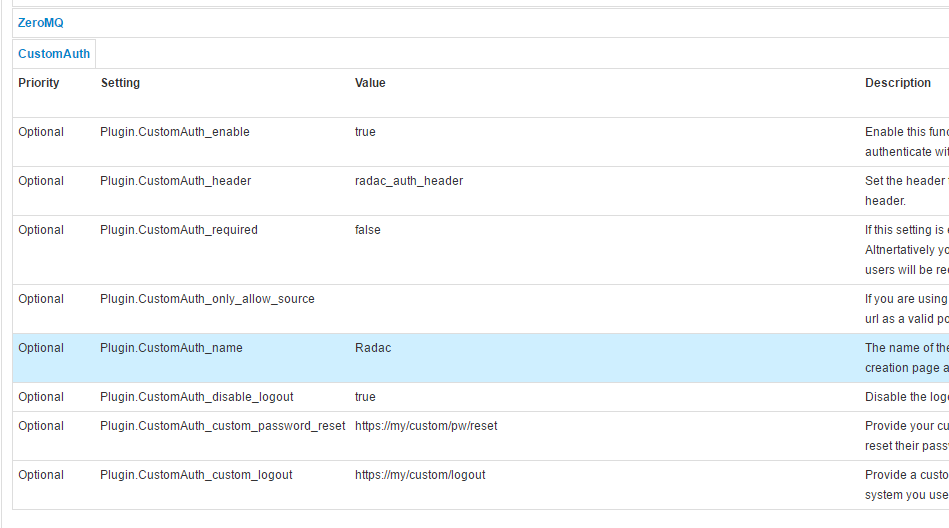
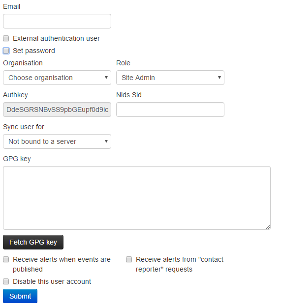

# Summary

<!-- toc -->

# Appendix A: External Authentication

#### The external authentication mechanism described

The external authentication allows a user or an external tool to authenticate with MISP using an arbitrary value passed along in a custom header. This authentication method overrides the regular authentication mechanisms and is customisable by a site-admin. 

It is possible to create a mixed mode MISP setup where certain users can go through the normal authentication mechanism and other users are required to use the external authentication method.

#### Setting up the external authentication mechanism

To change the authentication settings, navigate to Administration - Server settings - Plugin settings

The settings associated with the external authentication can be found by pressing the CustomAuth button as depicted below:



To change a setting simply double click on the value to edit the field. Use the guidance provided by the setting tool to configure the external authentication. The accessible settings are as follows:

*   **enable**: Enable or disable external authentication (off by default)

*   **header**: The header which MISP will use to identify users

*   **required**: Enabling this setting will force all users to use the external authentication. Leave this disabled allows administrators to assign external authentication or regular authentication users.

*   **only_allow_source**: Setting a url / IP address here will only allow requests that originated from the given address

*   **name**: The name to be used for the authentication mechanism. This is reflected in the user creation / edit views, the logs and the error messages on failed logins.

*   **disable_logout**: Disable the default logout button. Using an external authentication mechanism that authenticates via the header with each requests makes the logout button obsolete. 

*   **custom_password_reset**: If your authentication system has a url that a user can access to reset his/her password, please specify the full url for it here. This will then be reused in the UI.

*   **custom_password_logout**: If your authentication system has a url that a user can access to logout, please specify the full url for it here. This will then be reused in the UI.

#### User management

Using a new setting, user self management can be disabled for all users that are not administrators via the MISP.disableUserSelfManagement setting, found in the MISP settings tab. Enabling this setting removes the ability of users to change their user settings and reset their authentication keys. All other functionality remains unchanged.



To create an external authenticated user, simply tick the External authentication user checkbox, after which an external auth key field will appear. This will be used to identify the users via the passed along header. 

#### Logging

For a description of the logging facilities provided by this plugin, please refer to the "Logging of failed authentication attempts" section of the Administration section.

# Appendix B: ACL descriptors

#### Querying the ACL system

MISP allows site admins to query the ACL system for various types of data. This can be interesting when tuning for example WAF access to MISP. All applicable queries can be requested via /servers/queryACL

#### Getting a list of URLs accessible to a role

~~~~
https://<misp url>/servers/queryACL/printRoleAccess/<role id>
~~~~

The above URL will return a JSON with all accessible URLs for the given role ID. If no Role ID is provided, a JSON containing all roles and their access lists will be returned. 

Example:

~~~~json
{
  "2": {
    "name": "User",
    "urls": [
      "/attributes/add/*",
      "/attributes/add_attachment/*",
      "/attributes/add_threatconnect/*",
      "/attributes/attributeReplace/*",
      "/attributes/delete/*",
      "/attributes/deleteSelected/*",
      "/attributes/download/*",
      "/attributes/downloadAttachment/*",
      "/attributes/downloadSample/*",
      "/attributes/edit/*",
      "/attributes/editField/*",
      "/attributes/editSelected/*",
      "/attributes/fetchEditForm/*",
      "/attributes/fetchViewValue/*",
      "/attributes/hoverEnrichment/*",
      "/attributes/index/*",
      "/attributes/restSearch/*",
      "/attributes/returnAttributes/*",
      "/attributes/rpz/*",
      "/attributes/search/*",
      "/attributes/searchAlternate/*",
      "/attributes/text/*",
      "/attributes/updateAttributeValues/*",
      "/attributes/view/*",
      "/eventDelegations/acceptDelegation/*",
      "/eventDelegations/delegateEvent/*",
      "/eventDelegations/deleteDelegation/*",
      "/eventDelegations/view/*",
      "/events/add/*",
      "/events/addIOC/*",
      "/events/addTag/*",
      "/events/add_misp_export/*",
      "/events/contact/*",
      "/events/csv/*",
      "/events/delegation_index/*",
      "/events/delete/*",
      "/events/downloadExport/*",
      "/events/downloadOpenIOCEvent/*",
      "/events/downloadSearchResult/*",
      "/events/edit/*",
      "/events/export/*",
      "/events/exportChoice/*",
      "/events/filterEventIndex/*",
      "/events/freeTextImport/*",
      "/events/hids/*",
      "/events/index/*",
      "/events/nids/*",
      "/events/proposalEventIndex/*",
      "/events/queryEnrichment/*",
      "/events/removePivot/*",
      "/events/removeTag/*",
      "/events/restSearch/*",
      "/events/saveFreeText/*",
      "/events/stix/*",
      "/events/updateGraph/*",
      "/events/view/*",
      "/events/viewEventAttributes/*",
      "/events/viewGraph/*",
      "/events/xml/*",
      "/jobs/cache/*",
      "/jobs/getGenerateCorrelationProgress/*",
      "/jobs/getProgress/*",
      "/logs/event_index/*",
      "/logs/maxDateActivity/*",
      "/logs/returnDates/*",
      "/organisations/fetchOrgsForSG/*",
      "/organisations/fetchSGOrgRow/*",
      "/organisations/index/*",
      "/organisations/landingpage/*",
      "/organisations/view/*",
      "/pages/display/*",
      "/posts/add/*",
      "/posts/delete/*",
      "/posts/edit/*",
      "/regexp/index/*",
      "/roles/index/*",
      "/roles/view/*",
      "/servers/fetchServersForSG/*",
      "/shadowAttributes/accept/*",
      "/shadowAttributes/acceptSelected/*",
      "/shadowAttributes/add/*",
      "/shadowAttributes/add_attachment/*",
      "/shadowAttributes/delete/*",
      "/shadowAttributes/discard/*",
      "/shadowAttributes/discardSelected/*",
      "/shadowAttributes/download/*",
      "/shadowAttributes/edit/*",
      "/shadowAttributes/editField/*",
      "/shadowAttributes/fetchEditForm/*",
      "/shadowAttributes/index/*",
      "/shadowAttributes/view/*",
      "/sharingGroups/index/*",
      "/sharingGroups/view/*",
      "/sightings/add/*",
      "/sightings/delete/*",
      "/tags/add/*",
      "/tags/delete/*",
      "/tags/edit/*",
      "/tags/index/*",
      "/tags/quickAdd/*",
      "/tags/selectTag/*",
      "/tags/selectTaxonomy/*",
      "/tags/showEventTag/*",
      "/tags/view/*",
      "/tags/viewTag/*",
      "/taxonomies/index/*",
      "/taxonomies/taxonomyMassConfirmation/*",
      "/taxonomies/view/*",
      "/templateElements/index/*",
      "/templates/deleteTemporaryFile/*",
      "/templates/index/*",
      "/templates/populateEventFromTemplate/*",
      "/templates/submitEventPopulation/*",
      "/templates/templateChoices/*",
      "/templates/uploadFile/*",
      "/templates/view/*",
      "/threads/index/*",
      "/threads/view/*",
      "/threads/viewEvent/*",
      "/users/dashBoard/*",
      "/users/downloadTerms/*",
      "/users/edit/*",
      "/users/histogram/*",
      "/users/index/*",
      "/users/login/*",
      "/users/logout/*",
      "/users/memberslist/*",
      "/users/resetauthkey/*",
      "/users/routeafterlogin/*",
      "/users/statistics/*",
      "/users/terms/*",
      "/users/updateLoginTime/*",
      "/users/view/*",
      "/whitelists/index/*"
    ]
  }
}
~~~~

#### Getting a list of all accessible controllers and actions in MISP

~~~~
https://<misp url>/servers/queryACL/printAllFunctionNames
~~~~

This URL will return a JSON with all controller and all mapped functions within them. 

#### Viewing a list of yet unmapped functions

~~~~
https://<misp url>/servers/queryACL/findMissingFunctionNames
~~~~

Functions that have not been tied into the new ACL yet show up here. These functions will (until added to the ACL) only be accessible to site admins.

# Appendix C: Official MISP developments

This section lists the projects that can be found on the main [MISP GitHub](https://github.com/MISP/repositories) page
 e know of but not officially support and rely on their respective maintainers to keep up to date to the MISP 2.4 developments.


| Project | Description | Status |
| -- | -- | -- |
| [misp-objects](https://github.com/MISP/misp-objects) | Definition, description and relationship types of MISP objects | Core to MISP, frequently updated and tested |

<!--
| []() |  | Core to MISP, frequently updated and tested |
| []() |  | Core to MISP, frequently updated and tested |
| []() |  | Core to MISP, frequently updated and tested |
-->

# Appendix D: Third-party development

This section lists some projects we know of but not officially support and rely on their respective maintainers to keep up to date to the MISP 2.4 developments.

| Project | Description | Status |
| -- | -- | -- |
| [MISP-STIX-ESM](https://github.com/mohlcyber/MISP-STIX-ESM) | Exports MISP events to STIX and ingest into McAfee ESM | Not tested by MISP core team |
| [Docker MISP](https://github.com/harvard-itsecurity/docker-misp) | Automated Docker MISP container | Not tested by MISP core team |
| [misp42splunk](https://github.com/remg427/misp42splunk) | A Splunk app to use MISP in background and combine with TheHive | Not tested by MISP core team |
| [getmispioc](https://github.com/xme/splunk/tree/master/getmispioc) | getiocmisp is a Splunk custom search command that helps to extract IOCs from a MISP instance. | Not tested by MISP core team |
| [OTX MISP](https://github.com/gcrahay/otx_misp) | Imports Alienvault OTX pulses to a MISP instance | Not tested by MISP core team |
| [BTG](https://github.com/conix-security/BTG) | BTG's purpose is to make fast and efficient search on IOC | Not tested by MISP core team |
| [MISP OSINT Collection](https://github.com/adulau/misp-osint-collection) | Collection of best practices to add OSINT into MISP and/or MISP communities | Not tested by MISP core team |
| [IBM XFE module](https://github.com/johestephan/XFE) | Various IBM X-Force Exchange modules | Not tested by MISP core team |
| [MISP dockerized](https://github.com/DCSO/MISP-dockerized-misp-modules) | MISP dockerized is a project designed to provide an easy-to-use and easy-to-install'out of the box' MISP instance that includes everything you need to run MISP with minimal host-side requirements. | Not tested by MISP core team |
| [MISP dockerized modules](https://github.com/DCSO/MISP-dockerized-misp-modules) | MISP-modules for MISP dockerized | Not tested by MISP core team |
| [FireMISP](https://github.com/deralexxx/FireMISP) | FireEye Alert json files to MISP Malware information sharing plattform (Alpha) | Not tested by MISP core team |
| [MISP Chrome Plugin](https://github.com/deralexxx/misp-chrome-plugin) | MISP Chrome plugin for adding and looking up indicators | Not tested by MISP core team |
| [PySight2MISP](https://github.com/deralexxx/PySight2MISP) | PySight2MISP is a project that can be run to be used as glue between iSight intel API and MISP API | Not tested by MISP core team |
| [tie2misp](https://github.com/DCSO/tie2misp) | Import DCSO TIE IOCs as MISP events | Not tested by MISP core team |
| [security onion MISP](https://github.com/weslambert/securityonion-misp) | Grab NIDS rules and Bro Intel generated from a MISP instance and use them in Security Onion | Not tested by MISP core team |
| [virustream](https://github.com/ntddk/virustream) | A script to track malware IOCs with OSINT on Twitter. | Not tested by MISP core team |
| [LAC CSV Import](https://github.com/LAC-Japan/MISP-CSVImport) | Register MISP events based on information described in files such as CSV and TSV. | Not tested by MISP core team |
| [The Hive](https://github.com/TheHive-Project/TheHive) | TheHive: a Scalable, Open Source and Free Security Incident Response Platform | Strong links between core team members, tested and known working |
| [puppet-misp](https://github.com/voxpupuli/puppet-misp) | This module installs and configures MISP - [puppet forge site](https://forge.puppet.com/puppet/misp) | Not tested by MISP core team |
| [Ansible MISP](https://github.com/StamusNetworks/ansible-misp) | Ansible playbook to install Malware Information Sharing Platform (MISP) | **unmaintained** |
| [ansible MISP](https://github.com/juju4/ansible-MISP) | ansible role to setup MISP | Not tested by MISP core team |
| [OpenDXL ATD MISP](https://github.com/mohlcyber/OpenDXL-ATD-MISP) | Automated threat intelligence collection with McAfee ATD, OpenDXL and MISP | Not tested by MISP core team |
| [IMAP Proxy](https://github.com/CIRCL/IMAP-Proxy) | Modular IMAP proxy (including PyCIRCLeanMail and MISP forward modules) | Not tested by MISP core team |
| [AutoMISP](https://github.com/da667/AutoMISP) | automate your MISP installs - This shell script is designed to automatically install [MISP](https://github.com/MISP/MISP) and the [misp-modules](https://github.com/MISP/misp-modules) extension on either Ubuntu 16.04, or 18.04. | Not tested by MISP core team |
| [Palo Alto Networks report_to_misp](https://github.com/PaloAltoNetworks/report_to_misp) | Parse a report and import the events into MISP | Not tested by MISP core team |
| [Palo Alto Networks minemeld-misp](https://github.com/PaloAltoNetworks/minemeld-misp) | MineMeld nodes for MISP | Not tested by MISP core team |
| [golang-misp](https://github.com/0xrawsec/golang-misp) | Golang Library to interact with your MISP instance | Not tested by MISP core team |
| [go-misp](https://github.com/Zenithar/go-misp) | Golang MISP [API Client](http://zenithar.org/go/misp) | Not tested by MISP core team |
| [MISP MAR](https://github.com/mohlcyber/MISP-MAR) | Integration between MISP platform and McAfee Active Response | Not tested by MISP core team |
| [MISP IoC Validator](https://github.com/tom8941/MISP-IOC-Validator) | Validate IOC from MISP ; Export results and iocs to SIEM and sensors using syslog and CEF format | Not tested by MISP core team |
| [vt2misp](https://github.com/eCrimeLabs/vt2misp) | Script to fetch data from virustotal and add it to a specific event as an object | Not tested by MISP core team |
| [Threat Pinch Lookup](https://github.com/cloudtracer/ThreatPinchLookup) | Documentation and Sharing Repository for ThreatPinch Lookup Chrome & Firefox [Extension](https://chrome.google.com/webstore/detail/threatpinch-lookup/ljdgplocfnmnofbhpkjclbefmjoikgke) | Not tested by MISP core team |
| [dovehawk](https://github.com/tylabs/dovehawk) | Dovehawk is a Bro module that automatically imports MISP indicators and reports Sightings | Not tested by MISP core team |
| [yara-exporter](https://github.com/CERT-Bund/yara-exporter) | Exporting MISP event attributes to yara rules usable with Thor apt scanner | Not tested by MISP core team |
| [volatility-misp](https://github.com/CIRCL/volatility-misp) | Volatility plugin to interface with MISP | Not tested by MISP core team |
| [misp2bro](https://github.com/thnyheim/misp2bro) | Python script that gets IOC from MISP and converts it into BRO intel files. | Not tested by MISP core team |
| [TA-misp](https://github.com/stricaud/TA-misp) | Splunk integration with MISP | Not tested by MISP core team |
| [MISP QRadar](https://github.com/karthikkbala/MISP-QRadar-Integration) | The Project can used to integrate QRadar with MISP Threat Sharing Platform | Not tested by MISP core team |
| [pymisp-suricata_search](https://github.com/raw-data/pymisp-suricata_search) | Multi-threaded suricata search module for MISP | Not tested by MISP core team |
| [MISP-ThreatExchange](https://github.com/EC-DIGIT-CSIRC/MISP-ThreatExchange) | Script to interface MISP with Facebook ThreatExchange | Not tested by MISP core team |
| [aptc](https://github.com/jymcheong/aptc) | [Automated Payload Test Controller](https://jymcheong.github.io/aptc/) | Not tested by MISP core team |
| [aptmap](https://github.com/3c7/aptmap) | A [map](https://aptmap.netlify.com) displaying threat actors from the [misp-galaxy](https://github.com/MISP/misp-galaxy) | Not tested by MISP core team |
| [mispy](https://github.com/nbareil/mispy) | Another MISP module for Python | Not tested by MISP core team |
| [MispSharp](https://github.com/DBHeise/MispSharp) | C# Library for MISP | Not tested by MISP core team |
| [misp_btc](https://github.com/rommelfs/misp_btc) | get BTC addresses from MISP and fetch BTC transactions | Tested by MISP core team |
| [Privacy Aware Sharing of IoCs in MISP](https://github.com/charly077/MISP-privacy-aware-sharing-master-thesis) | [Master Thesis](https://github.com/charly077/MISP-privacy-aware-sharing-master-thesis/blob/master/report/report.pdf) including MISP data. | Master thesis |
| [sam-bot ](https://github.com/IRATEAU/sam-bot) | Bot to create MISP events from data in Slack | Not tested by MISP core team |
| [Polarity.io Connector](https://github.com/polarityio/misp) | "Polarity is the memory augmentation platform that makes your team smarter" | Not tested by MISP core team |

<!--
| []() |  | Not tested by MISP core team |
| []() |  | Not tested by MISP core team |
| []() |  | Not tested by MISP core team |
-->

# Appendix E: Other Threat Intel Ressources

A brief list of online ressources that around #ThreatIntel

* [Curated list of awesome cybersecurity companies and solutions.](https://github.com/Annsec/awesome-cybersecurity/blob/master/README.md) (Updated April 2017)
* [A curated list of awesome malware analysis tools and resources](https://github.com/rshipp/awesome-malware-analysis/blob/master/README.md). Inspired by [awesome-python](https://github.com/vinta/awesome-python) and [awesome-php](https://github.com/ziadoz/awesome-php).
* [An authoritative list of awesome devsecops tools with the help from community experiments and contributions](https://github.com/devsecops/awesome-devsecops/blob/master/README.md).[DEV.SEC.OPS](http://devsecops.org)
* [Advance Python IoC extractor](https://github.com/InQuest/python-iocextract)

# Appendix F: LDAP Authentication

MISP currently supports LDAP authentication thought Apache mod_authnz_ldap module. 
This manual will show how to configure LDAP authentication on Centos 7.

#### How it works

The real authentication will happen in Apache and then Apache will send the `REMOTE_USER` HTTP header to MISP application.  

#### Installation and configuration

1. Install MISP according to documentation
2. Install `mod_authnz_ldap` Apache module
    ```
   yum install mod_ldap
   ```
3. Install `mod_ldap` PHP module
    ```
    yum install rh-php72-php-ldap
    ```
4. Prepare variables for configuration

* `{{ LDAP_SERVER }}` – FQDN or IP address of LDAP server. For example: `ldap://example.com`
* `{{ LDAP_BASE_DN }}` – DN for path that contains users. For example: `cn=users,cn=accounts,dc=example,dc=com`
* `{{ LDAP_BIND_DN }}` – user that can read. For example: `uid=misp,cn=sysaccounts,cn=etc,dc=example,dc=com`
* `{{ LDAP_BIND_PASSWORD }}` – password for that user.
* `{{ LDAP_USER_GROUP }}` – group with access to MISP. For example: `cn=misp-users,cn=groups,cn=accounts,dc=example,dc=com`

5. Configure `mod_authnz_ldap` in Apache config in `/etc/httpd/conf.d/misp.ssl.conf`
    ```apacheconfig
    <Directory /var/www/MISP/app/webroot>
    AuthType Basic
    AuthName "LDAP account"
    AuthBasicProvider ldap
    AuthLDAPBindAuthoritative on
    AuthLDAPURL {{ LDAP_SERVER }}/{{ LDAP_BASE_DN }}?uid
    AuthLDAPBindDN {{ LDAP_BIND_DN }}
    AuthLDAPBindPassword "{{ LDAP_BIND_PASSWORD }}"
    Require ldap-group {{ LDAP_USER_GROUP }}
    Require valid-user
    </Directory>
    ```
    
6. Configure MISP ApacheSecureAuth in `app/Config/config.php`

    ```php
    'ApacheSecureAuth' => array(
      'apacheEnv' => 'REMOTE_USER',
      'ldapServer' => '{{ LDAP_SERVER }}',
      'ldapDN' => '{{ LDAP_BASE_DN }}',
      'ldapSearchFilter' => '(objectclass=inetuser)',
      'ldapReaderUser' => '{{ LDAP_BIND_DN }}',
      'ldapReaderPassword' => '{{ LDAP_BIND_PASSWORD }}',
      'ldapUserGroup' => '{{ LDAP_USER_GROUP }}',
      'updateUser' => true,
    );
    ```

Required variables are:

* `apacheEnv` – name of the HTTP header that will contain user name. Usually `REMOTE_USER`
* `ldapServer` – FQDN or IP address of LDAP server. TODO: Encryption
* `ldapReaderUser` – DN or RDN LDAP user with permission to read LDAP information about users
* `ldapReaderPassword` – password for that user
* `ldapDN` – DN for path that contains users

Optional variables are:

* `ldapSearchFilter` - LDAP search filter.
* `ldapSearchAttribute` - LDAP attribute that contains username. Default: `uid`
* `ldapEmailField` - LDAP attribute (string) or attributes (array) that will be checked if contains user e-mail address. Default: `mail`
* `ldapFilter` – fields that will be fetched from LDAP server. Default: `mail` and `memberof`
* `ldapUserGroup` - LDAP group that must be assigned to user to access MISP. Default: not set
* `updateUser` - if `true`, MISP will update existing users information (like e-mail address or role) from LDAP after login. Default: `false`
* `ldapDefaultOrg` – default organisation ID for user from LDAP. By default it is first organisation in database.
* `ldapDefaultRoleId` - default role for newly created user. It can be integer or array. Must be defined if `updateUser` is set to `true` (without that variable, user will be disabled).
* `ldapProtocol` - protocol version used. Default: 3.
* `ldapNetworkTimeout` - timeout for communication with LDAP server in seconds. Default: 5 seconds.
* `ldapAllowReferrals` - follow referrals returned by the LDAP server. Default: `false`.
* `ldapStartTls` - enable STARTTLS. Default: `false`.

#### Debugging

Setting LDAP authentication can be sometimes tricky and when it doesn't work as expected, you should first check Apache log (by default in `/var/log/httpd/misp.local_error.log`) if they contain information about LDAP authentication. If everything looks OK, then you can check MISP error log (by default in `/var/www/MISP/app/tmp/logs/`) that can contain useful information with problem description.

#### Caveats

* MISP will authenticate user just according to `REMOTE_USER` header. So be sure that this header can be sent just by Apache HTTP server, not directly by user.
* When user is disabled in LDAP, it will not disabled in MISP. That means that user cannot login, but for example notification e-mails still works.
* In My Profile page, users can still change their e-mail address or password. But password change will have no effect and e-mail will be changed back to value from LDAP after next login. Or you can disable user self-management by setting `MISP.disableUserSelfManagement` to `false`.
* Logout is currently not supported, so you should set `CustomAuth_disable_logout` to `true`.


