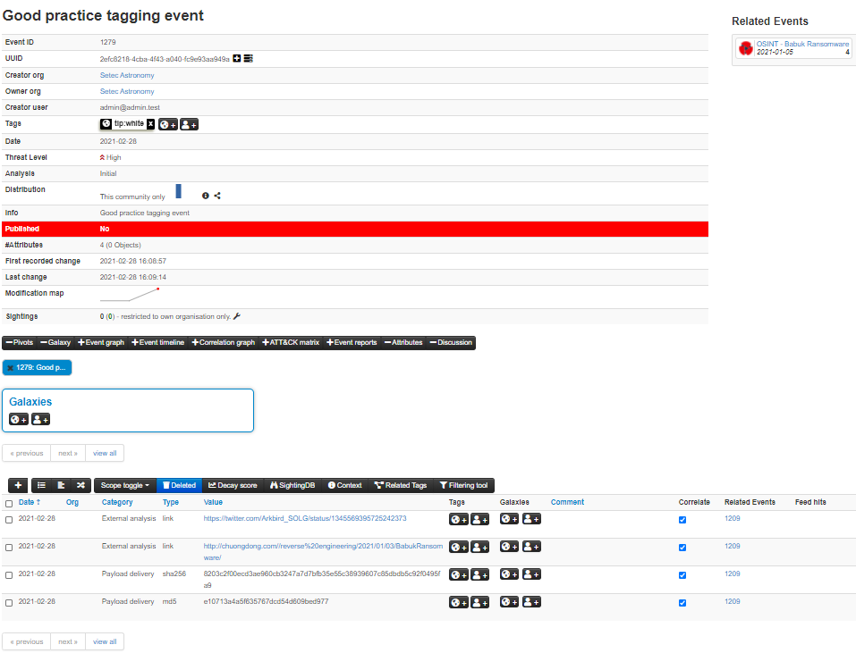
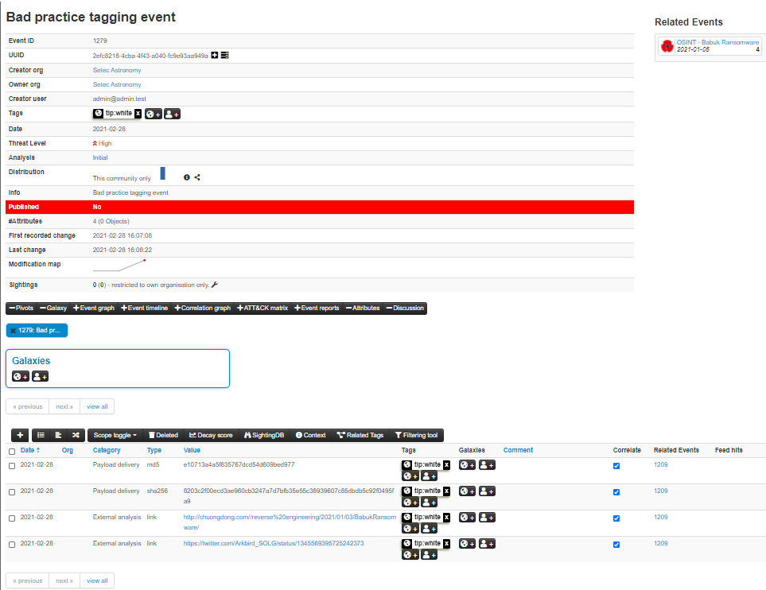
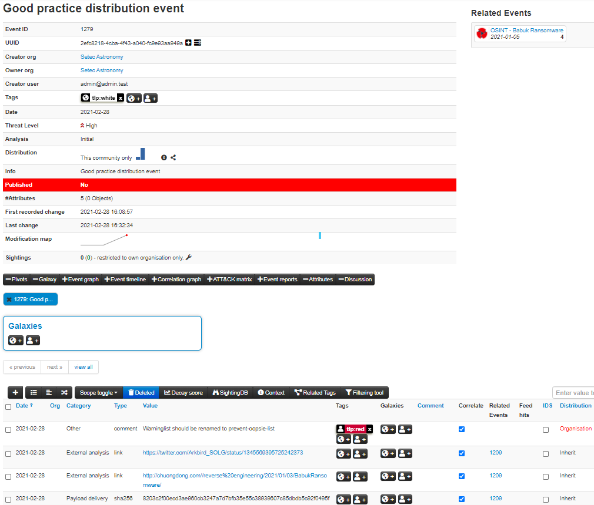
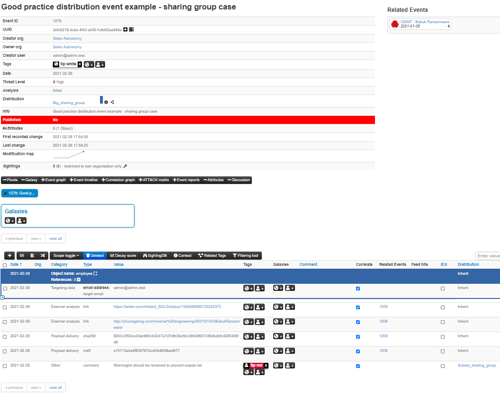
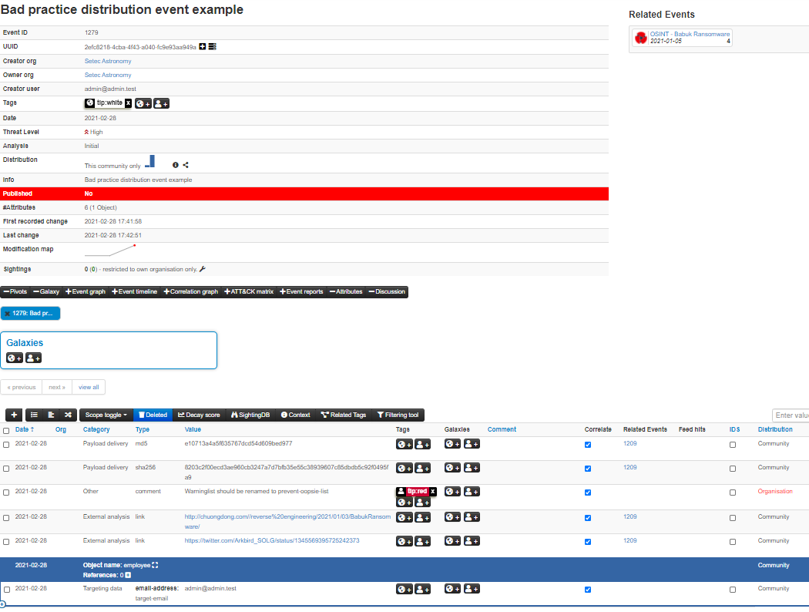
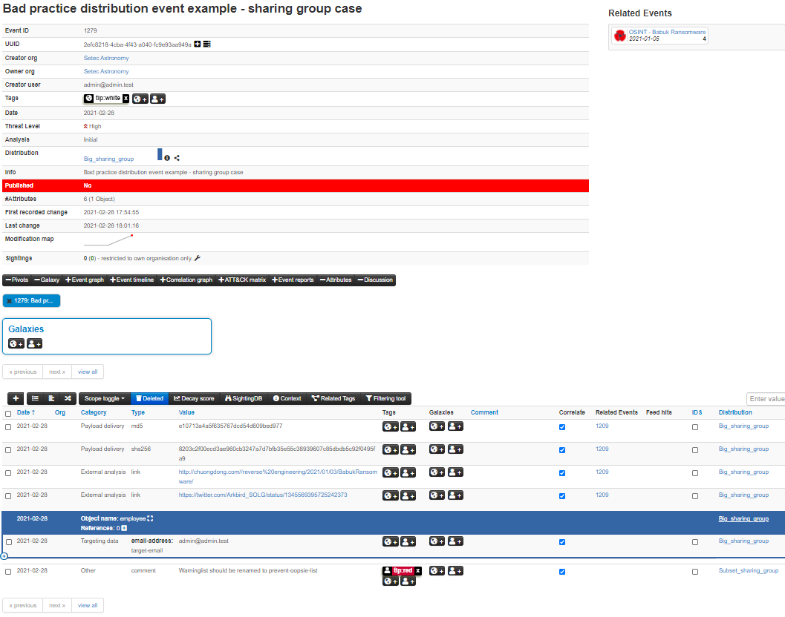

<!-- toc -->

# Best Practices
The following page hosts some best practices for the usage of the MISP platform. For generic threat intelligence practices, please refer to [MISP project - best practices in threat intelligence](https://www.misp-project.org/best-practices-in-threat-intelligence.html).

## Tagging
### Tagging at event level versus tagging at attribute level
You can add tags to an entire event. For a more fine-grained specification tags can also be placed at attribute level. This allows the user to put a more detailed and selective view on each attribute. If a tag applies to all or most attributes in the event, the best practice is to only include a specific tag for the attributes when they are an exception from the tag set at event level. In the below screenshot you see an example of the best practice, the tlp:white tag is only set at the event level.

In the next screenshot you see a bad practice example. The tlp:white tag is added to both the event and all the attributes.

### Minimal subset of tags to use for each event
#### Traffic Light Protocol
[TLP-Tags](https://github.com/MISP/misp-taxonomies/blob/master/tlp/machinetag.json): TLP utilizes a simple four color schema for indicating how intelligence can be shared.

#### Confidence
[Confidence-Tags/Vetting State](https://github.com/MISP/misp-taxonomies/blob/master/cssa/machinetag.json): There are huge differences in the quality of data, whether it was vetted upon sharing. As this means that the author was confident that the shared data is or at least was a good indicator of compromise.

#### Origin
[Origin-Tags](https://github.com/MISP/misp-taxonomies/blob/master/cssa/machinetag.json): Describes where the information came from, whether it was in an automated fashion or in a manual investigation. This should give an impression how value this intelligence is, as manual investigation should supersede any automatic generation of data.

#### Permissible Actions Protocol
[PAP-Tags](https://github.com/MISP/misp-taxonomies/blob/master/PAP/machinetag.json): An even more advanced approach of data classification is using the Permissible Actions Protocol. It indicates how the received data can be used to search for compromises within the individual company or constituency.
## Setting distribution
Similar to tagging, inheritance should be used wherever possible. This is especially important when using sharing groups due to limit the impact of sharing group usage on performance. Note that for distribution, the event or object distribution of the attribute should be the same or less restrictive than the attribute distribution. Below are two good practice examples, the first using community distribution and the second using sharing groups. Note that a combination of the two can be used as well.

In the next to screenshots, you can see the equivalent bad practice examples.

## Use objects instead of combined attributes
Some attributes like filename|sha512 and ip-dst|port now have equivalent objects such as file and ip-port. Using the object equivalent of attributes is recommended. It gives flexibility to add more context later and groups all the relevant attributes related to one concept, for example a file, together.
## Use proposals when possible to request author to make changes to an event
If possible, use proposals when you want to inform the original analyst/author (e.g. a security vendor or a CSIRT) about a specific mistake or error which needs to be corrected. The advantages of using the proposal system include the lack of a need to create a new event as well as the process itself being very simple and fast.

