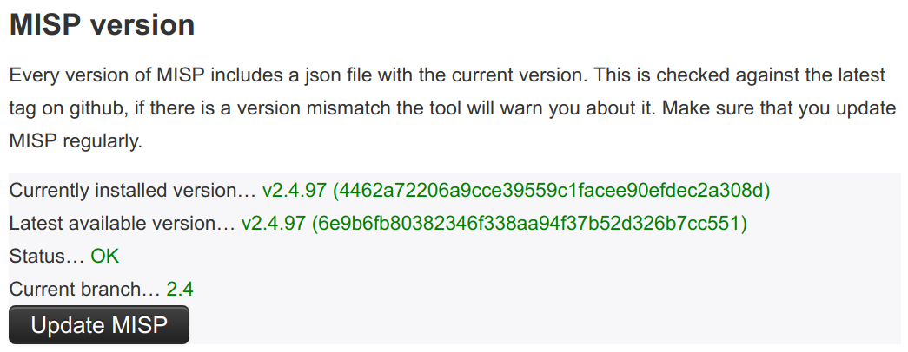
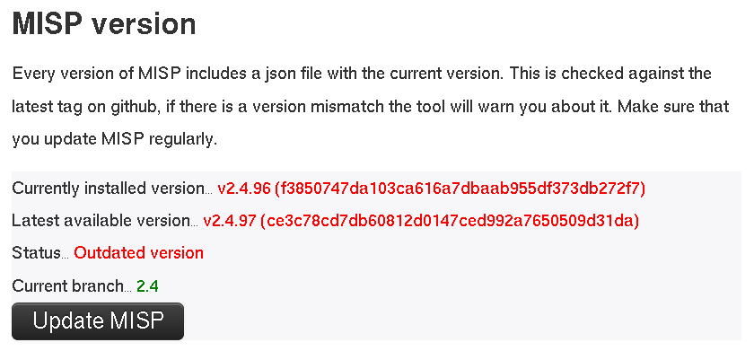
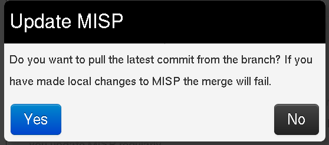
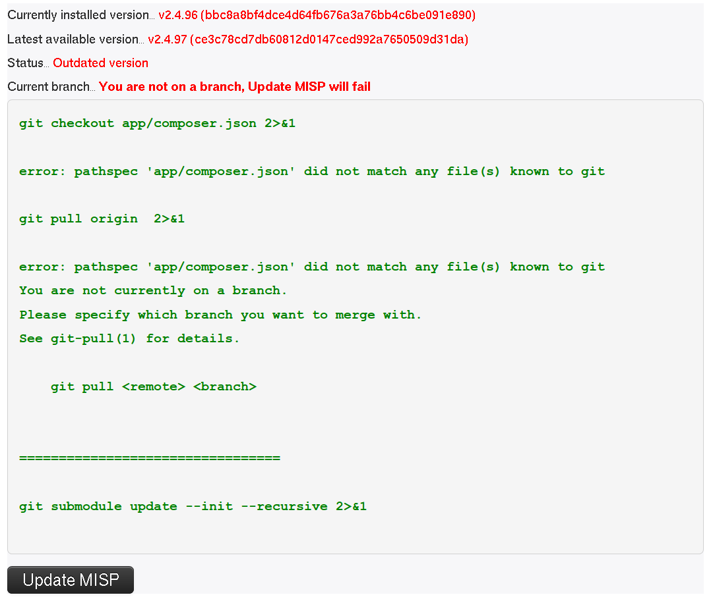
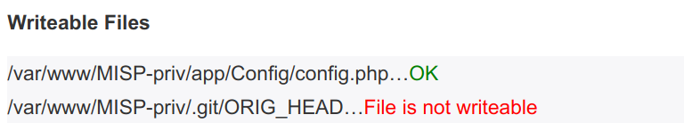
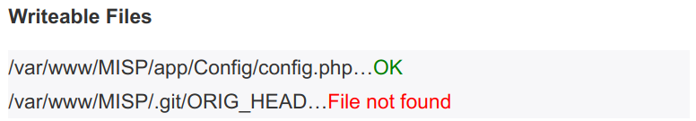
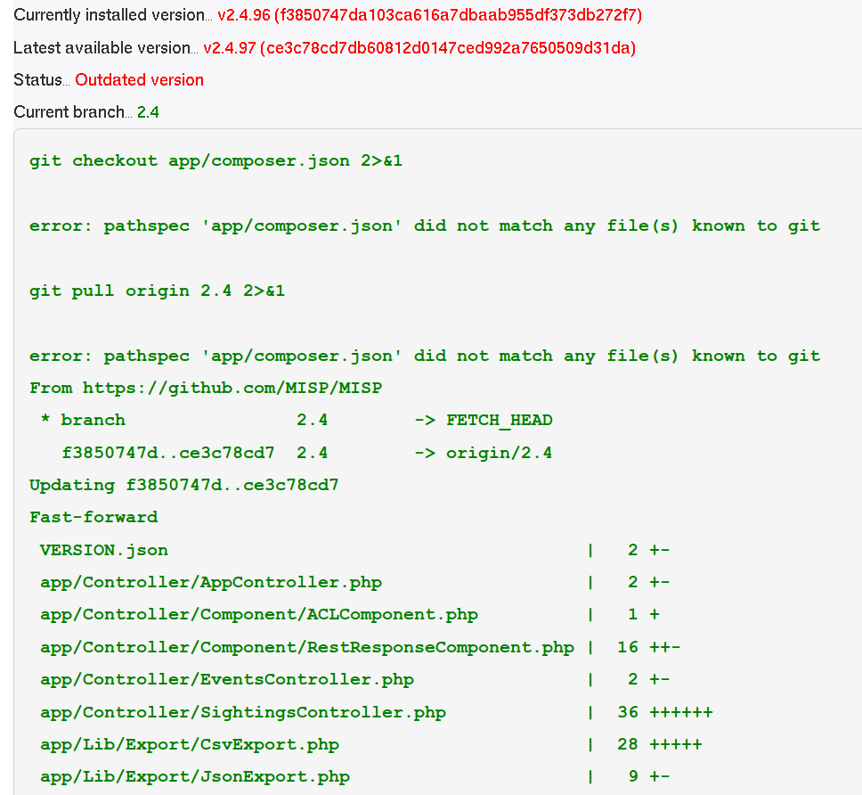
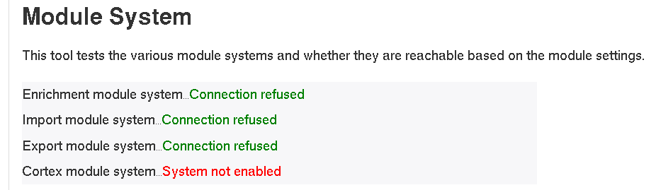

<!-- toc -->

# Frequently Asked Questions

The following page hosts some frequently asked questions as noticed in our [issues](https://github.com/MISP/issues) and [gitter](https://gitter.im/MISP/Support) channels.

***
## General questions
### Where can I get support?

If you have feature requests or you found a bug you can open a ticket on [MISP's GitHub repository issue](https://github.com/MISP/MISP/issues) tracker.

If you want to discuss something related to MISP or want help from the MISP community, join the appropriate MISP Gitter channel:

- [MISP Developer Room](https://gitter.im/MISP/MISP) Dev discussions
- [MISP Support Room](https://gitter.im/MISP/Support) OMGoo! My MISP doesn't work discussions
- [MISP Sharing Room](https://gitter.im/MISP/Sharing) Threat Intelligence Sharing discussions
- [misp-cloud Room](https://gitter.im/MISP/misp-cloud) Using MISP in the clouds discussions

### What are the hardware requirements?

From a hardware perspective, MISP's requirements are quite humble, a web server with 2+ cores and 8-16 GB of memory should be plenty, though more is always better of course. A lot of it depends on the data set and the number of users you are dealing with. 

We recommend a standard LAMP stack on top of Ubuntu >18.04 LTS. For details on the exact dependencies please refer to the [installation guide](https://misp.github.io/MISP/INSTALL.ubuntu1804/) as well as the [requirements for the MISP modules](https://github.com/MISP/misp-modules/blob/master/REQUIREMENTS). 

During a [Hackathon](https://hackathon.hack.lu) a small tool called [MISP-Sizer](https://misp-project.org/MISP-sizer/) was conceived. It will give you a **very rough** idea on what requirements are if you have a bigger installation. [source-code is here](https://github.com/MISP/MISP-sizer)

***
## Specific questions
### Can I configure MISP encrypted notification emails to contain more information in the subject?

The setting 'MISP.extended_alert_subject' allows you to have an extended subject. /!\ Beware if you’re using encryption: the subject will not be encrypted. Be aware that you might leak some sensitive information this way. Below is an example how the two subject types look like. First with the option disabled, then with the option enabled.

    Event 7 - Low - TLP Amber
    Event 8 - OSINT - Dissecting  XXX... - Low - TLP Amber

(Source: [Getting started with MISP](http://www.vanimpe.eu/2015/05/31/getting-started-misp-malware-information-sharing-platform-threat-sharing-part-3/))

### How can I restart the workers?

The workers can be restarted from the web interface: 
    
    administration -> server settings -> workers -> restart all

You can also follow the manual process below.

If you are on Ubuntu / Debian based systems:

    sudo su -l www-data -s /bin/bash -c "bash /var/www/MISP/app/Console/worker/start.sh"

If you are on RHEL / Fedora based systems:

    su -s /bin/bash apache -c 'bash /var/www/MISP/app/Console/worker/start.sh'

### How can I redirect HTTP to HTTPs?

```
<VirtualHost *:80>
        ServerAdmin misp@misp.misp
        ServerName misp.misp.misp
        ServerAlias misp-int.misp.misp

        Redirect permanent / https://misp.misp.misp

        LogLevel warn
        ErrorLog /var/log/apache2/misp.local_error.log
        CustomLog /var/log/apache2/misp.local_access.log combined
        ServerSignature Off
</VirtualHost>

<VirtualHost *:443>
        ServerAdmin misp@misp.misp
        ServerName misp.misp.misp
        ServerAlias misp-int.misp.misp

        DocumentRoot /var/www/MISP/app/webroot
        <Directory /var/www/MISP/app/webroot>
                Options -Indexes
                AllowOverride all
                Order allow,deny
                allow from all
        </Directory>

        SSLEngine On
        SSLCertificateFile /etc/ssl/misp.misp.misp/misp.crt
        SSLCertificateKeyFile /etc/ssl/misp.misp.misp/misp.key
        SSLCertificateChainFile /etc/ssl/misp.misp.misp/mispCA.crt

        LogLevel warn
        ErrorLog /var/log/apache2/misp.local_error.log
        CustomLog /var/log/apache2/misp.local_access.log combined
        ServerSignature Off
</VirtualHost>
```

Source: [Getting started with MISP](http://www.vanimpe.eu/2015/05/31/getting-started-misp-malware-information-sharing-platform-threat-sharing-part-3/)

### When I try to access my new installation, I am redirected to localhost:8443 and get an error.

By default, MISP runs on a local instance and is setup for local access upon installation. This allows you to setup security and customizations before making it available elsewhere. If you would like to access the MISP instance from a remote host (including another VM host/client), assign an IP to the MISP host and point your browser accordingly. Upon login, you may get the “localhost:8443” redirection. Change that piece of the URL back to the IP assigned to the MISP host (or associated DNS name) and refresh the browser. Once in, go to Administration - Server Settings and Maintenance - MISP settings. You can change the top two items to your MISP IP or DNS name and the redirect will start using that address instead of 'localhost'.

### How can I define the default sharing level?

MISP allows you to define the group of people with whom you want to share your threat data. If you do not set it to your preferred default then it’s likely that at one given moment you’ll make an error and share your intel with the wrong group. Defining the sharing level is done with the setting default_event_distribution in the configuration file. There are three levels:

    0 : Your organisation only (default)
    1 : This community only
    2 : Connected communities
    3 : All communities

You can set a similar configuration setting for the attributes. The setting default_attribute_distribution has the same values as default_event_distribution. Additionally it has the value event which allows the attribute to get the setting from the event to which it belongs.

Source: [Getting started with MISP](http://www.vanimpe.eu/2015/05/31/getting-started-misp-malware-information-sharing-platform-threat-sharing-part-3/)

### How can I add an organisation logo and/or foter logo?

MISP can be made more appealing to the eye by adding some graphics.

As Org.- or Site-admin navigate to *Administration* -> *List organisations* and edit the corresponding organization.
Withing this editor you will be able to update the logo.

Other ways to achieve this, would be:
    
Set your organisation logo by adding an image (.png) that has the same name as your organisation in the directory */var/www/MISP/app/webroot/img/orgs/*.

Yet another way of doing this is by logging into your MISP instance with Admin rights, navigate to *Administration* -> *Server Settings*, tab -> *Manage files*. 

You can add a footer logo. Add an image to the directory */var/www/MISP/app/webroot/img/custom/* and define the footer logo in the config file (config.php) or in *Adminitration* -> *Server Settings...* -> *MISP settings* (search for: "footer_logo") point to the location on-disk of the image.

Partial source: [Getting started with MISP](http://www.vanimpe.eu/2015/05/31/getting-started-misp-malware-information-sharing-platform-threat-sharing-part-3/)

### All workers are starting correctly except _schdlr_ . How can I fix this?

This can happen if the [FQDN](https://en.wikipedia.org/wiki/Fully_qualified_domain_name) of the server hosting the instance has changed. A way to fix this is to flush temporary data stored in redis. This can be done by logging in redis, for example when logging in with redis-cli, and issuing a _*flushall*_ command.

### How can I import data directly from PDF reports?

/!\ This section needs review, verification and eventual amendments to make sure it works.

You can use a generic script called IOC parser (https://github.com/armbues/ioc_parser) or use a script published by Palo Alto to convert IOC parser output to a MISP event (https://github.com/PaloAltoNetworks-BD/report_to_misp/). You have also the option to select all the text and paste it in the free-text import form.

Another option is the new [OCR import module](https://github.com/MISP/misp-modules) that can be used via the import modules. You will need to install the OCR software tesseract.

### I am having trouble updating beyond version 2.4.50 (stuck loading any page beyond the login), what can I do?

/!\ This applies to an earlier version of MISP, do not randomly try this fix on valuable data. By all means try it on a test-machine and report back if your problem was solved by this.

This is most likely due to the fact that MISP did not clean up expired sessions prior to version 2.4.51 automatically and relied on a site-admin occasionally cleaning it up using the button found on the diagnostics page. Once you upgrade to 2.4.51, MISP will try to cull the table with each page load by a site-admin, which in some cases if the table has grown to extreme sizes it will get stuck on. To resolve the issue, log into mysql:

`mysql -u [misp-db-user-name] -p [misp-db-name];`

and execute the following commands:

   DROP cake_sessions;
   CREATE TABLE IF NOT EXISTS `cake_sessions` (
     `id` varchar(255) COLLATE utf8_bin NOT NULL DEFAULT '',
     `data` text COLLATE utf8_bin NOT NULL,
     `expires` int(11) NOT NULL,
     PRIMARY KEY (`id`),
     INDEX `expires` (`expires`)
   ) ENGINE=InnoDB DEFAULT CHARSET=utf8 COLLATE=utf8_bin;

After this everything should work and the session table will be trimmed each time a site-admin loads a page.

### I have many failed jobs when doing email notification. What should I do?

This is most probably due to some encryption failing for some users. We strongly advise to review the current
PGP keys and to ensure that they keys are not expired or perhaps not supported anymore (weak keys). The keys can be reviewed at the following
location in MISP:

  ```
  https://<YOUR MISP URL>/users/verifyGPG
  ```

### Upgrading from MISP 2.4.65 to MISP 2.4.66 - Unable to merge due to the Composer file.

In MISP 2.4.66, Composer is included by default to avoid the risk of downloading a rogue PHP Composer version (if the composer repository is compromised or MiTM are performed) via the download and php execution. But when upgrading (via a git pull), the git merge process might complain about the composer phar file still being there. You can safely remove that file and `git pull origin 2.4` again.

### I have issues with pushing events

- What does the 'Connection test' for the specific server report? (*Sync Actions* -> *List Servers*)

- Is the event you assume to push/pull ready to be published?

- Is the distribution level set not too restrictive?

- Have you enabled push in the servers config you want to push to?

- Do you have any limitations to the push rules e.g. limited to a certain TLP Level tag or other?

- What is written in your job log?

  https://<YOUR MISP URL>/jobs/index

Have a look at: /var/www/MISP/app/tmp/logs and /var/log/apache2/misp (or the relevant apache log folder of the instance in cause)

### I have many users or API accesses, what's the best PHP session handler?

We strongly recommend production-level MISP installations to rely on PHP session in Redis. As Redis is already part
of a standard MISP setup, we recommend to enable the redis session handling.

To configure the redis session handling in PHP, edit : 

~~~
  session.save_handler = redis
  session.save_path = "tcp://127.0.0.1:6379
~~~

### Is there TAXII support? 

A TAXII 1 implementation can be found at https://github.com/MISP/MISP-Taxii-Server . 
This is mostly a TAXII server hooked up to MISP, meant to receive STIX files to its in box and uploading them to MISP.
There is also an experimental feature to push MISP events to the TAXII server when they're published - that's in `scripts/push_published_to_taxii.py`. It seems to work, but may occasionally re-upload duplicate events to MISP.

TAXII 2 is provided in the future once the specification, which is at time of writing in draft, reaches a stable form.

### Wipe MISP data - Remove all data

If you need to start from scratch with your MISP database and remove all data you can use the [`misp-wipe`](https://github.com/MISP/MISP/tree/2.4/tools/misp-wipe)  script provided in the `tools/` folder.

### Constantly acknowledging my self-signed certificate drives me nuts

You want to add it in 2 places: Your browser(s) and your OS.

The following steps can be performed on the CLI to install the Certificate:

```bash
sudo mkdir -m 0755 /usr/local/share/ca-certificates/MISP
sudo cp /etc/ssl/private/misp.local.crt /usr/local/share/ca-certificates/MISP
sudo chmod 0644 /usr/local/share/ca-certificates/MISP/misp.local.crt
sudo update-ca-certificates
```

For the Chrome Browser:

1. Visit: "Advanced Settings" -> chrome://settings/?search=Manage+certificates
2. Scroll down to: Manage Certificates (click)
3. Select: "Authorities"
4. Click: "Import"
5. Browse to your .crt file and import it.
6. On the next screen tick: "Trust this certificate for identifying websites"
7. Done, enjoy the new gained quality of life

Note: Chrome might expect a [Subject Alternative Name](https://en.wikipedia.org/wiki/Subject_Alternative_Name) make sure you created your certificate with '-extension san'.

To allow insecure localhost connections enable this option: chrome://flags/#allow-insecure-localhost

Sources: [CLI](https://askubuntu.com/questions/645818/how-to-install-certificates-for-command-line) and [Chrome](https://origin-symwisedownload.symantec.com/resources/webguides/sslv/sslva_first_steps/Content/Topics/Configure/ssl_chrome_cert.htm)/[Chrome insecure localhost](https://stackoverflow.com/questions/7580508/getting-chrome-to-accept-self-signed-localhost-certificate)

[For the Firefox Browser](https://superuser.com/questions/1054724/how-to-make-firefox-ignore-all-ssl-certification-errors)

### How can I change the theme?

MISP uses [bootstrap.css](https://getbootstrap.com) the specific CSS file can be found on a typical MISP install at `/var/www/MISP/app/webroot/css/bootstrap.css`. 

You can customize this for your own needs. There are also pre-made boostrap themes which you can use as-is or build upon. 

Before making any changes, confirm the version of boostrap currenlty used by running `head -5 /var/www/MISP/app/webroot/css/bootstrap.css`. You can find themes on sites like [Bootswatch](https://bootswatch.com/2/). 

To replace the current theme with a theme you found on bootsplash, run: `wget https://bootswatch.com/2/readable/bootstrap.css   -O /var/www/MISP/app/webroot/css/bootstrap.css` , replacing the URL as needed. 

Some bootswatch themes applied on MISP: 
* https://i.imgur.com/usONTLk.png
* https://i.imgur.com/5XMjB7o.png
* https://i.imgur.com/5gc57VU.png
* https://i.imgur.com/4AJCPgf.png
* https://i.imgur.com/JuMGm8U.png
* https://i.imgur.com/v1Wu6xW.png

### How can I deal with a MISP instance that has pulled in feeds over and over into new events, generating hundreds of GBs of junk correlations, rendering the instance unusable?

*Step 1:* ensure that all your CSV/freetext source_format feeds are using the fixed event setting. If you want to make sure this is the case, you can run this SQL query instead of doing it manually:

```
UPDATE feeds SET fixed_event = 1 WHERE source_format="csv" OR source_format="freetext";
```

*Step 2:* purge all of your correlations (this will make the next steps much faster), for which you have two methods at your disposal:
  - either go to your administration -> server settings -> MISP tab and set `MISP.completely_disable_correlation` to true
  - via MYSQL run `TRUNCATE correlations;`

*Step 3:* purge all of your feed data that have been pulled into multiple events. The easiest way of doing this: check which feeds are enabled (ignore misp source format feeds, they are not causing issues) and note down the IDs. Afterwards, use the CLI cleanup tool to remove all the feed events:

`/var/www/MISP/app/Console/cake Admin purgeFeedEvents [user_id] [feed_id]`

Execute this for each feed that you had enabled, replacing user_id with your admin user's ID and feed_id with the individual feed IDs on your list.

*Step 4:* recorrelate your data, depending on which method you've used in *Step 2* you have two options:
  - either go to your *Administration* -> *Server Settings...* -> *MISP...* tab and set `MISP.completely_disable_correlation` to *false*
  - recorrelate your current data-set via the recorrelate attributes tool on `/pages/display/administration`
  
### I have a long list of events that I want to delete via the API, do I really have to loop through each and issue a delete to /events/delete?

No, the delete action also accepts a list of IDs when it comes to bulk event deletions. 

Simply POST your ID list to `/events/delete` in the following format:

```
{
  "id": [1,3,5,7,9]
}
```

### I can no longer log in. How do I reset the admin password?

You can reset the password via the console. 
See [Issue #1160](https://github.com/MISP/MISP/issues/1160)

`/var/www/MISP/app/Console/cake Password [email] [password]`

***
## Usage questions
### How can I see all the deleted events in a MISP instance?

You can use the logging system for this, to see all deleted events, simply go to *Audit* -> *Search Logs* and use the following parameters:

~~~~
  model: Event
  action: delete
~~~~

This will list all event deletions. To find out more about what a particular deleted event
was, simply grab the ID from the above search results and search for:

~~~~
  model: Event
  action: add
  model_id: <Event ID retrieved from the listing of all event deletions>
~~~~

To do the same via the API, first search for the deletions:

~~~~
  POST request:
    url: https://url.of.your.misp/logs/index
    headers:
      Authorization: <your_api_key>
      Accept: application/json
      Content-type: application/json
    Body:
      {
        "model": "Event",
        "action": "delete"
      }
~~~~

Then find the individual event's metadata that was deleted

~~~~
  POST request:
    url: https://url.of.your.misp/logs/index
    headers:
      Authorization: <your_api_key>
      Accept: application/json
      Content-type: application/json
    Body:
      {
        "model": "Event",
        "action": "add",
        "model_id": "<Event ID retrieved from the query before>"
      }
~~~~

## Permission issues

If you have any permission issues, please [set the permissions](https://misp.github.io/MISP/INSTALL.ubuntu1804/#5-set-the-permissions) to something sane first.

### RHEL/CentOS

There are a plethora of issues that might arise when using SELinux when it comes to permissions.
First, please familiarize yourself with [the basics](https://opensource.com/article/18/7/sysadmin-guide-selinux) of SELinux.
RedHat has a comprehensive [SELINUX USER'S AND ADMINISTRATOR'S GUIDE](https://access.redhat.com/documentation/en-us/red_hat_enterprise_linux/7/html-single/selinux_users_and_administrators_guide/index).

For file system permissions, refer to the [install guide](https://misp.github.io/MISP/INSTALL.rhel8/#5-set-file-permissions) first.

Another way to see what SELinux might not be happy about is to use **ausearch**. This assumes Audit is enabled.

```bash
# Just php-fpm
sudo ausearch -c 'php-fpm' --message AVC
# All messages
sudo ausearch --message AVC
```

### Redis Connection problems

If you have the following in **error.log**

```
2019-05-08 10:16:05 Error: [RedisException] Permission denied
Request URL: /events/view/1
Stack Trace:
#0 /var/www/MISP/app/Model/AppModel.php(1776): Redis->connect('127.0.0.1', 6379)
#1 /var/www/MISP/app/Model/Feed.php(329): AppModel->setupRedis()
#2 /var/www/MISP/app/Model/Event.php(2073): Feed->attachFeedCorrelations(Array, Array, Array, false)
#3 /var/www/MISP/app/Controller/EventsController.php(1547): Event->fetchEvent(Array, Array)
#4 [internal function]: EventsController->view('1')
#5 /var/www/MISP/app/Lib/cakephp/lib/Cake/Controller/Controller.php(499): ReflectionMethod->invokeArgs(Object(EventsController), Array)
#6 /var/www/MISP/app/Lib/cakephp/lib/Cake/Routing/Dispatcher.php(193): Controller->invokeAction(Object(CakeRequest))
#7 /var/www/MISP/app/Lib/cakephp/lib/Cake/Routing/Dispatcher.php(167): Dispatcher->_invoke(Object(EventsController), Object(CakeRequest))
#8 /var/www/MISP/app/webroot/index.php(92): Dispatcher->dispatch(Object(CakeRequest), Object(CakeResponse))
#9 {main}
```

This means that apache/php-fpm cannot connect over the network (localhost included).

Fix:

```bash
sudo setsebool -P httpd_can_network_connect on
# Perhaps a reload is not needed, but good practice wants us to test it anyways.
sudo systemctl restart rh-php72-php-fpm.service
sudo systemctl restart httpd.service
```

## RHEL/CentOS SELinux debug

More often than not there might be issues with SELinux when not configured correctly. The below will give you pointers where to look and how to figure out what is wrong.

You can investigate SELinux issues without any tools by opening the audit log it generates. This log is found at /var/log/audit/audit.log. However, unless you know exactly what to look for and have a lot of free time, you’re going to find it difficult making sense of the log.

Install some handy tools:

```bash
# Note: This will pull in some X tools, you have been warned
sudo yum install setroubleshoot setools
```

We now have a tool called sealert that analyzes the audit log used by SELinux. Sealert will scan the log file and will then generate a report containing all discovered SELinux issues.
In this overview of what went wrong you will see suggestions on how to fix them after the issue detected.

To run sealert from the command-line, we need to point it to the SELinux audit log.

```bash
sudo sealert -a /var/log/audit/audit.log
```

### Clearing the audit logs

It is not recommended to clear the audit logs as they might contain information needed in the future for troubleshooting or security investigations. However, if that is not the case, just empty the audit log:

```bash
# > /var/log/audit/audit.log
```

[Partial source](https://www.serverlab.ca/tutorials/linux/administration-linux/troubleshooting-selinux-centos-red-hat/)

[StackExchange](https://unix.stackexchange.com/questions/337704/selinux-is-preventing-nginx-from-writing-via-php-fpm)

[Gentoo Wiki](https://wiki.gentoo.org/wiki/SELinux/Logging#Clearing_the_audit_logs)

## When to update MISP?

One question might be how often to update MISP.
You can update MISP as ofte as you like. If you see the follwing:



This means that the main repository has an update available.

If you want to play it safer or want to integrate it in your Weekly/Bi-Monthly update routine you can track our [Changelog](https://www.misp-project.org/Changelog.txt) a more up to date version is available [here](https://misp.github.io/MISP/Changelog/)

Further on we do regular tagged releases. (Approximately once per month.)
The releases happen either if a milestone has been hit for a certain feature/improvement/fix or for any security related matters.

Thus you have the choice of either tracking 2.4 which is on a rolling release schedule, or track the tagged releases.

### How to switch from tagged releases and back?

This can be achieved with the following git commands:

```bash
$ cd /var/www/MISP # aka. $PATH_TO_MISP
$ sudo -H -u www-data git checkout tags/$(git describe --tags `git rev-list --tags --max-count=1`)

## OS Upgrades

In theory all should "just work"(tm), but in practice the following dependencies might make your install unstable and need a little though before just doing the updates.

* php/pear
* python
* apache
* init scheme/scripts
* mariadb/mysql
* redis
* git

### PHP

This is probably the most likely one that might get you into trouble.
The following happened on a Debian Testing lately. During the upgrade php got upgraded to php-7.3 and seemingly some php-7.2 dependencies were deinstalled and the system now had 2 concurrent versions of php installed.
The fix was to remove any *libapache2-mod-php7.2* packages and make sure that *apt remove libapache2-mod-php7.3* was installed. Most certainly you need to add symbolic links to */etc/apache2/mods-enabled* to make php7.3 work.
Then double check if all the php dependencies are install, refer to the install documents.

The same for pear, where we mostly use 2 (bundled) packages: Console Command Line, Crypt GPG.
If you upgrade from a very old and out of date version of MISP this might raise issues.

php.ini might also become problematic if you just erase the recommended defaults.

### Python3

If you use python2 for MISP, please read the install docs about MISP being Python 3 only.
Currently Python3.6 is minimum. It is known working on 3.7 with some minor difficulties (see PyMISP issues).
The biggest issue is certainly with PyMISP doig unexpected things when python might be updated.
Using a virtualenv, whilst not always ideal for all setups, will at least make sure that problems are contained a little more.

### Apache

Mostly config issues might be a show stopper. And major version updates where some underlying config might need to be changed.

### init/systemd

MISP launches a couple of things on boot. Changing what handles boot behavious might have an impact.

### MariaDB/MySQL/redis

Similar to apache, most importantly always take good care that the DB engine is not all of a sudden changed without you noticing it.
From minor to major updates, rarely things might need to be adapted.

### git

Currently (as of v2.4.108) the git-cli command is used in MISP core. In very rare cases where the expected output changes, this might be an issue.
Included here more as an FYI then anything else.

## Hardening

### How do I harden my MISP instance?

You can check the [hardening section](https://misp.github.io/MISP/generic/hardening/) in the install guide.

## Maintenance mode

### Is there a MISP maintenance mode?

Yes, you want to flip your instances "Live-mode".
This wants to be done on the CLI if you experience issues:

```bash
$PATH_TO_MISP/app/Console/cake "MISP.live" 0
```

Other related MISP Settings

Optional	MISP.maintenance_message	Great things are happening! MISP is undergoing maintenance, but will return shortly. You can contact the administration at $email or call CIRCL.	The message that users will see if the instance is not live.

Critical	MISP.live	true	Unless set to true, the instance will only be accessible by site-admins.

## Update MISP fails

If your MISP instance is outdated, meaning ONLY the core, not the modules or dashboard or python modules, you well see the following.



Once you click on update MISP you will be asked confirmation.



If you are not on a branch, the UI will tell you this, the update will fail.



If you cannot write the **.git** files and directory as the user running the web server (and thus PHP), the update will fail.
The following diagnostic check will let you know if you can update or not.



In case you get a file not found on **.git/ORIG_HEAD**, this means that you have never updated your MISP OR you have installed git from an archive file (like .zip/.tar.gz or similar)
Try to click update MISP and see what happens.



### What can go wrong if I update MISP?

In theory nothing. We put great effort into protecting the integrity of the data stored in your MISP instance.
DB upgrades happen upon login or on reload once you have update the repository.
You cannot "break" anything by clicking **Update MISP** worse case it will complain about something and you will certainly find the answer on this page.

IF not, please open an [issue](https://github.com/MISP/MISP/issues) on GitHub or come to our [gitter](https://gitter.im/MISP/MISP) chat to see if the community can help.

### error: pathspec 'app/composer.json' did not match any file(s) known to git

This is **not** an error and can be ignore. Nothing will be impacted by this.



### MISP modules "Connection refused"



If you get have a **Connection refused state** on your modules one of the following might be true.

- You have no [misp-modules](https://github.com/MISP/misp-modules) not installed
- They are instaled but not running
- Something completly different

If they are not installed, check out this section of the [INSTALL guide](https://github.com/MISP/misp-modules/#how-to-install-and-start-misp-modules-in-a-python-virtualenv) of [misp-modules](https://github.com/MISP/misp-modules).

In case they are not running, try this on the console:

```
sudo -u www-data /var/www/MISP/venv/bin/misp-modules -l 127.0.0.1 -s &
```

OR if you were foolish enough to not install in a Python virtualenv:

```
sudo -u www-data misp-modules -l 127.0.0.1 -s &
```

> [warning] Running misp-modules like this will certainly kill it once you quit the session. Make sure it is in your **/etc/rc.local** or some ther init script that gets run on boot.

## Uninstalling MISP

There is no official procedure to uninstalling a MISP instance.

If you want to re-use a machine where MISP was installed, wipe the machine and do a fresh install.
Consider the data in your MISP instance as potentially confidential and if you synchronized with other instances, be respectful and wipe it clean.


## Updating PyMISP to incorporate newer versions of the MISP object templates

In some cases, for instance if a newer version of a MISP object is present on the server but not yet on PyMISP, you want to reflect the current state in your PyMISP installation.

In order to do so, perform the following steps. It fetches the latest object templates and installs PyMISP again:

```
git clone https://github.com/MISP/PyMISP.git
cd PyMISP/pymisp/data
git submodule update --init
cd misp-objects
git pull origin master
cd ../../../
sudo pip3 install -I .
```


## How to disable freetext/custom/user-created tags and only allow certain tags

Remove the "tag editor" from the permissions that you grant to users. 
Set all tags that you do not want to "hidden".
There is a server setting to treat all incoming tags as hidden by default: `MISP.incoming_tags_disabled_by_default`

**Important** Make sure that you don't remove "tag editor" from sync users, or you'll be stripping tags from synchronized data.


## How to enable the csv import module? 

First you have to enable the import services: double-click on "false" in the very first line and change it to "true".

In Server Settings & Maintenance -> Plugin Settings -> Import -> set "Plugin.Import_csvimport_enabled" to true. 
Afterwards you'll find the csvimport from within the newly created event: "Populate from..." 

Don't use from the main site ("Import from...").


## Why do I see 'The request has been black-holed' when I submit forms?

That's a security measure for form tampering protection.

All forms have a timeout (~15min) and all of them can only be submitted once. If you use your browser's "back" button and resubmit the form MISP will consider it as a potential attempt at form tampering.


## Importing large feeds creates PHP Fatal error

When importing a large feed like the CIRCL feed, the job reaches 99% and then fails.
The log file records:
```
PHP Fatal error: Allowed memory size of 536870912 bytes exhausted (tried to allocate 1941504 bytes) in /var/www/MISP/app/Model/Feed.php on line 691
```

In this case you will need to increase the memory_limit option in `php.ini` file


## I deleted the admin user by mistake


Now, I only have Org Admin.

You have several options:

1. Delete the org admin. MISP automatically creates a new default site-admin user if no users are found in the db (mysql: truncate users;)

2. Upgrade a user to a site-admin, such as an org admin user:
```
SELECT id, email from users;
```
Note down the ID you want to upgrade.  Let's say this is 2 for the example's sake.
```
SELECT id, name from roles;
```
Note down the role ID you want to upgrade. Let's say this is 1 for the example's sake.
```
UPDATE users set role_id = 1 where id = 2;
```

## config.php is not writeable

```
Warning: app/Config/config.php is not writeable. This means that any setting changes made here will NOT be saved.
```

According to the install guide, make sure to:
```
chown -R apache:apache /var/www/MISP
find /var/www/MISP -type d -exec chmod g=rx {} \;
chmod -R g+r,o= /var/www/MISP
```
If it still doesn't work, make sure SELinxu is not enabled or modify the rule set:
```
chcon -t httpd_sys_rw_content_t /var/www/MISP/app/files
chcon -t httpd_sys_rw_content_t /var/www/MISP/app/files/terms
chcon -t httpd_sys_rw_content_t /var/www/MISP/app/files/scripts/tmp
chcon -t httpd_sys_rw_content_t /var/www/MISP/app/Plugin/CakeResque/tmp
chcon -R -t httpd_sys_rw_content_t /var/www/MISP/app/tmp
chcon -R -t httpd_sys_rw_content_t /var/www/MISP/app/webroot/img/orgs
chcon -R -t httpd_sys_rw_content_t /var/www/MISP/app/webroot/img/custom
```

## How to debug misp-dashboard

This is the full chain from MISP to the live dashboard and some tips to find out which link is faulty.

1. MISP
Ensure that ZMQ is installed and enabled with the correct settings

2. MISP ZMQ
You can use MISP/tools/misp-zmq/sub.py which will subscribe to the ZMQ and print the data

3. ZMQ_subscriber
You can change the logging level from logging.INFO to logging.DEBUG and look in the logs for the string Pushed: *
Or add a print statement in the put_in_redis_list function

4. ZMQ_dispatcher
Look in the logs for the string Handling *

5. Server (Flask) and Browser (live Dashboard)
Open the Web developer Network tab in your browser and look for the url /_logs with Content-Type: text/event-stream;

## How to update object templates?

`git submodule update` in your MISP directory (or via the diagnostic page) and just click “Update Objects” in List Object Templates.

## What to do if my REST client is throwing SSL errors when trying to query my MISP instance?

The REST client will use the framework's certificate store to validate the contacted host. If your root CA / self-signed certificate is not known by the certificate store, the request will fail. You can skip the SSL validation altogether using the "Skip SSL validation" checkbox.

## What to do if my REST client cannot reach the host, despite me being able to issue requests using Curl / Postman / etc.?

The REST client issues instructions to your MISP server to contact a remote host (most commonly itself). Always consider how your MISP server can address itself when using the REST client, by default it will prepend the requested relative path in the URL field with the instance's baseurl.

If your MISP cannot reach itself via the baseurl the request will fail. You can use the "Use full path - disclose my API key" checkbox along with the full URL in the URL field to instruct MISP to use another path than what it would construct using the baseurl. 

## How would one set up a sharing group with a remote org, where we only share a mutual community instance (i.e. we both have sync users on that instance). On our local instance, they exist as a remote org (from events that have synced from their instance via our shared community instance). 

It is not possible to do that. Keep in mind that if you are both on a mutual community instance, someone is in charge of that instance that will have database and admin level access. They would be able to inspect the data you exchange on their community instance with one another, so MISP will block any attempt to share with them.

If you really want to go through the community instance to exchange with them, you explicitly have to include the host organisation of the community instance (they would get access if they wanted to anyway, this way we can ensure that you are clear about that):

- You are org a on instance A.
- Your partner that you want to share with is org b on instance B.
- You have no way of directly reaching org b, but you both have access to instance C, which is run by org c (the sharing instance)
- In order to reach org b, you have two options for sharing groups, depending on whether you want to be able to push to them or want to rely on them pulling data from the community instance:
```
SG Option 1 (push all the way to B)
  orgs: a, b, c
  instances, A, B, C
```
```
SG Option 2 (b has to pull from C):
  orgs: a, b, c
  instances: A, C
```

## Is it possible to propose objects to an event?

This is not possible yet.
What you can do at the moment: Create a new event and extend it with the other (foreign) event.


## How to use the enforceWarninglist parameter in REST search?

If you would like to export IoCs, for example into a suricata rule and exclude all values matching your warning lists, you can use the following:

```
{
    "returnFormat": "suricata",
    "published": 0,
    "enforceWarninglist": 1
}
```

Keep in mind that unpublished events need the `"published": 0` parameter in order to be exported.

## Column not found issue

When a user attempts to add an object to an event and the following error is received (Level 1 debug enabled):

```SQLSTATE[42S22]: Column not found: 1054 Unknown column 'Event.org_id' in 'where clause’```

One potential resolution is to upgrade MISP to 2.4.107.

#### Symptoms
Users with the site-admin role are able to add objects to events without any error. This error was encountered when a user belonged to every role **except** site-admin.

## WatchList Customization

### How to create a customized WatchList.

WatchLists are stored within folder under /var/www/MISP/app/files/warninglists/lists
Every folder contains a list.json file.
Create a new folder and copy and modify an existing list (or create a new one from scratch).
Ensure the "name" value within the file is unique.
Increment the version number when the file is changed.

Within the MISP GUI, go to WarningLists and "Update WarningLists".

The new WarningList will now show up. In case of errors, check the permissions on the list.json and it's folder.

To modify the list or to add entries to it, go back to the file via the CLI, modify the file and reload it via the GUI ("Update WarningLists".


## How to upgrade PHP on RHEL/CentOS?

To our knowledge, there is no way to "upgrade" PHP. You'll need to install the new PHP version like you're doing a fresh install.
You may try copying your old `php.ini` to your new PHP config directory which may work. We would recommend redoing the config though.

### Example: Upgrade from PHP 7.2 to 7.3 on CentOS 7

#### Enable repository

```
$ sudo yum install -y http://rpms.remirepo.net/enterprise/remi-release-7.rpm
$ sudo yum-config-manager --enable remi-php73
```

#### Install packages

```
$ sudo yum install -y php73-php php73-php-cli php73-php-fpm php73-php-devel php73-php-mysqlnd php73-php-mbstring php73-php-xml php73-php-bcmath php73-php-opcache php73-php-gd php73-php-pecl-redis4 php73-php-pecl-gnupg php73-php-pear
```

> Confirm GPG key if required:
>
> ```
> Retrieving key from file:///etc/pki/rpm-gpg/RPM-GPG-KEY-remi
> Importing GPG key 0x00F97F56:
>  Userid     : "Remi Collet <RPMS@FamilleCollet.com>"
>  Fingerprint: 1ee0 4cce 88a4 ae4a a29a 5df5 004e 6f47 00f9 7f56
>  Package    : remi-release-7.6-2.el7.remi.noarch (installed)
>  From       : /etc/pki/rpm-gpg/RPM-GPG-KEY-remi
> Is this ok [y/N]: y
> ```

#### Install required PEAR-modules

```
$ sudo php73-pear channel-update pear.php.net
Updating channel "pear.php.net"
Update of Channel "pear.php.net" succeeded
$ sudo php73-pear install /var/www/MISP/INSTALL/dependencies/Console_CommandLine/package.xml
install ok: channel://pear.php.net/Console_CommandLine-1.2.2
$ sudo php73-pear install /var/www/MISP/INSTALL/dependencies/Crypt_GPG/package.xml
install ok: channel://pear.php.net/Crypt_GPG-1.6.3
```

#### PHP configuration

Edit `/etc/opt/remi/php73/php.ini`:

> ```
> date.timezone = "Europe/Berlin"
> max_execution_time = 300
> memory_limit = 512M
> upload_max_filesize = 50M
> post_max_size = 50M
> ```

#### Switch to PHP 7.3

```
$ sudo systemctl stop rh-php70-php-fpm
$ sudo systemctl start php73-php-fpm
# check if everything's fine
$ sudo systemctl status php73-php-fpm
```

Now check if the MISP web UI is accessible and if the diagnostics page shows any errors.

> The diagnostics page will show "PHP CLI Version (>7.2 recommended): Unknown (Issues determining version)". That's a [known issue](https://github.com/MISP/MISP/issues/2334).

#### Disable/enable services

```
$ sudo systemctl disable rh-php70-php-fpm
Removed symlink /etc/systemd/system/multi-user.target.wants/rh-php70-php-fpm.service.
$ sudo systemctl enable php73-php-fpm
Created symlink from /etc/systemd/system/multi-user.target.wants/php73-php-fpm.service to /usr/lib/systemd/system/php73-php-fpm.service.
```


## How to add a galaxy to an event via PyMISP

A galaxy can be assigned like a tag. You can use the add tag function and copy the full conntector-tag. Example `misp-galaxy:ransomware=“Locky”`, which can be found in `/galaxy_clusters/view/`

## Updating PHP from 7.2 to 7.4.5 on Ubuntu 18.04

### Installation

1. Disable and Uninstall Currently Installed SSDEEP
```bash
sudo phpdismod ssdeep
sudo pecl uninstall ssdeep
sudo apt purge ssdeep
sudo rm -rf /etc/php/7.2/mods-available/ssdeep.ini
```

2. Install PHP 7.4.5
```bash
sudo apt install software-properties-common -qy
sudo add-apt-repository ppa:ondrej/php -y
sudo apt update
sudo apt install -qy \
    libapache2-mod-php7.4 \
    php7.4 \
    php7.4-cli \
    php7.4-dev \
    php7.4-json \
    php7.4-xml \
    php7.4-mysql \
    php7.4-opcache \
    php7.4-readline \
    php7.4-mbstring \
    php-redis \
    php-gnupg \
    php-gd
sudo apt update
sudo apt upgrade -y
```

3. Install SSDEEP
```bash
cd /usr/local/src
sudo rm -rf ssdeep-2.14.1.tar.gz ssdeep-2.14.1
sudo wget https://github.com/ssdeep-project/ssdeep/releases/download/release-2.14.1/ssdeep-2.14.1.tar.gz
sudo tar zxvf ssdeep-2.14.1.tar.gz
cd ssdeep-2.14.1
sudo ./configure --datadir=/usr --prefix=/usr --localstatedir=/var --sysconfdir=/etc
sudo make
sudo make install
```

4. Test SSDEEP
```bash
ssdeep -h
```

5. Install ssdeep_php
```bash
  sudo pecl channel-update pecl.php.net
  sudo pecl install ssdeep
```

6. Enable SSDEEP in both 7.2 and 7.4 (** as root** `sudo su`)
```bash
echo 'extension=ssdeep.so' >  /etc/php/7.2/mods-available/ssdeep.ini
echo 'extension=ssdeep.so' >  /etc/php/7.4/mods-available/ssdeep.ini
```

7. Enable SSDEEP PHP Mod
```bash
sudo phpenmod ssdeep
```

8. Set PHP 7.4.5 to default PHP
```bash
sudo a2dismod php7.2
sudo a2enmod php7.4
sudo update-alternatives --set php /usr/bin/php7.4
```

9. [Optional] Set better values for defaults
```bash
sudo sed -i "s/max_execution_time = 30/max_execution_time = 300/" /etc/php/7.4/apache2/php.ini ; \
sudo sed -i "s/memory_limit = 128M/memory_limit = 2048M/" /etc/php/7.4/apache2/php.ini ; \
sudo sed -i "s/upload_max_filesize = 2M/upload_max_filesize = 500M/" /etc/php/7.4/apache2/php.ini ; \
sudo sed -i "s/post_max_size = 8M/post_max_size = 500M/" /etc/php/7.4/apache2/php.ini ; \
sudo sed -i "s/max_execution_time = 30/max_execution_time = 300/" /etc/php/7.4/cli/php.ini ; \
sudo sed -i "s/upload_max_filesize = 2M/upload_max_filesize = 500M/" /etc/php/7.4/cli/php.ini ; \
sudo sed -i "s/post_max_size = 8M/post_max_size = 5000M/" /etc/php/7.4/cli/php.ini ;
```

10. Restart Apache to implement changes
```bash
sudo sudo systemctl restart apache2
```

### Verification of php 7.2 to 7.4

1.   **Administration** > **Server Settings & Maintenance**

2.   **Diagnostics**

3. Scroll down to the **PHP Settings** section and verify


### What are the required steps after a MISP installation to have a properly running instance?

- First login with the installation credentials and change the password immediatly (especially if your instance is publicly accessible)
- Set the base_url to the hostname of your machine (apache virtualhost name)
- Create a new organisation which will be the host organisation running the MISP instance
- Set the new organisation in `MISP.host_org_id` to replace the default one
- Set messages like `MISP.footermidleft` and alike to a proper message to help your users
- Create a new user as `admin` role with the new organisation
- Log with the new user, if successful, remove the default user used during the installation such as `admin@admin.test`
- Select and enable required taxonomies for your sharing community
- Select and enable the external feeds (as caching only if you don't want full events but you can get the full feeds too)
- Select and enable the warning-list (if you don't know what to enable, select all)
- Add the remote MISP instances where you have access to (either caching only or full pull if you want the complete events)

<!-- 
  Comment Place Holder
  -->
