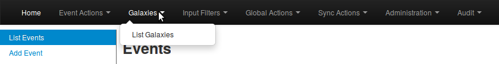
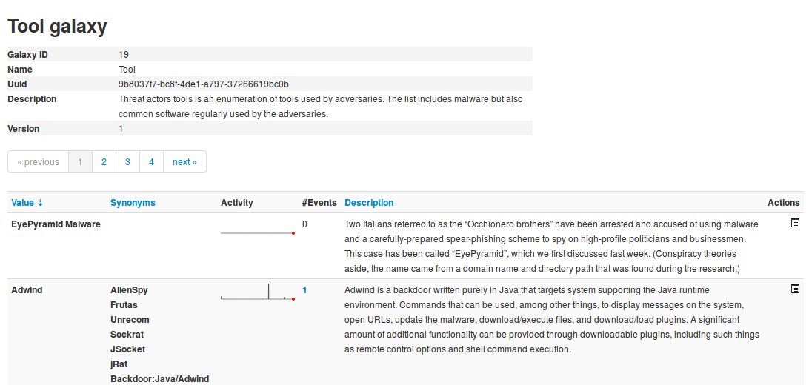
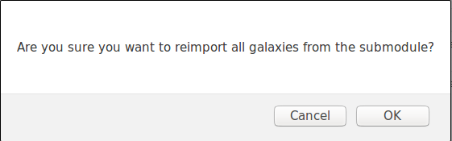
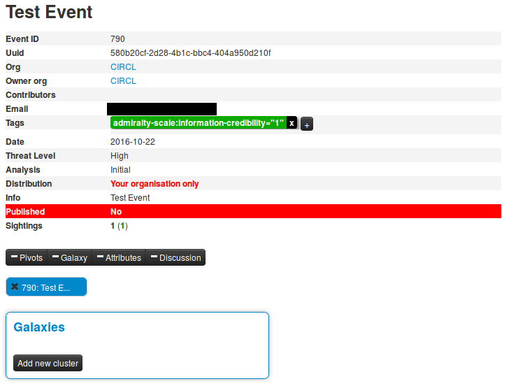
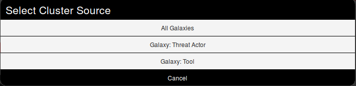
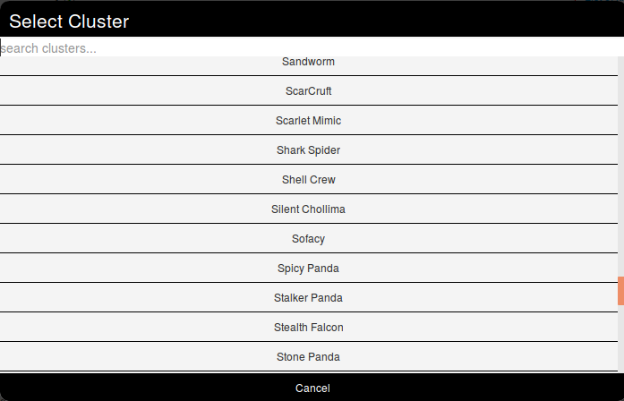
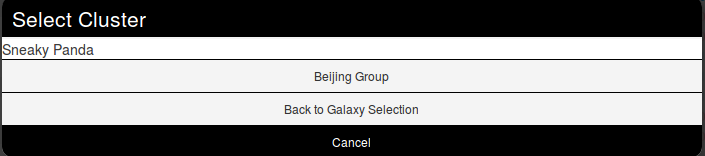
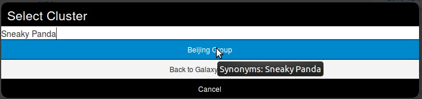
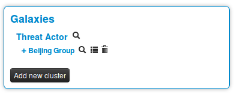

<!-- toc -->

## Galaxies

Galaxies in MISP are a method used to express a large object called cluster that can be attached to MISP events or attributes. A cluster can be composed of one or more elements. Elements are expressed as key-values.

There are default vocabularies available in MISP galaxy but those can be overwritten, replaced or updated as you wish. Vocabularies are from existing standards (like STIX, Veris, MISP and so on) or custom ones.

Existing clusters and vocabularies can be used as-is or as a template. MISP distribution can be applied to each cluster to permit a limited or broader distribution scheme.

The objective is to have a common set of clusters for organizations starting analysis but that can be expanded to localized information (which is not shared) or additional information (that can be shared).

[MISP galaxy](https://github.com/MISP/misp-galaxy) are available on Github.

### Managing Galaxies in MISP

> [warning] You need to have a specific role to manage Galaxies on a MISP instance.

Galaxies management is accessed using the Galaxies link on the top menu.

A list with all the galaxies existing on the server will appear.

Each galaxy can be explored using the icon at the end of the line.

Here is shown the metadata of the selected galaxy as well as a table with each available value as well as some complementary data such as a description of the value or the activity, that is to say the evolution of the use of each value.

Galaxies can be reimported from the submodules by clicking the "Update Galaxies" link on either the galaxies list or while browsing a specific galaxy. A popup will appear to confirm the reimportation.

All galaxies will always be updated, even while browsing a specific galaxy.

### Using Galaxies in MISP Events - Example

For this example, we will try to add a cluster to an existing event. This cluster will contains informations about threat actor known as Sneaky Panda.

Here on the event view, we notice a blue frame under the metadatas with the title "Galaxies" and a button "Add new cluster". Let's click on the latter to begin.

A popup will appear proposising to explore a particular galaxy or all at the same time. Here, as we know we want to as a threat actor, we will choose the second option and scroll to find Sneaky Panda (We are courageous, aren't we?).

Wait. No Sneaky Panda? Hm that's strange. Or maybe it is only registred as a alias. Let's have a look! To do so we will use the search field which stay on top of the list. So what do we get? Beijing Group, is it an alias of our threat actor.

Pointing the cursor on it will give us the answer.

We have a match. So we select it and here we go.

Clicking on the magnifying glass next to Threat actor redirects to the list of all threat actors
Clicking on the magnifying glass next to Beijing Group redirects us to a page about this group
Clicking on the addition symbol on the left of Beijing Group extends the module.

### Available Galaxies

#### Clusters

[Android](https://github.com/MISP/misp-galaxy/blob/master/clusters/android.json) - Android malware galaxy based on multiple open sources.

[Banker](https://github.com/MISP/misp-galaxy/blob/master/clusters/banker.json) - A list of banker malware.

[Exploit Kit](https://github.com/MISP/misp-galaxy/blob/master/clusters/exploit-kit.json) - Exploit-Kit is an enumeration of some exploitation kits used by adversaries. The list includes document, browser and router exploit kits. It's not meant to be totally exhaustive but aim at covering the most seen in the past 5 years.

[Microsoft Activity Group](https://github.com/MISP/misp-galaxy/blob/master/clusters/microsoft-activity-group.json) - Activity groups as described by Microsoft.

[Preventive Measure](https://github.com/MISP/misp-galaxy/blob/master/clusters/preventive-measure.json) - Preventive measures.

[Ransomware](https://github.com/MISP/misp-galaxy/blob/master/clusters/ransomware.json) - Ransomware galaxy based on https://docs.google.com/spreadsheets/d/1TWS238xacAto-fLKh1n5uTsdijWdCEsGIM0Y0Hvmc5g/pubhtml

[RAT](https://github.com/MISP/misp-galaxy/blob/master/clusters/rat.json) - remote administration tool or remote access tool (RAT), also called sometimes remote access trojan, is a piece of software or programming that allows a remote "operator" to control a system as if they have physical access to that system.

[TDS](https://github.com/MISP/misp-galaxy/blob/master/clusters/tds.json) - TDS is a list of Traffic Direction System used by adversaries.

[Threat Actor](https://github.com/MISP/misp-galaxy/blob/master/clusters/threat-actor.json) - Adversary groups - Known or estimated adversary groups targeting organizations and employees. Adversary groups are regularly confused with their initial operation or campaign. MISP

[Tool](https://github.com/MISP/misp-galaxy/blob/master/clusters/tool.json) - tool is an enumeration of tools used by adversaries. The list includes malware but also common software regularly used by the adversaries.

[MITRE Attack Pattern](https://github.com/MISP/misp-galaxy/blob/master/clusters/mitre_attack-pattern.json) - Attack Pattern - MITRE Adversarial Tactics, Techniques & Common Knowledge (ATT&CK)

[MITRE Course of Action](https://github.com/MISP/misp-galaxy/blob/master/clusters/mitre_course-of-action.json) - Course of Action - MITRE Adversarial Tactics, Techniques & Common Knowledge (ATT&CK)

[MITRE Intrusion Set](https://github.com/MISP/misp-galaxy/blob/master/clusters/mitre_intrusion-set.json) - Intrusion Test - MITRE Adversarial Tactics, Techniques & Common Knowledge (ATT&CK)

[MITRE Malware](https://github.com/MISP/misp-galaxy/blob/master/clusters/mitre_malware.json) - Malware - MITRE Adversarial Tactics, Techniques & Common Knowledge (ATT&CK)

[MITRE Tool](https://github.com/MISP/misp-galaxy/blob/master/clusters/mitre_tool.json) - Tool - MITRE Adversarial Tactics, Techniques & Common Knowledge (ATT&CK)

[Sectors](https://github.com/MISP/misp-galaxy/blob/master/clusters/sectors.json) - Activity sectors

[CertEU Govsector](https://github.com/MISP/misp-galaxy/blob/master/clusters/cert-eu-govsector.json) - Cert EU GovSector/master/clusters/tool.json) - Enumeration of software tools used by adversaries. The list includes malware but also common software regularly used by the adversaries.

#### Vocabularies

##### Common

[certainty-level](https://github.com/MISP/misp-galaxy/blob/master/vocabularies/common/certainty-level.json) - Certainty level of an associated element or cluster.

[threat-actor-type](https://github.com/MISP/misp-galaxy/blob/master/vocabularies/common/threat-actor-type.json) - threat actor type vocab as defined by Cert EU.

[ttp-category](https://github.com/MISP/misp-galaxy/blob/master/vocabularies/common/ttp-category.json) - ttp category vocab as defined by Cert EU.

[ttp-type](https://github.com/MISP/misp-galaxy/blob/master/vocabularies/common/ttp-type.json) - ttp type vocab as defined by Cert EU.

##### threat-actor

[cert-eu-motive](https://github.com/MISP/misp-galaxy/blob/master/vocabularies/threat-actor/cert-eu-motive.json) - Motive vocab as defined by Cert EU.

[intended-effect-vocabulary](https://github.com/MISP/misp-galaxy/blob/master/vocabularies/threat-actor/intended-effect.json) - The IntendedEffectVocab is the default STIX vocabulary for expressing the intended effect of a threat actor. STIX 1.2.1

[motivation-vocabulary](https://github.com/MISP/misp-galaxy/blob/master/vocabularies/threat-actor/motivation.json) - The MotivationVocab is the default STIX vocabulary for expressing the motivation of a threat actor. STIX 1.2.1

[planning-and-operational-support-vocabulary](https://github.com/MISP/misp-galaxy/blob/master/vocabularies/threat-actor/planning-and-operational-support.json) - The PlanningAndOperationalSupportVocab is the default STIX vocabulary for expressing the planning and operational support functions available to a threat actor.

[sophistication](https://github.com/MISP/misp-galaxy/blob/master/vocabularies/threat-actor/sophistication.json) - The ThreatActorSophisticationVocab enumeration is used to define the default STIX vocabulary for expressing the subjective level of sophistication of a threat actor.

[type](https://github.com/MISP/misp-galaxy/blob/master/vocabularies/threat-actor/type.json) - The ThreatActorTypeVocab enumeration is used to define the default STIX vocabulary for expressing the subjective type of a threat actor
