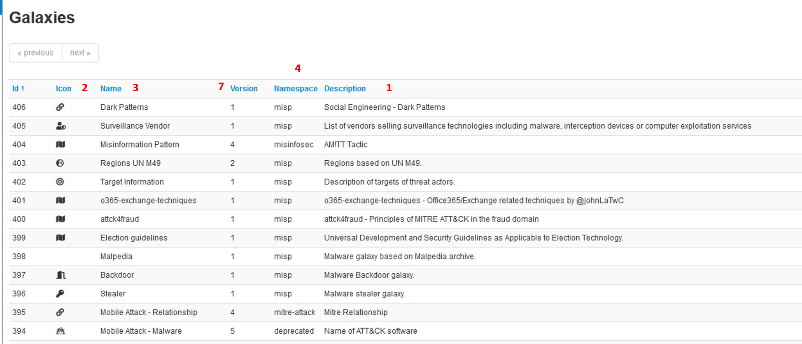

<!-- toc -->

## Galaxies

Galaxies in MISP are a method used to express a large object called cluster that can be attached to MISP events or attributes. A cluster can be composed of one or more elements. Elements are expressed as key-values.

There are default vocabularies available in MISP galaxy but those can be overwritten, replaced or updated as you wish. Vocabularies are from existing standards (like [STIX](https://oasis-open.github.io/cti-documentation/stix/intro), [Veris](http://veriscommunity.net/veris-overview.html), [ATT&CK](https://attack.mitre.org/), MISP and so on) or custom ones you only use for your organization.

Existing clusters and vocabularies can be used as-is or as a template. MISP distribution can be applied to each cluster to permit a limited or broader distribution scheme.

The objective is to have a common set of clusters for organizations starting analysis but that can be expanded to localized information (which is not shared) or additional information (that can be shared).

[MISP galaxy](https://github.com/MISP/misp-galaxy) is available on Github.

### Managing Galaxies in MISP

> [warning] You need to have a specific role to manage Galaxies on a MISP instance.

Galaxies management is accessed using the Galaxies link on the top menu.


A list with all the galaxies existing on the server will appear.


Each galaxy can be explored using the **View** icon at the end of the line.


Here the metadata of the selected galaxy is shown. You also see a table with each available value as well as some complementary data such as a description of the value or the activity (MISP Sightings), that is to say the evolution of the use of each value.

Galaxies can be reimported from the submodules by clicking the "Update Galaxies" link on either the galaxies list or while browsing a specific galaxy. A popup will appear to confirm the reimportation.


All galaxies will always be updated, even while browsing a specific galaxy.

### Adding a custom Galaxy repository in MISP (WiP - notFunctional)

[Fork](https://help.github.com/articles/fork-a-repo/) the [misp-galaxy](https://github.com/MISP/misp-galaxy/) repository to your github account.

Once you have forked the repo you can do the following, assuming you have followed the Standard MISP Install.

```bash
cd /var/www/MISP/app/files/
sudo rm -rf misp-galaxy
# Replace the following line with your fork
sudo -u www-data git clone https://github.com/SteveClement/misp-galaxy.git
```

Once this is done double check if you can still see the Galaxies in the Web UI.

> [warning] This will impact the UI "Update MISP" functionality in administration. Your git head might get [detached](https://git-scm.com/docs/gitglossary#gitglossary-aiddefdetachedHEADadetachedHEAD) in your misp-galaxy repo.

### Adding a new Galaxy (WiP - notFuctional)

#### Context

A galaxy is designed to provide more info than a tag. It comes in two formats: regular or matrix-shape. In a tag, you can only display one label and one color. In a galaxy, you can display:
- name
- synonymous
- description
- categories (for matrix-galaxies)

#### Directory structure

Galaxies are represented by two json files stored in:
```bash
/var/www/MISP/app/files/misp-galaxy/galaxies/mygalaxy.json
/var/www/MISP/app/files/misp-galaxy/clusters/mygalaxy.json
```
The __/galaxies__ file contains metatdatas and galaxy structure.
The __/clusters__ file contains actual data.

__WARNING__: files names are very important: they will be used to chain the files together.
The cluster file is linked to the galaxy file through a json property (__type__) which MUST equal the cluster file name (more later).

#### The galaxy managment GUI



In this windows, you will be able to check all your galaxies and if your newly created ones are OK.

#### The galaxy file
The galaxy file provides the framework for the data stored in the cluster file.
For example:
```bash
{
  "description": "attck4fraud - Principles of MITRE ATT&CK in the fraud domain",
  "icon": "map",
  "kill_chain_order": {
    "fraud-tactics": [
      "Initiation",
      "Target Compromise",
      "Perform Fraud",
      "Obtain Fraudulent Assets",
      "Assets Transfer",
      "Monetisation"
    ]
  },
  "name": "attck4fraud",
  "namespace": "misp",
  "type": "financial-fraud",
  "uuid": "cc0c8ae9-aec2-42c6-9939-f4f82b051836",
  "version": 1
}
```


* __description__: generalities about the galaxy (1)
* __icon__: the icon used in the MISP interface (2)
* __name__: the name of the galaxy (3)
* __namespace__: the namespace where is stored the galaxy. Namespace are used to regroup similar galaxies (4)
* __type__: __IMPORTANT field__, it MUST match the cluster file name to actually chain both files together (5)
* __uuid__: as any MISP object, it has a uuid. __IMPORTANT__, it MUST be repeated in the uuid property of the cluster file (6)
* __version__: as usual in MISP, versioning, especially to force update (7)
* __kill_chain_order__: a special and optionnal field: it will be used if you want to create a matrix-galaxy. In this field, you insert a named table (_fraud-tactics_ in the example above) containing the categories labels of you data. They will be used then in the cluster file (8)

More detail on galaxy fields here: https://tools.ietf.org/html/draft-dulaunoy-misp-galaxy-format-06#page-9

#### The cluster file

The cluster file provides the actual data of the galaxy.
For example (Attck4fraud):
```bash
{
  "authors": [
    "Francesco Bigarella"
  ],
  "category": "guidelines",
  "description": "attck4fraud - Principles of MITRE ATT&CK in the fraud domain",
  "name": "attck4fraud",
  "source": "Open Sources",
  __"type": "financial-fraud",__
  __"uuid": "cc0c8ae9-aec2-42c6-9939-f4f82b051836"__,
  "values": [
    {
      "description": "In the context of ATT&CK for Fraud, phishing is described as the sending of fraudulent emails to a large audience in order to obtain sensitive information (PII, credentials, payment information). Phishing is never targeted to a specific individual or organisation. Phishing tries to create a sense of urgency or curiosity in order to capture the victim.",
      "meta": {
        "detection": "Email sender is spoofed; Email sender belongs to a domain recently created; Presence of typos or poor grammar in the email text; The request in the mail is unsolicited and creates urgency; No recollection of the subject or the sender of the phishing email; Request for credentials; Presence of a suspicious URL or attachment.",
        "examples": [
          "Phishing messages were sent to Amazon users posing as the Amazon customer support",
          "Fake Apple invoices were sent to Apple App Store customers in order to obtain their Apple ID credentials"
        ],
        "external_id": "FT1001",
        "kill_chain": [
          "fraud-tactics:Initiation"
        ],
        "mitigation": "Implementation of DKIM and SPF authentication to detected spoofed email senders; anti-phishing solutions.",
        "refs": [
          "https://blog.malwarebytes.com/cybercrime/2015/02/amazon-notice-ticket-number-phish-seeks-card-details/",
          "https://www.bleepingcomputer.com/news/security/widespread-apple-id-phishing-attack-pretends-to-be-app-store-receipts/"
        ],
        ...
  ],
  "version": 3
}
```


* __authors__: descriptive field (1)
* __category__: descriptive field (2)
* __description__: descriptive field (3)
* __name__: same as in /galaxy file, used in the Matrix display (4)
* __source__: descriptive field (5)
* __type__: IMPORTANT, this field MUST match the /galaxy and /cluster files names AND the type field in the /galaxy file name -5 in above paragraph- (6)
* __uuid__: IMPORTANT, this field MUST match the /galaxy uuid field -6 in above paragraph- (7)
* __values__: a table containing the actual values (8)
* __data fileds__: fields used to describe single data are detailed here: https://tools.ietf.org/html/draft-dulaunoy-misp-galaxy-format-06#page-9 (9)
* __kill_chain__: IMPORTANT, provide the column of the Matrix where the data will be displayed: (10)
    __arg1__: MUST match /galaxy file's kill_chain arg (_fraud-tactics_ in the example)
    __arg2__: name of the column of the data (_Initiation_ in the example)
*__version__: same as for galaxies

More details on /cluster fields can be found here: https://tools.ietf.org/html/draft-dulaunoy-misp-galaxy-format-06#page-9

#### Implementation
* Once your files are ready, ALWAYS submit them in a json validator such as:
https://jsonformatter.curiousconcept.com/

Do it before putting them into your instance, your sanity is at stake.

* Copy/paste your files in both folders (/galaxies and /clusters)

* Go to Galaxies/List galaxies and clic on Update galaxies
w
* Your new galaxy should be displayed on the screen with the others

* Your galaxy is available in the events for selecting in the right namespace

#### Troubleshooting

* __The galaxy does not udpate, galaxy is empty__
    * Check json validation
    * Update version of files
    * Check files names
    * erase the galaxy in the GUI and update

* __Matrix is not displayed__
    * Check the kill_chain_order array in the /galaxies json
    * Check the chaining

#### Example
We will create a galaxy from scratch. To demonstrate MISP can handle any type of use-case, we will not work on malware but on Shadowrun pen and paper RPG.
In this RPG, 2060's large megacorporations launch paramilitary actions against each other. They can belong to 3 main categories (ranked by international standards):
- AAA: extraterritorial corporation and seating at the top-10 council;
- AA: only extraterritorial compagnies;
- A: nation-scale corporation.
A corporation can act in several fields:
- energy
- IT
- biotechnology
- cybertechnology (body enhancement)
It can work on several continent:
- Europe;
- Asia;
- Africa;
- Oceania;
- America.
All these context elements are enough to build a galaxy.

* the galaxy file: galaxies/shadowrun.json

```
{
  "description": "My Shadowrun test galaxy",
  "icon": "user-secret",
  "name": "shadowrun",
  "namespace": "RPG",
  "type": "shadowrun",
  "uuid": "7a956b4d-613c-4c08-b5d6-19974682aea8",
  "version": 1
}
```
Keep the uuid and type, it will be necessary later.

* Check your json
* Click on update and see your work:


* the cluster file: clusters/shadowrun.json

```
{
  "authors": [
    "myself"
  ],
  "category": "RPG",
  "description": "Shadowrun galaxy",
  "name": "shadowrun corporations",
  "source": "Internal",
  "type": "shadowrun",
  "uuid": "7a956b4d-613c-4c08-b5d6-19974682aea8",
  "values": [
    {
      "description": "extraterritorial corporation and seating at the top-10 council.",
      "meta": {
        "Corporate council seat": "Yes",
        "examples": [
          "Renraku",
		  "Shiawase",
		  "Aztechnology",
		  "Ares Macrotechnologies",
          "Saeder Krupps"
        ]                   
      },
      "uuid": "43e1b900-5a03-11ea-9ad1-080027cbfd66",
      "value": "AAA"
    },
    {
      "description": "only extraterritorial compagnies.",
      "meta": {
        "Corporate council seat": "No",
        "examples": [
          "Shibata",
		  "Monobe",
		  "Zeta Impchem",		  
          "ESUS"
        ]                   
      },
      "uuid": "7aad2dd4-5a03-11ea-ad69-080027cbfd66",
      "value": "AA"
    },
    {
      "description": "nation-scale corporation.",
      "meta": {
        "Corporate council seat": "No",
        "examples": [
          "Genom",
		  "KSAF",
		  "Seretech",
		  "Infocore",		  
          "MicroDek (ex-Microsoft)",
		  "Tan Tien"
        ]                   
      },
      "uuid": "7aad2dd4-5a03-11ea-ad69-080027cbfd66",
      "value": "A"
    }    
  ],
  "version": 1
}
```
IMPORTANT: 
* the ""uuid": "7a956b4d-613c-4c08-b5d6-19974682aea8"," is the same in both files
* the cluster filename is the same as the "type" field in the galaxy file
* CHECK YOUR JSON (https://jsonformatter.curiousconcept.com/) AND SAVE YOUR SANITY!

We check the thing by clicking on the update button in the galaxy GUI:


We can test our work on the MISP GUI:


Remark: we created a simple galaxy. We will later see how to create a Matrix-shaped one.


#### Dependencies

To create your own Galaxies the following tools are needed to run the validation scripts.

- jsonschema (>v2.4)
- jq
- moreutils (sponge)

On a Debian flavoured distribution you can potentially do this:

```bash
sudo apt install jq moreutils python3-jsonschema
sudo wget -O /usr/local/bin/jsonschema https://gist.githubusercontent.com/SteveClement/e6ac60e153e9657913000216fc77c6ef/raw/c273ace06ad338d609dd2c84a0a6e215a268ea11/jsonschema
sudo chmod +x /usr/local/bin/jsonschema # This will only work with jsonschema >2.4 (before no CLI interface was available)
```


#### Create a fork

To add your custom Galaxy it is preferable to [fork](https://help.github.com/articles/fork-a-repo/) the [misp-galaxy](https://github.com/MISP/misp-galaxy/) repository. See above for details.

#### Understanding directory structure


#### Removing a Galaxy to better understand the add

Let's start with removing a single Galaxy. 

```bash
cd /var/www/MISP/app/files/misp-galaxy
sudo -u www-data rm galaxies/android.json
sudo -u www-data rm clusters/android.json
sudo -u www-data /var/www/MISP/app/Console/cake Admin updateGalaxies force
```

After this you will have removed the android Galaxy Cluster.


### Using Galaxies in MISP Events - Example

For this example, we will try to add a cluster to an existing event. This cluster contains information about  threat actor known as Sneaky Panda.


Here on the event view, we notice a blue frame under the metadatas with the title "Galaxies" and a button "Add new cluster". Let's click on the latter to begin.


A popup will appear proposising to explore a particular galaxy or all at the same time. Here, as we know we want to as a threat actor, we will choose the second option and scroll to find Sneaky Panda (We are courageous, aren't we?).


Wait. No Sneaky Panda? Hm that's strange. Or maybe it is only registred as a alias. Let's have a look! To do so we will use the search field which stay on top of the list. So what do we get? Beijing Group, is it an alias of our threat actor.


Pointing the cursor on it will give us the answer.


We have a match. So we select it and here we go.


Clicking on the magnifying glass next to Threat actor redirects to the list of all threat actors
Clicking on the magnifying glass next to Beijing Group redirects us to a page about this group
Clicking on the addition symbol on the left of Beijing Group extends the module.

### Available Galaxies

<!-- NB. This list is generated dynamically with gen-doc.sh included in this directory. -->

#### Clusters

[Android](https://github.com/MISP/misp-galaxy/blob/master/clusters/android.json) - Android malware galaxy based on multiple open sources.

[Backdoor](https://github.com/MISP/misp-galaxy/blob/master/clusters/backdoor.json) - A list of backdoor malware.

[Banker](https://github.com/MISP/misp-galaxy/blob/master/clusters/banker.json) - A list of banker malware.

[Botnet](https://github.com/MISP/misp-galaxy/blob/master/clusters/botnet.json) - botnet galaxy

[Branded vulnerability](https://github.com/MISP/misp-galaxy/blob/master/clusters/branded_vulnerability.json) - List of known vulnerabilities and attacks with a branding

[Cert eu govsector](https://github.com/MISP/misp-galaxy/blob/master/clusters/cert-eu-govsector.json) - Cert EU GovSector

[Exploit kit](https://github.com/MISP/misp-galaxy/blob/master/clusters/exploit-kit.json) - Exploit-Kit is an enumeration of some exploitation kits used by adversaries. The list includes document, browser and router exploit kits.It's not meant to be totally exhaustive but aim at covering the most seen in the past 5 years

[Malpedia](https://github.com/MISP/misp-galaxy/blob/master/clusters/malpedia.json) - Malware galaxy cluster based on Malpedia.

[Microsoft activity group](https://github.com/MISP/misp-galaxy/blob/master/clusters/microsoft-activity-group.json) - Activity groups as described by Microsoft

[Mitre attack pattern](https://github.com/MISP/misp-galaxy/blob/master/clusters/mitre-attack-pattern.json) - ATT&CK tactic

[Mitre course of action](https://github.com/MISP/misp-galaxy/blob/master/clusters/mitre-course-of-action.json) - ATT&CK Mitigation

[Mitre enterprise attack attack pattern](https://github.com/MISP/misp-galaxy/blob/master/clusters/mitre-enterprise-attack-attack-pattern.json) - ATT&CK tactic

[Mitre enterprise attack course of action](https://github.com/MISP/misp-galaxy/blob/master/clusters/mitre-enterprise-attack-course-of-action.json) - ATT&CK Mitigation

[Mitre enterprise attack intrusion set](https://github.com/MISP/misp-galaxy/blob/master/clusters/mitre-enterprise-attack-intrusion-set.json) - Name of ATT&CK Group

[Mitre enterprise attack malware](https://github.com/MISP/misp-galaxy/blob/master/clusters/mitre-enterprise-attack-malware.json) - Name of ATT&CK software

[Mitre enterprise attack tool](https://github.com/MISP/misp-galaxy/blob/master/clusters/mitre-enterprise-attack-tool.json) - Name of ATT&CK software

[Mitre intrusion set](https://github.com/MISP/misp-galaxy/blob/master/clusters/mitre-intrusion-set.json) - Name of ATT&CK Group

[Mitre malware](https://github.com/MISP/misp-galaxy/blob/master/clusters/mitre-malware.json) - Name of ATT&CK software

[Mitre mobile attack attack pattern](https://github.com/MISP/misp-galaxy/blob/master/clusters/mitre-mobile-attack-attack-pattern.json) - ATT&CK tactic

[Mitre mobile attack course of action](https://github.com/MISP/misp-galaxy/blob/master/clusters/mitre-mobile-attack-course-of-action.json) - ATT&CK Mitigation

[Mitre mobile attack intrusion set](https://github.com/MISP/misp-galaxy/blob/master/clusters/mitre-mobile-attack-intrusion-set.json) - Name of ATT&CK Group

[Mitre mobile attack malware](https://github.com/MISP/misp-galaxy/blob/master/clusters/mitre-mobile-attack-malware.json) - Name of ATT&CK software

[Mitre mobile attack tool](https://github.com/MISP/misp-galaxy/blob/master/clusters/mitre-mobile-attack-tool.json) - Name of ATT&CK software

[Mitre pre attack attack pattern](https://github.com/MISP/misp-galaxy/blob/master/clusters/mitre-pre-attack-attack-pattern.json) - ATT&CK tactic

[Mitre pre attack intrusion set](https://github.com/MISP/misp-galaxy/blob/master/clusters/mitre-pre-attack-intrusion-set.json) - Name of ATT&CK Group

[Mitre tool](https://github.com/MISP/misp-galaxy/blob/master/clusters/mitre-tool.json) - Name of ATT&CK software

[Preventive measure](https://github.com/MISP/misp-galaxy/blob/master/clusters/preventive-measure.json) - Preventive measures based on the ransomware document overview as published in https://docs.google.com/spreadsheets/d/1TWS238xacAto-fLKh1n5uTsdijWdCEsGIM0Y0Hvmc5g/pubhtml# . The preventive measures are quite generic and can fit any standard Windows infrastructure and their security measures.

[Ransomware](https://github.com/MISP/misp-galaxy/blob/master/clusters/ransomware.json) - Ransomware galaxy based on https://docs.google.com/spreadsheets/d/1TWS238xacAto-fLKh1n5uTsdijWdCEsGIM0Y0Hvmc5g/pubhtml and http://pastebin.com/raw/GHgpWjar

[Rat](https://github.com/MISP/misp-galaxy/blob/master/clusters/rat.json) - remote administration tool or remote access tool (RAT), also called sometimes remote access trojan, is a piece of software or programming that allows a remote "operator" to control a system as if they have physical access to that system.

[Sector](https://github.com/MISP/misp-galaxy/blob/master/clusters/sector.json) - Activity sectors

[Stealer](https://github.com/MISP/misp-galaxy/blob/master/clusters/stealer.json) - A list of malware stealer.

[Tds](https://github.com/MISP/misp-galaxy/blob/master/clusters/tds.json) - TDS is a list of Traffic Direction System used by adversaries

[Threat actor](https://github.com/MISP/misp-galaxy/blob/master/clusters/threat-actor.json) - Known or estimated adversary groups targeting organizations and employees. Adversary groups are regularly confused with their initial operation or campaign.

[Tool](https://github.com/MISP/misp-galaxy/blob/master/clusters/tool.json) - threat-actor-tools is an enumeration of tools used by adversaries. The list includes malware but also common software regularly used by the adversaries.

#### Vocabularies

##### Common

[Certainty level](https://github.com/MISP/misp-galaxy/blob/master/vocabularies/common/certainty-level.json) - Certainty level of an associated element or cluster.

[Sector](https://github.com/MISP/misp-galaxy/blob/master/vocabularies/common/sector.json) - List of activity sectors

[Threat actor type](https://github.com/MISP/misp-galaxy/blob/master/vocabularies/common/threat-actor-type.json) - threat actor type vocab as defined by Cert EU.

[Ttp category](https://github.com/MISP/misp-galaxy/blob/master/vocabularies/common/ttp-category.json) - ttp category vocab as defined by Cert EU.

[Ttp type](https://github.com/MISP/misp-galaxy/blob/master/vocabularies/common/ttp-type.json) - ttp type vocab as defined by Cert EU.

##### threat-actor

[Cert eu motive](https://github.com/MISP/misp-galaxy/blob/master/vocabularies/threat-actor/cert-eu-motive.json) - Motive vocab as defined by Cert EU.

[Intended effect](https://github.com/MISP/misp-galaxy/blob/master/vocabularies/threat-actor/intended-effect.json) - The IntendedEffectVocab is the default STIX vocabulary for expressing the intended effect of a threat actor

[Motivation](https://github.com/MISP/misp-galaxy/blob/master/vocabularies/threat-actor/motivation.json) - The MotivationVocab is the default STIX vocabulary for expressing the motivation of a threat actor.

[Planning and operational support](https://github.com/MISP/misp-galaxy/blob/master/vocabularies/threat-actor/planning-and-operational-support.json) - The PlanningAndOperationalSupportVocab is the default STIX vocabulary for expressing the planning and operational support functions available to a threat actor.

[Sophistication](https://github.com/MISP/misp-galaxy/blob/master/vocabularies/threat-actor/sophistication.json) - The ThreatActorSophisticationVocab enumeration is used to define the default STIX vocabulary for expressing the subjective level of sophistication of a threat actor.

[Type](https://github.com/MISP/misp-galaxy/blob/master/vocabularies/threat-actor/type.json) - The ThreatActorTypeVocab enumeration is used to define the default STIX vocabulary for expressing the subjective type of a threat actor.
