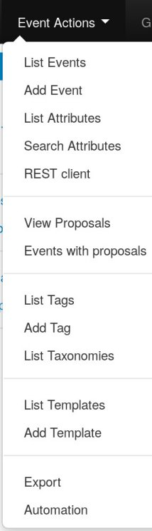
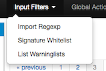
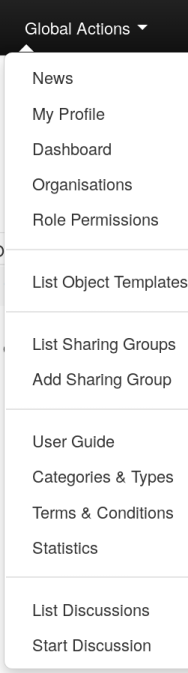
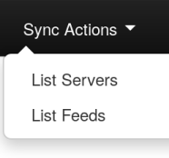
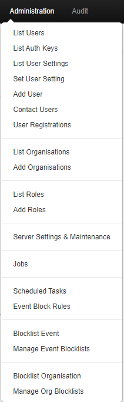
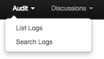

<!-- Nothing else matters -->

<!-- ToDo: Think about other default user roles that need to be considered and documented or at least hinted too. like: the role Read-only and user have these differences, if any -->

## General Layout

### The top bar

#### Simple User

This menu contains all of the main functions of the site as a series of dropdown menus. These contains all (from the current simple user's perspective) accessible functions sorted into several groups.

*   **Home button:** This button will return you to the start screen of the application, which is the event index page (more about this later).
*   **Event Actions:** All the malware data entered into MISP is made up of an event object that is described by its connected attributes. The Event actions menu gives access to all the functionality that has to do with the creation, modification, deletion, publishing, searching and listing of events and attributes.
*   **Galaxies:** Shortcut to the list of [MISP Galaxies](../galaxy/) on the MISP instance.
*   **Input Filters:** Input filters alter what and how data can be entered into this instance. Apart from the basic validation of attribute entry by type, it is possible for the site administrators to define regular expression replacements and blocklists for certain values in addition to blocking certain values from being exportable. Users can view these replacement and blocklist rules here whilst administrator can alter them.
*   **Global Actions:** This menu gives you access to information about MISP and this instance. You can view and edit your own profile, view the manual, read the news or the terms of use again, see a list of the active organizations on this instance and a histogram of their contributions by attribute type.
*   **MISP:** Simple link to your BASEURL
*   **Steve:** Name (Auto generated from Mail address) of current logged in user
*   **Envelope:** Link to User Dashboard where you can consult some of your notifications and changes since last visit. Like some of the proposals recieved for your organisation.
*   **Log out:** The Log out button to end your session immediatly.

#### Admin Menu Bar

*   **Home button:** idem as user.

*   **Event Actions:** ibidem

*   **Galaxies:** You can aditionally update the Galaxies.

*   **Input Filters:** Ibidem

*   **Global Actions:** Ibidem

*   **Sync Actions:** With administrator access rights, shows a list of the connected instances and allows the initiation of a push and a pull (more about the synchronization mechanisms later).

*   **Administration:** Administrators can add, edit or remove user accounts and user roles. Roles define the access rights to certain features such as publishing of events, usage of the REST interface or synchronization of any user belonging to the given role. Site administrators can also access a contact form, through which it is possible to reset the passwords of users, or to just get in touch with them via encrypted e-mails.

*   **Audit:** If you have audit permissions, you can view the logs for your organization (or for site admins for the entire system) here or even search the logs if you are interested in something specific.

*   **MISP:** ibidem

*   **Admin:** ibidem

*   **Envelope:** Link to User Dashboard where you can consult some of your notifications and changes since last visit. Like some of the proposals recieved for your organisation.

*   **Log out:** The Log out button to end your session immediatly.

### A list of the contents of each of the above drop-down menus

##### Event actions

*   **List Events:** Lists all the events in the system that are not private or belong to your organisation. You can add, modify, delete, publish or view individual events from this view.

*   **Add Event:** Allows you to fill out an event creation form and create the event object, which you can start adding attributes.

*   **List Attributes:** Lists all the attributes in the system that are not private or belong to your organisation. You can modify, delete or view each individual attribute from this view.

*   **Search Attributes:** You can set search terms for a filtered attribute index view here.

*   **REST client** MISP Online REST client where you can make calls directly to the API via a Web UI.

*   **View Proposals:** Shows a list of all proposals that you are eligible to see.

*   **Events with proposals:** Shows all of the events created by your organisation that has pending proposals.

*   **List Tags:** List all the tags that have been created by users with tag creation rights on this instance.

*   **Add Tag:** Create a new tag.

*   **List Taxonomies:** List all of the taxonomies installed on the MISP instance. This is also the place to activate the taxonomies as a Org Admin/Site Admin.

*   **List Templates:** List all of the templates created by users with template creation rights on this instance.

*   **Add Template:** Create a new template.

*   **Export:** Export the data accessible to you in various formats.

*   **Automation:** If you have authentication key access, you can view how to use your key to use the REST interface for automation here.

##### Input filters

*   **Import Regexp:** You can view the Regular Expression rules, which modify the data that can be entered into the system. This can and should be used to help filter out personal information from automatic imports (such as removing the username from windows file paths), having unified representation for certain common values for easier correlation or simply standardizing certain input. It is also possible to block certain values from being inserted. As a site administrator or a user with regex permission, you can also edit these rules.

*   **Signature Allowlist:** You can view the allowlist rules, which contains the values that are blocked from being used for exports and automation on this instance. Site administrators have access to editing this list.

*  **List Warninglists:** MISP warninglists are lists of well-known indicators that can be associated to potential false positives, errors or mistakes. The warning lists are integrated in MISP to display an info/warning box at the event and attribute level.

*  **List Noticelists:** MISP noticelists are lists of #Todo: Double check description from repo!!!

##### Global Actions

*   **News:** Read about the latest news regarding the MISP system

*   **My Profile:** Manage your user account.

*   **Dashboard:** allow you to see your Notifications of Proposals, Events with proposals and Delegation request. Your can see the last changes since your last visit, as Events updates and Events publications.

*   **Organizations:** View the organizations having a presence on this instance, with some useful informations as contact's name.

*   **Role Permissions:** You can view the role permissions here.

*  **List Sharing Groups:** You can view the list of existing Sharing Groups who you or your organization have access.

*  **Add Sharing Group:** You can create a sharing group.

*   **User Guide:** A link to this user guide.

*   **Categories & Types:** Quick overview of Attribute Categories and Type. e.g: md5 -> Payload delivery, Artifacts dropped, Payload installation, External analysis

*   **Terms & Conditions:** General terms and conditions which can be configured in Administration -> Server Settings -> MISP Settings: MISP.terms_file . From the UI: "The filename of the terms and conditions file. Make sure that the file is located in your MISP/app/files/terms directory"

*   **Statistics:** View a series of statistics about the users and the data on this instance.

*   **List Discussions:** List threads of discussions created on the MISP instance by the organisations connected to this local community.

*   **Start Discussion:** Create a new discussion thread.
<!-- #ToDo: Make a reference to best practices on how to use this form of messaging. Sense/non-sense etc... -->

##### Sync Actions

*   **List Servers:** Connect your MISP instance to other instances, or view and modify the currently established connections.

<!-- Include example of error message/stack trace differences. -->

*  **List Feeds:** Follow the RSS feeds of other organization or CERTs worldwide.  

##### Administration

*   **List Users:** View, modify or delete the currently registered users.

*   **Add User:** Create an account for a new user for your organisation. Site administrators can create users for any organisation.

*  **Contact Users:** You can use this view to send messages to your current or future users or send them a temporary password.

When adding a new user to the system, or when you want to manually reset the password for a user, just use the "Send temporary password" setting.

After selecting the action, choose who the target of the e-mails should be (all users, a single user or a user not yet in the system).

You can then specify (if eligible) what the e-mail address of the target is (for existing users you can choose from a dropdown menu).

In the case of a new user, you can specify the future user's GnuPG key, to send his/her new key in an encrypted e-mail.

The system will automatically generate a message for you, but it is also possible to write a custom message if you tick the check-box, but don't worry about assigning a temporary password manually, the system will do that for you, right after your custom message.

*  **List Organisations:** View the organizations having a presence on this instance, with some useful informations.

*  **Add Organisation:**

*   **List Roles:** List, modify or delete currently existing roles.

*   **Add Role:** Create a new role group for the users of this instance, controlling their privileges to create, modify, delete and to publish events and to access certain features such as the logs or automation.

*   **Server Settings & Maintenance:** Various tools, upgrade scripts that can help a site-admin run the instance & Set up and diagnose your MISP installation.

*   **Jobs:** View the background jobs and their progress

*   **Scheduled Tasks:** Schedule the pre-defined tasks for your instance (this currently includes export caching, server pull and server push).

*   **Blocklist Event:** Link to form where you can quickly add an event to a blocklist with it's UUID.
<!-- #Todo: Double check if blocklists and their impacts are explained at all -->

*   **Manage Event Blocklists:** List of blocklisted events on MISP instance.

*   **blocklist Organisation:** Link to for where you can quickly add an organisation to a blocklist with it's UUID.

<!-- #Todo: Double check if blocklists and their impacts are explained at all -->

*   **Manage Org blocklists:** List of blocklisted Organisations on this instance.

##### Audit

*   **List Logs:** View the logs of the instance.
*   **Search Logs:** Search the logs by various attributes.

### The left bar

This bar changes based on each page-group. The blue selection shows you what page you are on.
