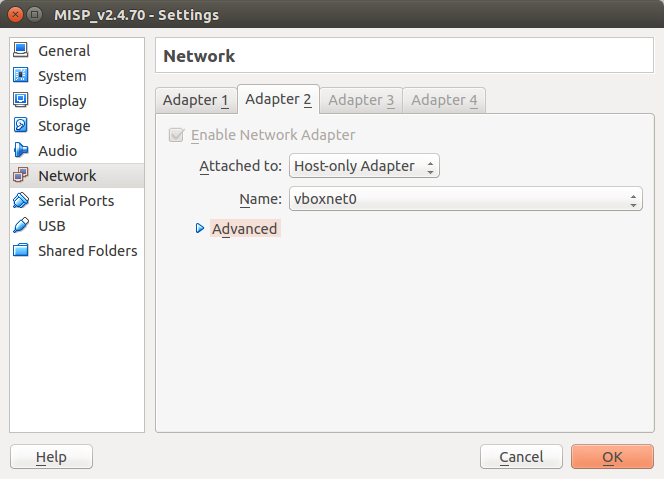
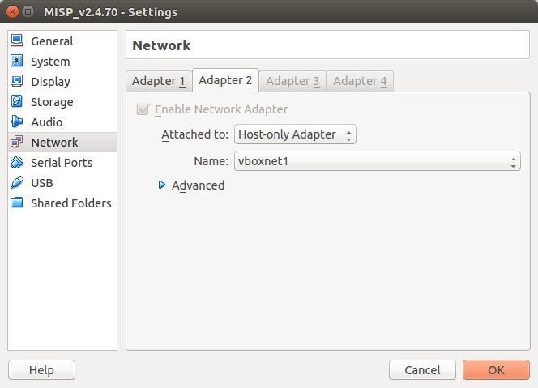

## Get your own MISP instance

The intention of this chapter is to support you in getting your own MISP instance up and running.

### MISP Virtual Machine

CIRCL maintains the image of a recent MISP virtual machine online.

This is a very easy out of the box solution, optimized for product evaluation and to support trainings hold by CIRCL staff.

The images is updated on a regular base. You should frequently re-visit the online resources to get the latest versions including bug fixes and new features.

#### MISP VM Download

The best place to get the latest version of the MISP virtual machine, as well as all the available training materials is the [MISP training materials page] [1] on the CIRCL website.

If you do not remember the direct link to the MISP training materials here are the very easy to remember step you have to follow to reach the right place:

1. Access the [CIRCL homepage] [2]
2. Navigate to the [Training area] [3]
3. Click [MISP Malware Information Sharing Platform - Threat Sharing] [4]
4. Follow the link to the [Training materials freely available] [1]

Download the image of the virtual machine and validate the SHA512 fingerprint.

#### Import Appliance

In VirtualBox use the "Import Appliance..." functionality to import the virtual machine.

The instructions in this manual covers VirtualBox only. If you prefer another virtualization solution like VMWare you can find some quick instruction on the [MISP training materials page] [1].

#### MISP VM Credentials

The MISP image is pre-configured to be reachable on the private IP address **192.168.56.50** by SSH. The GUI is reachable by **http://192.168.56.50/**.

You should have two interfaces on your VirtualBox configuration (NAT and host-only). You can also configure access to the MISP instance by doing port forwarding on the NAT interface.

MISP credentials:

*   **GUI Admin:** admin@admin.test:admin  (it's the site admin account with full rights, feel free to create other users)
*   **Shell/SSH:** misp : Password1234

#### Potential issues

During life trainings we see in rare cases that some users could not reach the virtual machine over the virtual network.

Some investigations discover that this always happens with user whom already had VirtualBox in use before and had already one or more **Host-only Adapter** configured in advance.

The MISP image is pre-configured to use **Host-only Adapter** with the Name **vboxnet0**.

If this is already occupied by previous VirtualBox projects, try to attach the network adapter to the next available **Host-only** network.

[1]: https://www.circl.lu/services/misp-training-materials/ "MISP training materials page"
[2]: https://www.circl.lu/ "CIRCL homepage"
[3]: https://www.circl.lu/services/training/ "Training area"
[4]: https://www.circl.lu/services/training/#misp-malware-information-sharing-platform-threat-sharing "Malware Information Sharing Platform"

