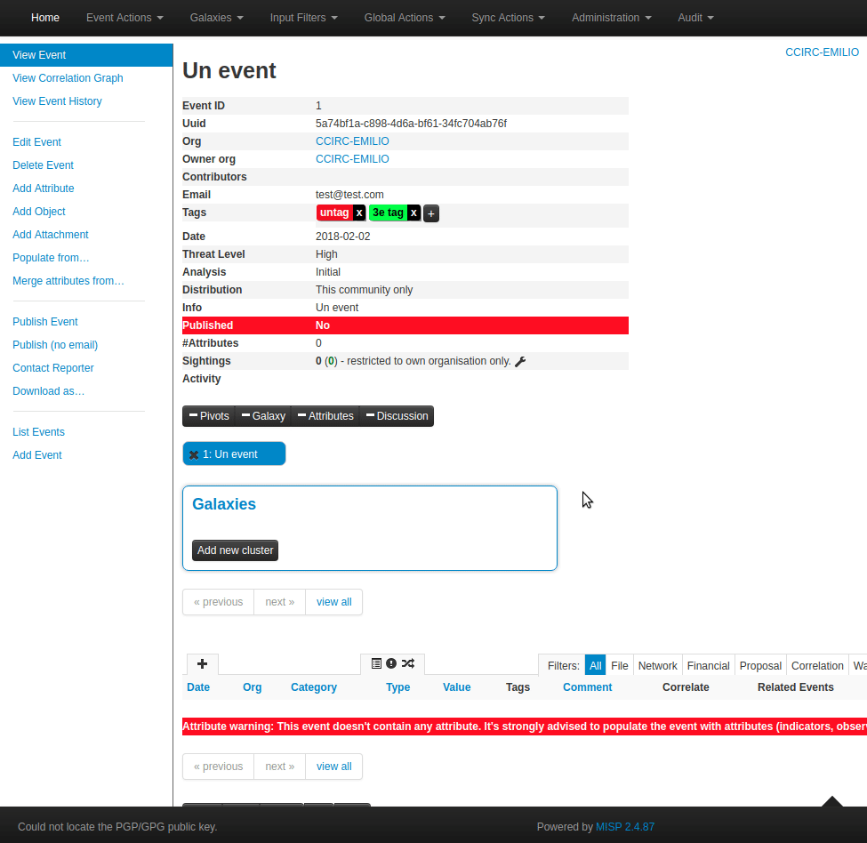
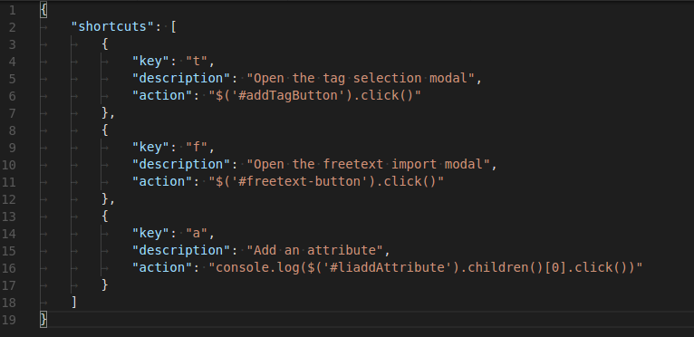
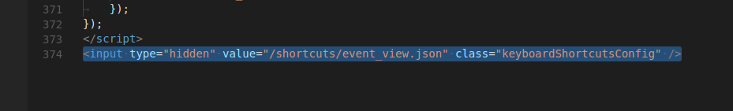

<!-- toc -->

# Keyboard shortcuts in MISP

MISP has keyboard shortcuts managed using JSON files.
To see the list of shortcuts for a given page, press the small black triangle at the bottom right of the page.
**Demo:**

**Q: Is it possible to customize the shortcuts in the GUI once they are there?**
**A:** Not at the moment.

**Q: How do I add keyboard shortcuts to my MISP instance?**
**A:**
1. Add a JSON file in `app/webroot/shortcuts` named after the page from which it will be included (for example `event_view.json`).
2. Set your shortcuts using this format: 

(`action` field is JS code) 

2. Include the keyboard shortcut config in the `.ctp` file you wish it to be used in using an `input type="hidden"` tag like this: 

3. Test your shortcuts.