<!-- toc -->

## Managing feeds

:warning: You need to be at least site admin to perform these actions.
To do so, you first need to access the list of feeds, using the top menu.

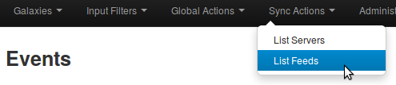

### Adding feeds

Then select the add feed option on the side menu.

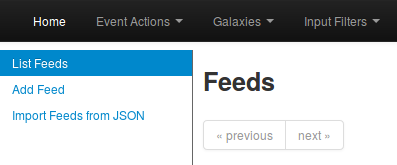

Here you will have access to a dynamic form. Let's check each field by order.

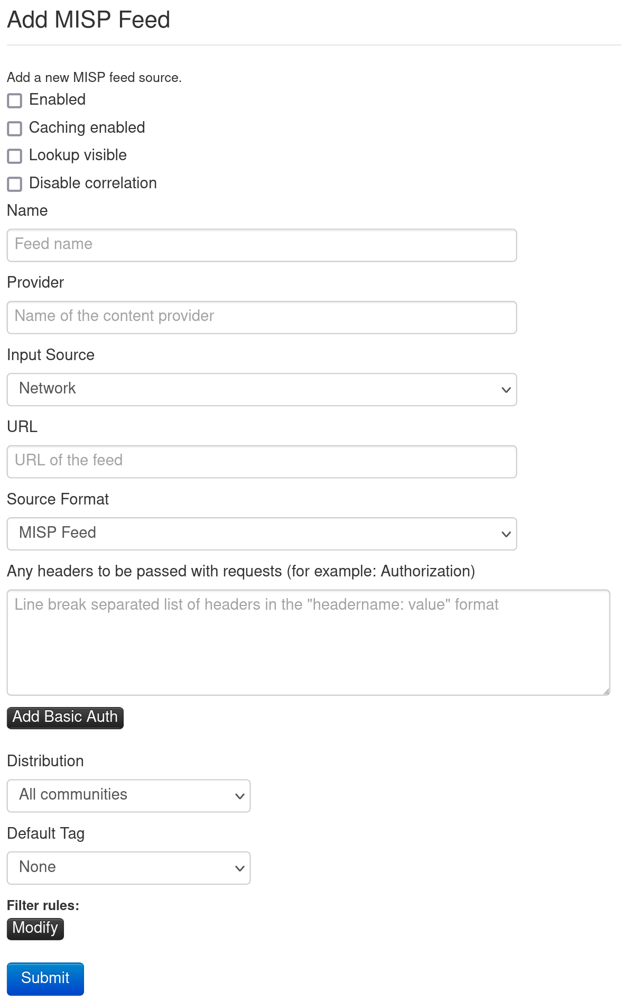

* Enabled: Is the feed active or not
* Name: Just a name to identify the feed
* Provider: Name of the content provider
* Input Source: Where does the input come from  
  
  * Network: hosted somewhere outside the platform
  * Local: Hosted on the local server. On this case, a new choice will appear:
   * Remove input after ingestion: As implied, if checked, the source is deleted after usage
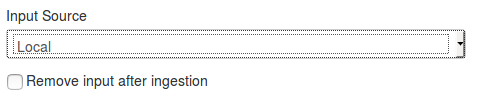

* Url: Url of the feed, where it is located

* The Source Format can be:  
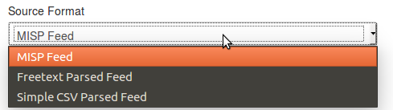
  * MISP Feed: The source points to a list of json formated like MISP events.  
  Example: https://www.circl.lu/doc/misp/feed-osint

  * Freetext Parsed Feed:  
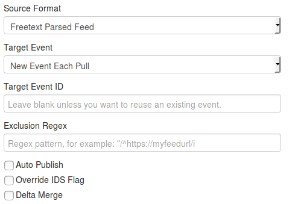
   * Target Event: Which will be the event getting updated with the data from the feed. Can be either "New Event Each Pull" (A new event will be created each time the feed is pulled) or "Fixed Event" (A unique event will be updated with the new data. This event is determined by the next field)  
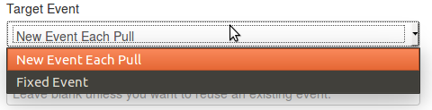
   * Target Event ID: The id of the event where the data will be added (if not set, the field will be set the first time the feed is fetched) 
   * Exclusion Regex: Add a regex pattern for detecting iocs that should be skipped (this can be useful to exclude any references to the actual report / feed for example)
   * Auto Publish: If checked, events created thanks to the feed will be automatically published
   * Override IDS Flag: If checked, the IDS flag will be set to false
   * Delta Merge: If checked, only data coming from the last fetch are kept, the old ones are deleted.

  * Simple CSV Parsed Feed:  
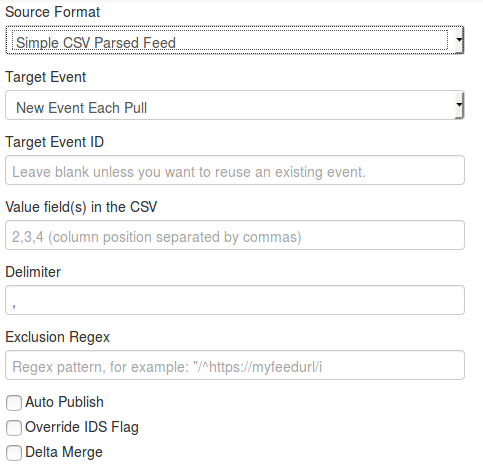
   * Target Event: Which will be the event getting updated with the data from the feed. Can be either "New Event Each Pull" (A new event will be created each time the feed is pulled) or "Fixed Event" (A unique event will be updated with the new data. This event is determined by the next field)  
   * Target Event ID: The id of the event where the data will be added (if not set, the field will be set the first time the feed is fetched) 
   * Exclusion Regex: Add a regex pattern for detecting iocs that should be skipped (this can be useful to exclude any references to the actual report / feed for example)
   * Value field(s) in the CSV: Select one or several fields that should be parsed by the CSV parser and converted into MISP attributes
   * Delimiter: Set the default CSV delimiter (default = ",")
   * Auto Publish: If checked, events created thanks to the feed will be automatically published
   * Override IDS Flag: If checked, the IDS flag will be set to false
   * Delta Merge: If checked, only data coming from the last fetch are kept, the old ones are deleted.

* Distribution: Define the distribution option that will be set on the event created by the feed

* Default Tag: A default tag can be added to the created event(s)

* Filter rules: Here you can define which tags or organisations are allowed or blocked.  
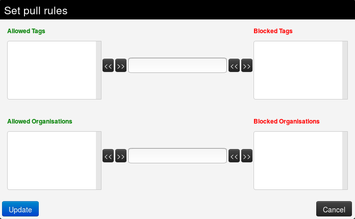

To add a tag (resp. organisation), first type it into the top middle (resp. bottom middle) text field . Then use the arrows that point to the outside to add it to the allowed or blocked tags (resp. organisations) list.  
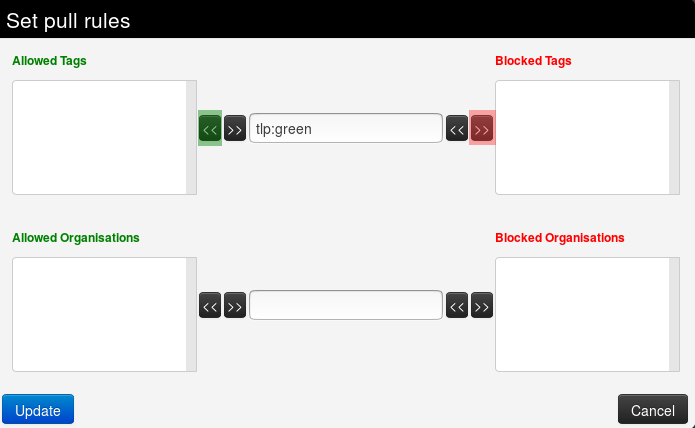  

To remove a tag (resp. organisation), select it in the list and click on the arrow pointing to the inside.  
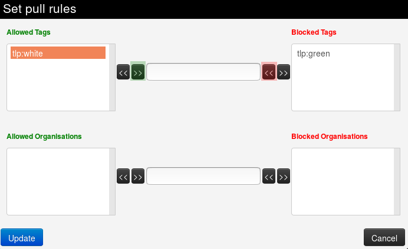  
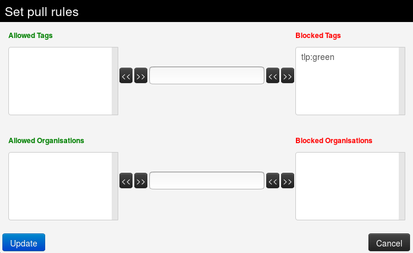
