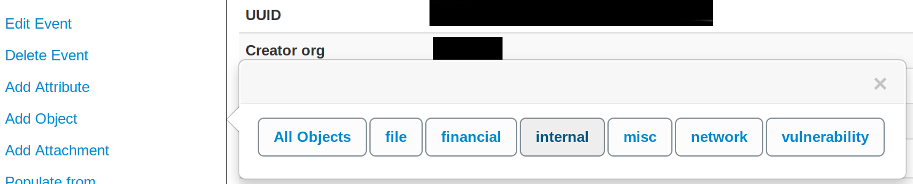
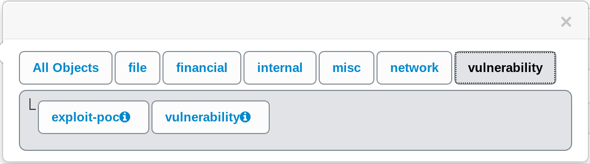
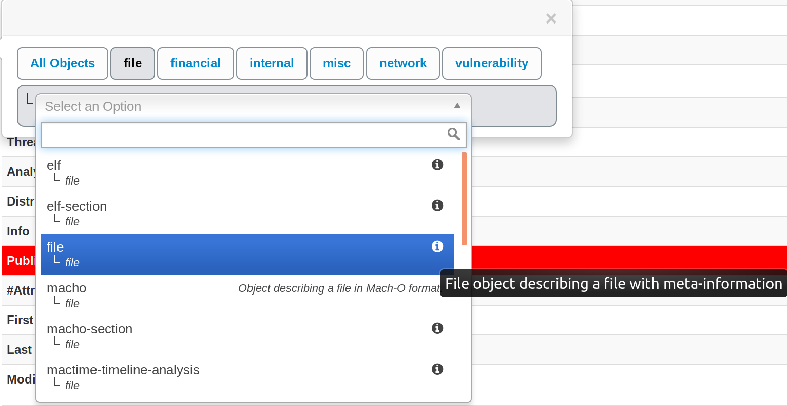
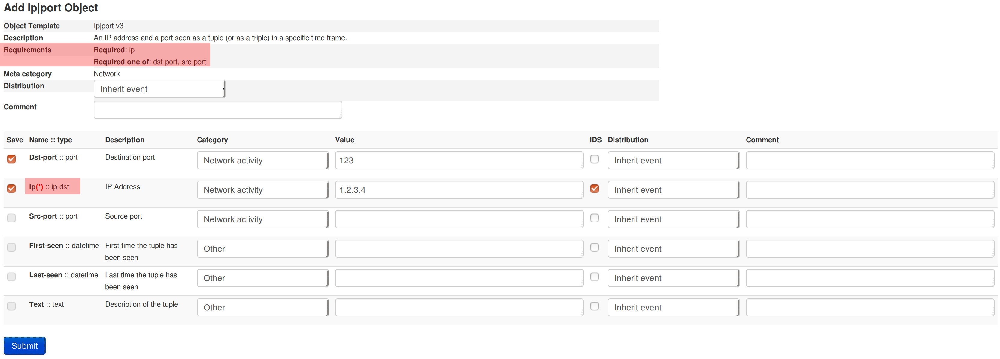
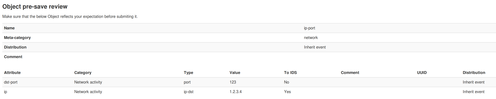

<!-- toc -->

# MISP Objects

[MISP objects](https://github.com/MISP/misp-objects) to be used in MISP (2.4.80) system and can be used by other information sharing tool. MISP objects are in addition to MISP attributes to allow advanced combinations and concatenation of attributes. The creation of these objects and their associated attributes are based on real cyber security use-cases and existing practices in information sharing.

## Using objects

Objects can be added by using the side menu:  

This will open a popup where you can choose the type of object:  
  
If there are only few templates available for this type, they will all be shown this way:

Otherwise you will be able to search and select the desired object within a scrolling list (a search field is available)
 
A description of each object is shown by hovering the info icon or directly besides it.

For this example we will try to add an ip|port object:  
  
Note: This screenshot displays an old version of the template
For some objects, there might be attributes that required to be set. For instance in this object, there is a required attribute, "Ip", and it is also required to set one of the attributes between "dst-port" and "src-port". If these requirements are not met, the object will not be valid and therefore not added to the event. Also you can't add an object without setting any attribute.   

After pressing "Submit, you are given the possibility to review your object before saving it.  

## Creating object

An object is designed using a JSON file which should respect a format described in [this document](https://github.com/MISP/misp-objects/blob/master/schema_objects.json).

An object is basically a combination of two or more attributes that can be used together to represent real cyber security use-cases. These attributes are listed in a JSON object.

Each attribute is an JSON object defined by a name, a description, a misp-attribute and an ui-priority value.
- Name and description are self-explanatory.
- misp-attribute is an existing type of attribute in misp that matches the attribute.
- Concerning ui-priority, the higher the number is, the most it is expected to be seen.

There are also others options that can be added to define an attribute more precisely.
- sane_default is a list of default valid value for this attribute. The user can pick a value from this list or choose "Enter value manually"
- disable_correlation will disable correlation for this value. Useful for dates for instance
- recommended value for this field
- multiple, if set to true, allow the user to add multiple instances of this attribute.

Not all attributes are mandatory, but some can be required. If so, they need to be listed in a list called "required". The object will only be valid if the listed attributes are set.
The same way, there are sometimes when only one attribute in a set is needed. This set can be put in a list called "requiredOneOf". If at least one of the attributes in this list is set, the object will be valid.
