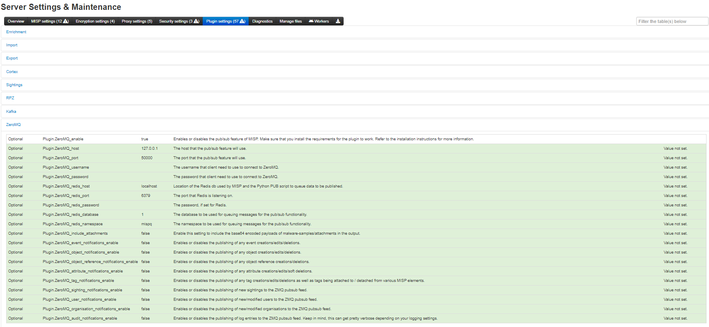
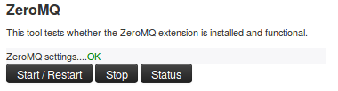

<!-- toc -->

## MISP ZeroMQ

MISP includes a flexible publish-subscribe model to allow real-time integration of the MISP activities (event publication, attribute creation or removal, sighting).
The MISP ZeroMQ plugin operates at global level in MISP which means standard distribution rules don't apply and every activities will be published within the ZeroMQ pub-sub
channels.

MISP ZeroMQ functionality can be used for various model of integration or to extend MISP functionalities:

- real-time search of indicators into a SIEM
- automatic expansion
- dashboard activities
- logging mechanisms
- continuous indexing
- custom software or scripting

The following notification topic channels exist and can be included in the MISP ZeroMQ pub-sub:

- `misp_json` - events published
- `misp_json_attribute` - attribute updated or created
- `misp_json_sighting` - sighting added to an attribute or an event
- `misp_json_user` - user updates or creation
- `misp_json_organisation` - organisation updates or creation
- `misp_json_self` -  keep-alive messages sent every minute

### MISP ZeroMQ configuration

To enable MISP ZeroMQ, the feature must be enabled in the Plugin setting tab.

Prior to enabling it, make sure that you have the pyzmq installed by running

~~~~
sudo pip install pyzmq
~~~~



Each notification channels can be enabled (from event publication to sightings), the MISP site admin can decide which type of message to publish.

By default, the ZMQ pub-sub channel is available to localhost only on TCP port 50000. The binding of the pub-sub channel can be updated in the
configuration interface as shown above

### MISP ZeroMQ debugging and testing

In the diagnostic section, ZeroMQ service can be started and stopped. There is a small status option to give
information about the numbers of events processed by the service.



### Testing with sub.py tool

A simple command line tool is included with MISP to connect to the MISP ZeroMQ channel and get the notifications:

~~~~
python3 sub.py --help
usage: sub.py [-h] [-s] [-p PORT] [-r HOST] [-o ONLY] [-t SLEEP]

Generic ZMQ client to gather events, attributes and sighting updates from a
MISP instance

optional arguments:
  -h, --help            show this help message and exit
  -s, --stats           print regular statistics on stderr
  -p PORT, --port PORT  set TCP port of the MISP ZMQ (default: 50000)
  -r HOST, --host HOST  set host of the MISP ZMQ (default: 127.0.0.1)
  -o ONLY, --only ONLY  set filter (misp_json, misp_json_attribute or
                        misp_json_sighting) to limit the output a specific
                        type (default: no filter)
  -t SLEEP, --sleep SLEEP
                        sleep time (default: 2)
~~~~

The `sub.py` will output the JSON objects for the subscribed topic, by default, all the topic channels are dumped:

~~~~
misp@cpeb:/var/www/MISP/tools/misp-zmq$ python3 -u sub.py  | jq .
....
{
  "uptime": 50,
  "status": "And when you're dead I will be still alive."
}
{
  "uptime": 60,
  "status": "And believe me I am still alive."
}
{
  "uptime": 70,
  "status": "I'm doing science and I'm still alive."
}
{
  "uptime": 80,
  "status": "I feel FANTASTIC and I'm still alive."
}
{
  "uptime": 90,
  "status": "While you're dying I'll be still alive."
}
{
  "Sighting": {
    "uuid": "592d9588-fda0-490f-bf6e-4e56950d210f",
    "source": "",
    "type": "0",
    "date_sighting": 1496159624,
    "org_id": "2",
    "event_id": "8102",
    "attribute_id": "1044812"
  }
}
{
  "Attribute": {
    "id": "1044802",
    "value2": "",
    "value1": "1.2.3.4",
    "uuid": "592d8494-7120-4760-b5e2-4858950d210f",
    "batch_import": "0",
    "comment": "",
    "value": "1.2.3.4",
    "type": "ip-dst",
    "to_ids": 0,
    "timestamp": 1496155284,
    "distribution": "5",
    "sharing_group_id": 0,
    "deleted": "0",
    "disable_correlation": "0",
    "event_id": "8100",
    "category": "Network activity"
  }
}
....
~~~~

### Notification Schemas
Each notification channel uses a slightly different JSON schema. Consult this section to identify which MISP components exist in a channel:
#### misp_json - events published
When an event is published to ZMQ (which is different from being published in MISP) the ZMQ notification will just contain the MISP event data along with all its component children.
These components include:
  * A list of attributes
  * A list of objects, which contain their own lists of attributes
  * A list of related events - added when attributes in separate events correlate
  * Any galaxies that this event belongs to
  * A list of tags that apply to the event

Example:
```
{
    "Event": {
        "id": "625",
        "orgc_id": "2",
        "org_id": "1",
        "date": "2017-05-24",
        "threat_level_id": "3",
        "info": "M2M - Fwd: IMG_3428.pdf",
        "published": false,
        "uuid": "59259036-fcd0-4749-8a6c-4d88950d210f",
        "attribute_count": "7",
        "analysis": "1",
        "timestamp": "1505755565",
        "distribution": "3",
        "proposal_email_lock": false,
        "locked": false,
        "publish_timestamp": "1505416766",
        "sharing_group_id": "0",
        "disable_correlation": false,
        "Org": {"id": "1", "name": "MISP", "uuid": "56ef3277-1ad4-42f6-b90b-04e5c0a83832"},
        "Orgc": {"id": "2", "name": "CIRCL", "uuid": "55f6ea5e-2c60-40e5-964f-47a8950d210f"},
        "Attribute": [
            {
                "id": "157835",
                "type": "attachment",
                "category": "Artifacts dropped",
                "to_ids": false,
                "uuid": "59259037-1014-4669-96b1-46af950d210f",
                "event_id": "625",
                "distribution": "5",
                "timestamp": "1495633975",
                "comment": "IMG_3428.pdf",
                "sharing_group_id": "0",
                "deleted": false,
                "disable_correlation": false,
                "object_id": "0",
                "object_relation": null,
                "value": "tmpzuni0skf",
                "ShadowAttribute": []
            }
        ],
        "ShadowAttribute": [],
        "RelatedEvent": [],
        "Galaxy": [],
        "Object": [
            {
                "id": "1",
                "name": "http-request",
                "meta-category": "network",
                "description": "A single HTTP request header",
                "template_uuid": "b4a8d163-8110-4239-bfcf-e08f3a9fdf7b",
                "template_version": "1",
                "event_id": "625",
                "uuid": "59c0016c-0984-4779-9688-05b8c0a83832",
                "timestamp": "1505755500",
                "distribution": "5",
                "sharing_group_id": "0",
                "comment": "",
                "deleted": false,
                "ObjectReference": [],
                "Attribute": [
                    {
                        "id": "164371",
                        "type": "http-method",
                        "category": "Network activity",
                        "to_ids": false,
                        "uuid": "59c0016c-a744-440d-ad92-05b8c0a83832",
                        "event_id": "625",
                        "distribution": "5",
                        "timestamp": "1505760143",
                        "comment": "",
                        "sharing_group_id": "0",
                        "deleted": false,
                        "disable_correlation": false,
                        "object_id": "1",
                        "object_relation": "method",
                        "value": "POST",
                        "ShadowAttribute": []
                    },
                    {
                        "id": "164372",
                        "type": "uri",
                        "category": "Network activity",
                        "to_ids": true,
                        "uuid": "59c0016c-fac0-4055-9f3d-05b8c0a83832",
                        "event_id": "625",
                        "distribution": "5",
                        "timestamp": "1505755500",
                        "comment": "",
                        "sharing_group_id": "0",
                        "deleted": false,
                        "disable_correlation": false,
                        "object_id": "1",
                        "object_relation": "uri",
                        "value": "\/test.php",
                        "ShadowAttribute": []
                    }
                ]
            }
        ],
        "Tag": [{"id": "2", "name": "tlp:white", "colour": "#ffffff", "exportable": true, "hide_tag": false}]
    }
}
```
#### misp_json_attribute - attribute updated or created
The attributes appear to have the most diversity depending on the action applied to them.

When an attribute gets created, just the attribute gets sent out via ZMQ. Its parent event id is sent inside the attribute JSON, but there is no extra event metadata like there is when an attribute is deleted or modified.

Create Example:
```
{
    "Attribute": {
        "to_ids": "1",
        "timestamp": 1505235275,
        "distribution": "5",
        "deleted": "0",
        "disable_correlation": "0",
        "event_id": "625",
        "category": "Network activity",
        "type": "domain",
        "value": "microsoft.net",
        "comment": "",
        "batch_import": "0",
        "uuid": "59b8114b-1c80-4149-be3a-03e9c0a83832",
        "sharing_group_id": 0,
        "value1": "microsoft.net",
        "value2": "",
        "id": "164363"
    }
}
```

Edited attribute notifications send metadata about their parent events and information about the attribute's sharing group, attribute-level tags, and sightings data.
It's important to note that only the new value of the edited attribute is sent along the ZMQ channel. In order to diff the new and old values, you'd have to have a copy of the old attribute value stored somewhere and can use the attribute's `uuid` key (which never changes) to correlate the new and old values.

Edit Example:
```
// microsoft.net --> microsoft.com
{
    "Attribute": {
        "id": "164363",
        "event_id": "625",
        "category": "Network activity",
        "type": "domain",
        "value1": "microsoft.com",
        "value2": "",
        "to_ids": "1",
        "uuid": "59b8114b-1c80-4149-be3a-03e9c0a83832",
        "timestamp": 1505235283,
        "distribution": "5",
        "sharing_group_id": 0,
        "comment": "",
        "deleted": false,
        "disable_correlation": false,
        "value": "microsoft.com",
        "batch_import": "0"
    },
    "Event": {
        "id": "625",
        "org_id": "1",
        "date": "2017-05-24",
        "info": "M2M - Fwd: IMG_3428.pdf",
        "user_id": "1",
        "uuid": "59259036-fcd0-4749-8a6c-4d88950d210f",
        "published": false,
        "analysis": "1",
        "attribute_count": "5",
        "orgc_id": "2",
        "timestamp": "1505235275",
        "distribution": "3",
        "sharing_group_id": "0",
        "proposal_email_lock": false,
        "locked": false,
        "threat_level_id": "3",
        "publish_timestamp": "1505233367",
        "disable_correlation": false
    },
    "SharingGroup": {
        "id": null,
        "name": null,
        "releasability": null,
        "description": null,
        "uuid": null,
        "organisation_uuid": null,
        "org_id": null,
        "sync_user_id": null,
        "active": null,
        "created": null,
        "modified": null,
        "local": null,
        "roaming": null
    },
    "AttributeTag": [],
    "Sighting": []
},
```

When an attribute gets deleted, the `deleted` key gets set to `1`, and the attribute's event metadata gets sent alongside it.

Delete Example:
```
{
    "Attribute": {
        "id": "164362",
        "event_id": "625",
        "category": "Network activity",
        "type": "domain",
        "value1": "microsoft.com",
        "value2": "",
        "to_ids": true,
        "uuid": "59b81121-f4b4-4ed3-aa43-03eac0a83832",
        "timestamp": 1505235262,
        "distribution": "5",
        "sharing_group_id": 0,
        "comment": "",
        "deleted": 1,
        "disable_correlation": false,
        "value": "microsoft.net"
    },
    "Event": {
        "id": "625",
        "org_id": "1",
        "date": "2017-05-24",
        "info": "M2M - Fwd: IMG_3428.pdf",
        "user_id": "1",
        "uuid": "59259036-fcd0-4749-8a6c-4d88950d210f",
        "published": false,
        "analysis": "1",
        "attribute_count": "5",
        "orgc_id": "2",
        "timestamp": "1505235233",
        "distribution": "3",
        "sharing_group_id": "0",
        "proposal_email_lock": false,
        "locked": false,
        "threat_level_id": "3",
        "publish_timestamp": "1505233367",
        "disable_correlation": false
    }
}
```
#### misp_json_sighting - sighting added to an attribute or an event
The message sent for sightings is fairly simple, with the type of sighting (0 = Addition, 1 = False Positive), the date (in seconds-since-epoch format), the id of the attribute it applies to, and the id of the attribute's parent event.

Addition Example:
```
{
    "Sighting": {
        "type": "0",
        "attribute_id": "164373",
        "event_id": "625",
        "org_id": "1",
        "date_sighting": 1505767537,
        "source": "",
        "uuid": "59c03071-f480-4311-a710-03edc0a83832",
        "id": "1"
    }
}
```

False Positive Example:
```
{
    "Sighting": {
        "type": "1",
        "attribute_id": "164373",
        "event_id": "625",
        "org_id": "1",
        "date_sighting": 1505767543,
        "source": "",
        "uuid": "59c03077-d560-4a8b-b841-05b8c0a83832",
        "id": "2"
    }
}
```
#### misp_json_user - user updates or creation
An update is sent through ZMQ when users log in. There are actually two messages in this - both being fairly sparse.
The `current_login` message just contains who logged in and what time (in seconds-since-epoch format) it happened. The `last_login` message contains who just logged in, what time the login occurred (technically the date the record was modified, but it's modified when the user logs in, so it appears to be interchangeable in this case), and what time the user last logged in.

Login Example:
```
{
    "User": {
        "id": "1",
        "last_login": "1000046766",
        "date_modified": 1000060160
    }
}
{
    "User": {
        "id": "1",
        "current_login": 1000060160,
        "date_modified": 1000060160
    }
}
```

When a user gets created, all of the information about the user (id, email, base64 encoded GnuPG key, role, etc.) gets sent along ZMQ. If this information is modified, the same JSON will be sent along the ZMQ channel, with updated values.
For example, if the below user is disabled, the same JSON will be sent, but the `disabled` key will be set to `"1"`

User Creation and User Edit Example:
```
{
    "User": {
        "server_id": 0,
        "autoalert": "1",
        "invited_by": "1",
        "nids_sid": 5976699,
        "termsaccepted": 0,
        "role_id": "3",
        "change_pw": 1,
        "contactalert": "1",
        "disabled": "0",
        "current_login": "0",
        "last_login": "0",
        "force_logout": "0",
        "email": "user@testemail.com",
        "enable_password": "0",
        "org_id": "1",
        "authkey": "__<redacted>__",
        "gpgkey": "__<redacted>__",
        "notify": "1",
        "date_created": 1000000000,
        "date_modified": 1000000000,
        "newsread": 0,
        "certif_public": "",
        "id": "4"
    }
}
```
#### misp_json_organisation - organisation updates or creation
Org notifications are sent when Orgs are updated and created, but not deleted. They are generally the same, except the fields `created_by` and `date_created` are present when an Org is created.

Creation Example:
```
{
    "Organisation": {
        "created_by": "1",
        "local": "1",
        "name": "test",
        "uuid": "59c0367d-fe8c-42a4-9db2-03ecc0a83832",
        "description": "Test",
        "nationality": "Not specified",
        "sector": "",
        "type": "",
        "contacts": "",
        "logo": {
            "name": "",
            "type": "",
            "tmp_name": "",
            "error": 4,
            "size": 0
        },
        "date_created": "2017-09-18 23:11:28",
        "date_modified": "2017-09-18 23:11:28",
        "id": "10"
    }
}
```

Edit Example:
```
{
    "Organisation": {
        "local": "1",
        "name": "test",
        "uuid": "59c0367d-fe8c-42a4-9db2-03ecc0a83832",
        "description": "Alternate Test",
        "nationality": "Not specified",
        "sector": "",
        "type": "",
        "contacts": "",
        "logo": {
            "name": "",
            "type": "",
            "tmp_name": "",
            "error": 4,
            "size": 0
        },
        "id": "10",
        "date_modified": "2017-09-18 23:11:37"
    }
}
```
#### misp_json_self -  keep-alive messages sent every minute
Only really useful to ensure the ZMQ server is running. And for a bit of humor
```
{
    "status": "I'm doing science and I'm still alive.",
    "uptime": 9170
}
```

### Tips for Building a Subscriber
1. `misp_json_attribute` notifications are sent when attributes are created, deleted, and edited
    * Check the `deleted` key to identify if an attribute has been created or deleted
    * If an attribute has been edited, the new value will be sent out via ZMQ, but the `uuid` key will remain the same. Use this to determine if an attribute has existed before or not
2. Some compound attribute types have component types that don't exist outside of them
    * For example, MISP doesn't have a single `ip` attribute type except in the `domain|ip` type
    * If you're going to split up and resubmit these attributes, you may have to modify these component types so MISP will recognize them (e.g. domain|ip -> domain, ip-dst)
