<!-- This is a comment.
And Justice for All! -->

# Quick Start
The Malware Information Sharing Platform (MISP) tool facilitates the exchange of Indicators of Compromise (IOCs) about targeted malware and attacks, within your community of trusted members. MISP is a distributed IOC database containing technical and non-technical information. Exchanging such information should result in faster detection of targeted attacks and improve the detection ratio, whilst also reducing the number of false positives.

## Create an Event

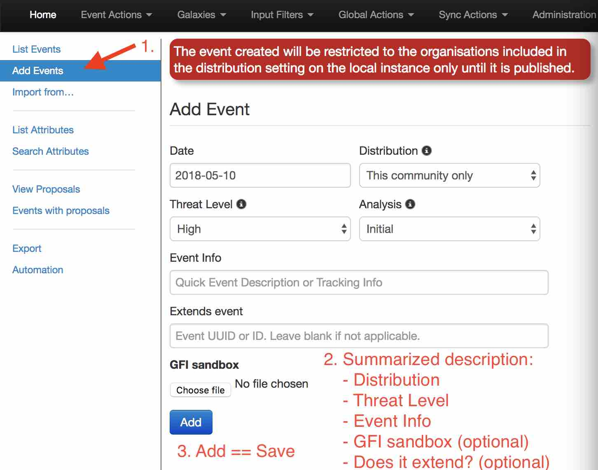

You only have to add a few pieces of information to register your Event. Further details will be specified after the Event has been added.

## Describe Event

Red is totally normal. No worries.

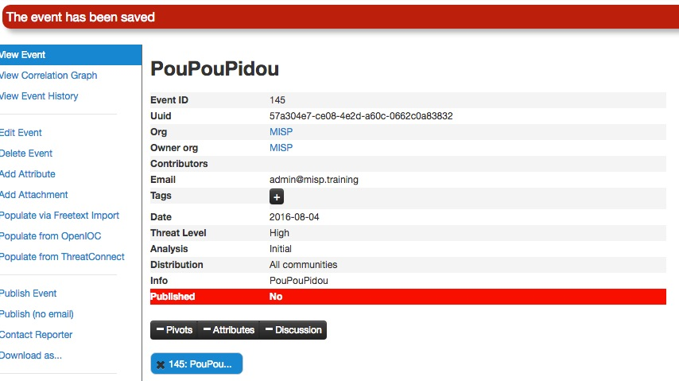

Now you can specify the information for your Event (you will need to scroll the window).

### Free-Text Import Tool

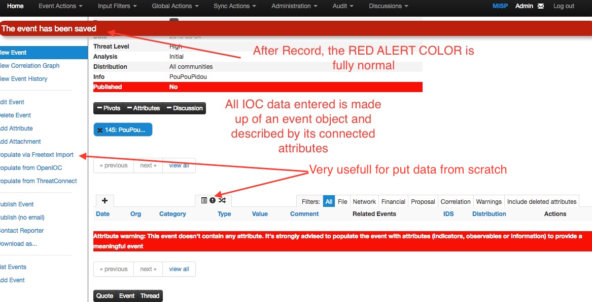

If you have a list of indicators from which you would like to quickly generate attributes then the **Free-text import tool** is
just what you need. Simply paste your list of indicators (separated by line-breaks) into this tool.

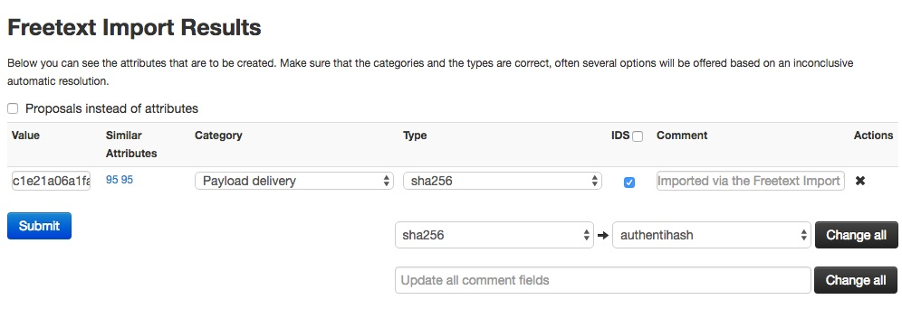

The tool will help you to find similarities between your import and other issues already registered in MISP.

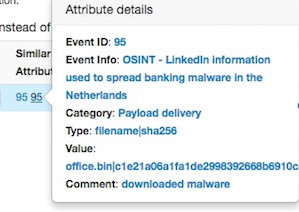

For example, you can see the ID of all related Events and view their information.

### Tags and Taglist

#### Using existing Data

Another easy way to add information is to use Tags. You can see the result of adding existing Tags (circl:incident-classification=XSS ans circl:incident-classification="information-leak).

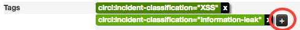

By clicking the button, you can add more tags from an existing Taglist.

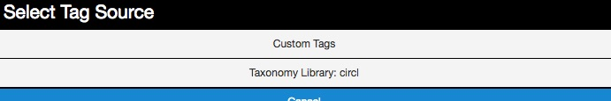

In particular the "Taxonomy Library: circl" Taglist is very complete, as you can see:

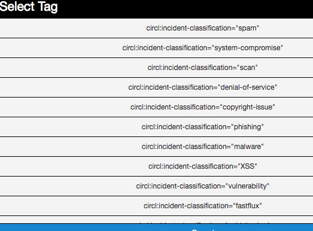

#### Make your own Taglist

If you want make your own Taglist, select Add Tag.

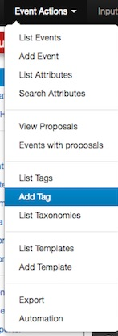

You will see the following window:

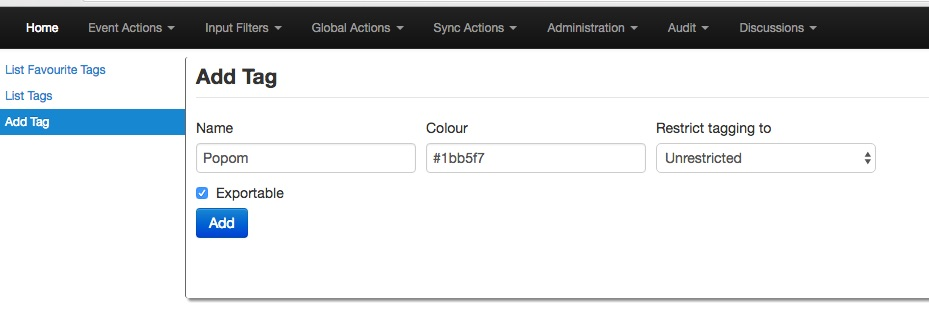

Then, when you add the new tag it will appear in the Custom Taglist.

### Suggestions

The following attribute types should be added for each Event:
- ip-src: source IP of attacker
- email-src: email used to send malware
- md5/sha1/sha256: checksum
- Hostname: full host/dnsname of attacker
- Domain: domain name used in malware

## Browsing Events
To see your Event, select List Events from the menu Events Action. You can click any row and select a filter.

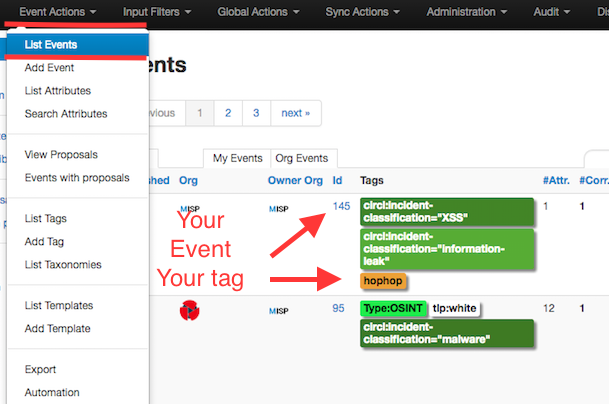

If you click on your Event's number, you can see all the information related to your Event.

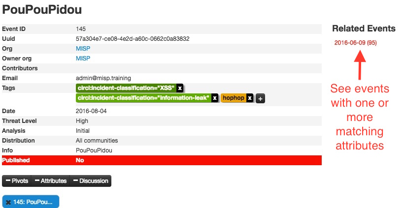

## Export Events for Log Search

Export functionality is designed to automatically generate signatures for intrusion detection systems. To enable signature generation for a given attribute, the Signature field of this attribute must be set to Yes. Note that not all attribute types are applicable for signature generation, currently we only support NIDS signature generation for IP, domains, host names, user agents etc., and hash list generation for MD5/SHA1 values of file artifacts. Support for more attribute types is planned.

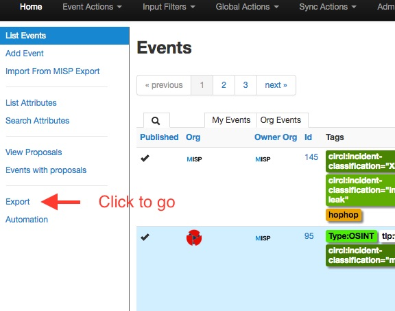

Simply click on any of the following buttons to download the appropriate data for log correlation.

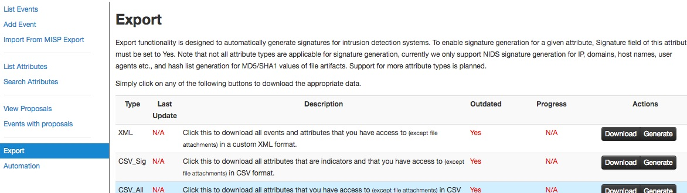
