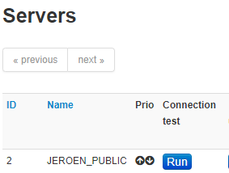
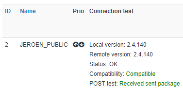
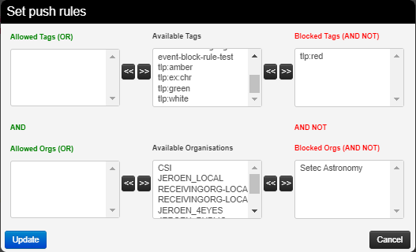

<!-- toc -->

# Sharing / Synchronisation

* MISP's core functionality is sharing where everyone can be a consumer and/or a contributor/producer.
* Quick benefit without the obligation to contribute
* Low barrier access to get acquainted to the system

# Synchronisation
## Concept

The following figure shows the concept how different MISP instances could tie together.

In MISP, two ways exist to get events from remote sources:

* **Use case 1**: From another MISP server (also called MISP instance), by synchronising two MISP servers.
* **Use case 2**: From a link, by using [Feeds](../managing-feeds).

The example below illustrate the synchronisation between two MISP servers (use case 1).
An organisation B (OrgB) wants to synchronise its MISP server, called ServerB, with the MISP server of an organisation A (Org A), called ServerA. The following steps can be taken to syncronise ServerB with ServerA:

   
  <i>FIGURE: Illustration of the synchronisation between two MISP servers</i>

* **Step 1**: Add OrgB as a local organisation on ServerA (OrgB.ServerA) using OrgB's existing UUID from their local organisation on ServerB.
* **Step 2**: Add a Sync User (syncuser@OrgB.ServerA) in the organisation OrgB.ServerA on the MISP ServerA.
* **Step 3**: [Set up a sync server](#adding-a-server) on MISP ServerB using the key (called Authkey) from the sync user (syncuser@OrgB.ServerA) created on MISP ServerA.

For additional information on the synchronisation process, refer to the [MISP GitHub issues](https://github.com/MISP/MISP/issues), for example, [issue 2595](https://github.com/MISP/MISP/issues/2595).

## Pull vs Push synchronisation
Synchronisation can be set up using the pull or push option. A combination of the two is possible as well. This section discusses the main practical differences between the two and the benefit of using both in conjunction.

To automatically execute pull and push synchronisations on a schedule, please use a scheduling service such as cron to execute the relevant command line functions mentioned in the related [administration](../administration/#automating-certain-console-tasks) section.

For a table overview of which community distributions lead to a sync on push or pull scenarios as well as how the distribution level automatically decreases on sync, please refer to the  [syncing scenarios with communities distribution](#syncing-scenarios-with-communities-distribution) section.

### Push
The push mechanism provides a seemingly real time experience. If a push connection is enabled, data created (and synchronized from other peers) will be synchronized as fast as possible. In practice, this means that an attempt to synchronise is made immediately after publication of an event.

A disadvantage of the push mechanism is that connection issues or dead workers might prevent the push from being successful. 

Data with distribution set to 'Your organisation only' or 'This community only' will not be synchronised using the push mechanism (unless the internal instance flag is set for the server to be synced to).

### Pull
In contrast to a push, pull synchronisation is only performed on command. This could be a manual trigger by an admin from the servers page or a cron job executing a pull command. See [administration](../administration/#automating-certain-console-tasks) for the available command line interface commands.

A pull will also fetch objects with a distribution set to 'this community only' and even your 'organisation only', if the auth key belongs to the organisation owning the related event.

### Benefits of using push and pull in conjunction
- If an unexpected issue prevented the push from happening, the data can be pulled in later
- Different rules can be set for the push and pull sync

## Adding a server

Servers can be added by users via

~~~~
https://<misp url>/servers/add
~~~~

    The Add Server Form has several input fields:

1. **Base URL**
    The base-url to the external server you want to sync with. Example: https://foo.sig.mil.be

2. **Instance Name**
    A name that will make it clear to your users what this instance is. For example: Organisation A's instance
    
3. **Internal instance**
This checkbox will only show up if the set 'local organisation', see 5, is the same as the owning organisation of the instance the remote server is being configured on. If this flag is set, the distribution of pushed data will not be automatically downgraded. Please refer to the [syncing scenarios with communities distribution](#syncing-scenarios-with-communities-distribution) section for a table overview of the differences.

4. **Remote Sync Organisation Type**
MISP has several organisation "pools", one for local and one for known external organisations. When adding a synchronisation connection, you need to define the host organisation of the remote instance. Select which pool you wish to pick the organisation from using this drop-down. You also have the option of adding a new external organisation directly from this interface.

5. **Local/Known remote Organisation**
Choose the organisation from the selected pool that defines the host organisation on the remote side. Make sure that the remote instance is actually run by the organisation you select. When selecting data to push, this organisation will be used to determine membership of sharing groups. As a result, this setting is very important, since selecting the wrong organisation can lead to leaking confidential data (oversharing) or sharing less than intended.

6. **Authkey**
You can find the authentication key on your profile on the external server. If advanced auth keys is enabled you might have to create an auth key manually. This can be done on your profile view as well.

7. **Push**
Allow the upload of events and their attributes. Only Events that match the given push rules (see 19) will be pushed to the server. Sightings and relevant galaxy clusters will not be pushed unless 'Push Sightings' and 'Push Galaxy Clusters' are enabled as well.
    
8. **Pull**
Allow the download of events and their attributes from the server. Only data matching the given pull rules (see 20) will be pulled. Relevant galaxy clusters will not be pulled in unless the 'Pull Galaxy Clusters' checkbox is ticked as well.

9. **Push sightings**
If checked, sightings will be pushed out as well on push.

10. **Caching Enabled**
Allow caching of the remote server. Once cached, caching related functionalities such as server overlap analysis can be done.

11. **Push Galaxy Clusters**
If checked, relevant galaxy clusters will be pushed out as well on push.

12. **Pull Galaxy Clusters**
If checked, relevant galaxy clusters will be pulled in as well on push. This also enables you to do a pull for galaxy clusters only if pull, see 8, is checked as well.

13. **Unpublish Event**
Unpublish the synced event. This only works on push.

14. **Publish Without Email**
Publish the event without sending out an email.

15. **Self Signed**
Check this if you would like to allow a connection despite the other instance using a self-signed certificate (not recommended).

16. **Skip proxy (if applicable)**
Do not connect to this server using the configured proxy (if any proxy host is set in the MISP configuration).

17. **Server certificate file**
You can upload a certificate file if the instance you are trying to connect to has its own signing authority.  (*.pem)

18. **Client certificate file**
Set a client certificate to use when connecting to this server.

19. **Push rules**
Allows you to set filtering rules for data to be pushed out (tag based and organisation based). Please see [rules](#rules) for more info.

20. **Pull rules**
Allows you to set filtering rules for data to be pulled in (tag based and organisation based). Please see [rules](#rules) for more info.

## Test connection
The connection test can be used to test the connection to the remote server and will give a feedback about local and remote version of MISP.

***

## Rules
Rules are used to limit sharing when synchronising events and attributes. In the example below, data tagged with tlp:red or owned by organisation Setec Astronomy will not be pushed out to this server. Please note any other filtering set up on the instance will still apply as well (blocklists for example).

## Troubleshooting
If you have issues connecting to a remote servers try to do the following things:
- manually try to do an API request, to ensure that your API key is valid
- try to connect with your user account to the remote server and check your roles on the remote server
- perform a package capture and analyse the traffic
- if you have a SSL connection issue to a remote server with a certificate signed by a CA that is not included in OS, make sure the whole certificate path is included in the path.

## Sharing and distribution

The following section describes how distribution mechanisms of events and attributes work.

### Distribution settings

The below five distribution settings are available for events and attributes. Descriptions of those settings can be found [here](../using-the-system/#creating-an-event).

* Your organisation only
* This community only
* Connected communities
* All communities
* Sharing group

Events that are not published are only distributed/shared to the local organisations on the same MISP server/instance (within the limit of the distribution model).
Only events that are **published** will be shared with remote organisations on other MISP servers via push/pull mechanisms.
More details on publishing events [here](../using-the-system/#publish-an-event).

#### Visibility of data - events objects and attributes
Assuming that none of the ancestors of the object of attribute are too restrictive, you can view an event/object/attribute on an instance if:
- You are a site admin
- Your organisation is owner of the event
- Neither of the above apply and one of the below statements is true:
    - The distribution of the event/object/attribute is 'This community only', 'Connected communities' or 'All communities'
    - Your organisation belongs to the sharing group of the event/object/attribute or the sharing group has the 'all orgs' flag set for the instance

*Note*:
- As of MISP version 2.4.140: When pulling in data you can only see due to the 'all orgs' flag being set in the sharing group, your organisation will be added to the sharing group when creating the data locally. 

### Community

A community is composed of the local organisations on a MISP server and the remote organisations connected by the sync users. For more information on the concept of community, refer to an [article on MISP information sharing following ISO/IEC 27010](https://github.com/MISP/misp-compliance/blob/master/ISO_IEC_27010/misp-sharing-information-following-ISO-IEC-27010.md#suitable-data-model), explaining the concept of community.

Specifically, communities are not reversible. Taking the example of <a href="#misp-server-sync">the above figure</a>, illustrating the synchronisation between two MISP servers, OrgB.ServerB is part of the MISP ServerA community but OrgB.ServerA is not part of MISP ServerB community.

### Sharing-groups

There is an article about sharing groups in [here](../using-the-system/#create-and-manage-sharing-groups)

### Distribution mechanisms

The distribution level of an event is automatically decreased as it is synchronised with other MISP instances, when it was originally set to:

* Community only (to organisation only)
* Connected community (to community only)
 
It is not decreased when it was originally set to:

* Organisation only
* All communities
* Sharing group

[!] This rule does not apply if “Internal instance” has been checked when creating the server.

As an example, the figure below illustrates two events **e** and **e'** created by OrgA and respectively shared as "This community only" and "Connected communities" and how they propagate in an illustrative MISP set of intances synchronised with each others.

#### General syncing rules
- The owner organisation of the event on instance B is set to the organisation of the sync user.
- The creator user is the authkey user when pushing
- The creator user is the user triggering the pull when pulling. This user can be different than the authkey user.
- Rule of thumb: if the user configured to pull from instance A to B can see the event on instance A, the event will be synced.

#### Syncing scenarios with communities distribution

##### Internal instance flag not set
The below scenarios are if “Internal instance” has not been checked when creating the server. This is the usual scenario.
###### Push from instance A to instance B - usual scenario
Which organisation the remote sync user belongs to has no impact on which events are pushed.

| Instance A  | Instance B                                                                        |
| ----------- | --------------------------------------------------------------------------------- |
| Your organisation only      | Event/object/attribute not pushed                                                 |
| This community only   | Event/object/attribute not pushed                                                 |
| Connected communities      | Event/object/attribute distribution decreased to 'This community only' on B       |
| All communities   | Event/object/attribute distribution stays 'all communities'                       |

###### Pulling from instance A to instance B - usual scenario
Rule of thumb: if the user configured to pull from instance A can see the event on instance A, the event will be synced.

| Instance A  | Instance B                                                                                                                                                                     |
| ----------- | ------------------------------------------------------------------------------------------------------------------------------------------------------------------------------ |
| Your organisation only      | Event/object/attribute pulled in only if the sync user is member of the event's owner organisation on A. Event distribution stays 'Your organisation only' on instance B       |
| This community only   | Event/object/attribute distribution decreased to 'Your organisation only' on B                                                                                                 |
| Connected communities      | Event/object/attribute distribution decreased to 'This community only' on B                                                                                                    |
| All communities   | Event/object/attribute distribution stays all communities on B                                                                                                                 |

##### Internal instance flag  set
The below scenarios are if “Internal instance” has been checked when creating the server. This is the *not* the usual scenario and *potentially dangerous*. The internal instance flag can be used when both instances have the same hosting organisation. 

###### Push from instance A to instance B - internal flag set scenario
| Instance A  | Instance B                                                                                                                                                                                                                                          |
| ----------- | --------------------------------------------------------------------------------------------------------------------------------------------------------------------------------------------------------------------------------------------------- |
| Your organisation only      | Event/object/attribute not pushed if triggering push of already locally (on instance A) published event. Event/object/attribute synced on publication of an event, even if the organisation publishing is not the host organisation of the instance |
| This community only   | Event/object/attribute distribution stays 'This community only' on B                                                                                                                                                                                |
| Connected communities      | Event/object/attribute distribution stays 'Connected communities' on B                                                                                                                                                                              |
| All communities   | Event/object/attribute distribution stays 'All communities on B'                                                                                                                                                                                    |

###### Pulling from instance A to instance B - internal flag set scenario
Rule of thumb: if the user configured to pull from instance A can see the event on instance A, the event will be synced.

| Instance A  | Instance B                                                                                                                                                      |
| ----------- | --------------------------------------------------------------------------------------------------------------------------------------------------------------- |
| Your organisation only      | Event/object/attribute pulled in only if the sync user is member of the event's owner organisation. Event distribution stays 'Your organisation only' on B      |
| This community only   | Event/object/attribute distribution decreased to 'Your organisation only' on B                                                                                  |
| Connected communities      | Event/object/attribute distribution decreased to 'This community only' on B                                                                                     |
| All communities   | Event/object/attribute distribution stays 'All communities' on B                                                                                                |

## Collaboration

### Proposals

Proposals can be used to propose new attribute values that can be reviewed by the event owner.

### Forums / Threats

Forums can be used to discuss non event related topics.

Discussions can be accessed on the top "Global Actions - List Discussions"

**Discussions will and can not be shared with other servers**

and via URL:

~~~~
https://<misp url>/threads/index
~~~~

#### Create a new Topic

To create a new topic

~~~~
https://<misp url>/posts/add
~~~~

#### Comment a topic

A topic can be commented by any user

~~~~
https://<misp url>/threads/view/<topic id>
~~~~

### Comments to events

In MISP ongoing events can be commented by every user to ask free text question to events.
**Comments to events will not be shared with other servers**

### Contact a reporter

This feature can be used to contact the person or the organisation that the person belongs to that has created the event.

All E-Mails can be enforced to be encrypted

### Receive alerts

It is possible to get alerts via encrypted mail in the following cases:

* published events by other user of the MISP instance
* events pushed to the MISP instance
* events pulled by the MISP instance

These E-Mail alerts are an opt-in feature

## Recommendation

The following section will describe what is the best practice how many MISP instances that showed to be good for orgs.
Of course depending on your specific requirements an architecture could be more spread or simplified.

The architecture is divided into several systems / stages beginning with:

### MISP Staging System

This systems purpose is to be linked to all available external MISP systems that you have access to.
It will download all events and do enrichment between these events.

### MISP SECOps System

This system is the main system used by human analysts.
It will it is not linked to any external MISP instance other then the Staging System.

To publish events to the community assign the right tags to match your push [Rules](#rules) and **publish the event**
