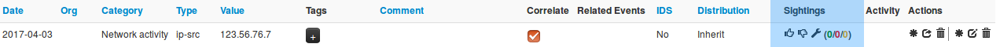
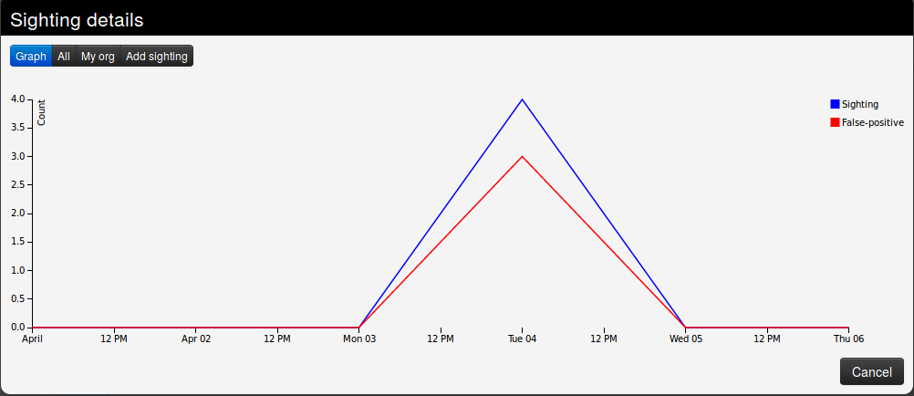
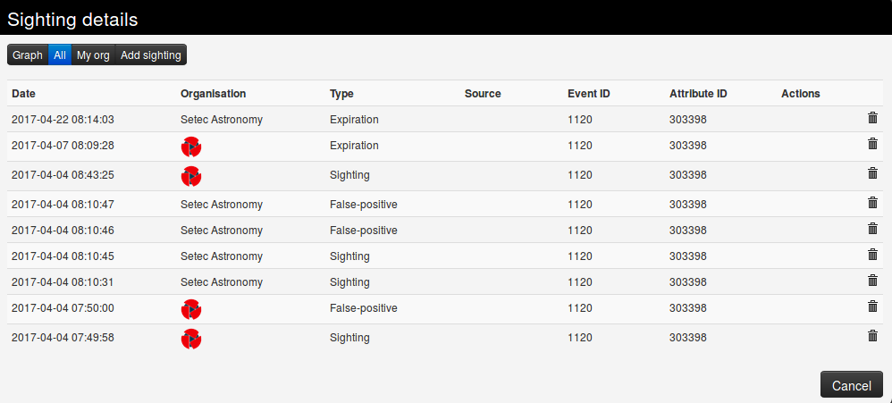
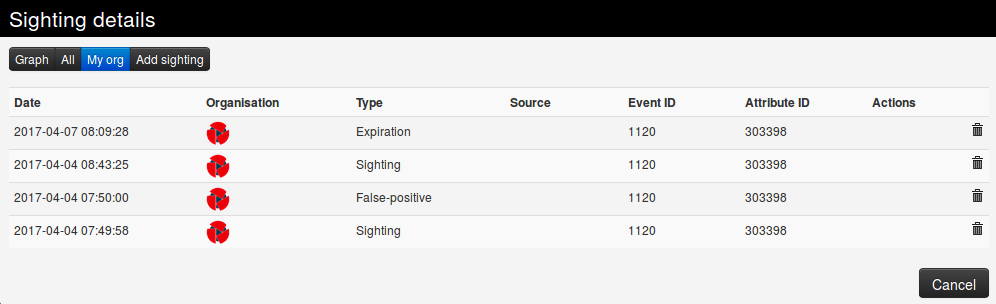
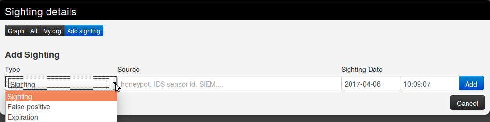
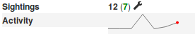
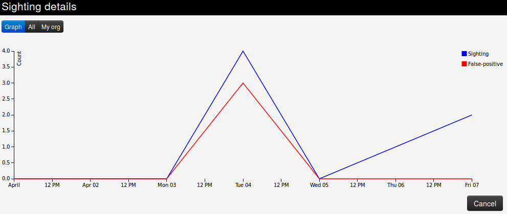

<!-- toc -->

## Sightings

Basically, sighting is a system allowing people to react on attributes on an event. It was originally designed to provide an easy method for user to tell when they see a given attribute, giving it more credibility.

Now sightings have been improved to also provide a method to signal false positives, but also to give an expiration date for some attributes.

### Explanation

As said before, Sighting is a way for a user to say that they have seen or notice an attribute and confirm its validity. An attribute can been spotted several times by the same user, that is why a single user can use sighting several times on a single attribute.

Sometimes, some attributes can be considered as false positives, even if the false positive list do not detect them (for instance, if the IDS flag is set to false) so they can also be notified. As well as concerning sighting, the same user can signal a single attribute as a false positive several times.

It also happens that some attributes are only valid a certain time (for instance, in case of a phishing campaign that is assumed to be up for only one week). In this case, people can also assign an expiration date to an attribute, but this time, there can be only one valid expiration date per *organisation*.

### Using sightings on an event (GUI)

Sighting is applied to every attribute, under the column "Sightings", easily identifiable with its colored number. This column shows three icons and three values.

These three values show respectively:
- The number of true positives detected with the attribute, in green. Malicious activity as described in the event.
- The number of times the attribute has been marked as false positive, in red. Non-malicious activity or incorrect detection.
- The number of different expiration dates that have been affected on this attribute, in orange

Concerning the three icons:
- The first one (Thumb up) allows to add a sighting (true positive) on an attribute.
- The second one (Thumb down) allows to mark the attribute as a false positive.
- The third one (Tool) opens a popup for advanced sightings, showing sightings details and allowing different actions.

#### Advanced sightings

- The first tab, "Graph", represents a line graph showing the evolution of sightings and false positives over time.

- The second tab gives a quick view of all the sightings applied to the attribute.

- The third tab gives a quick view of the sightings applied to the attribute by your own organisation only.

- The last tab can be used to add either a sighting, mark the attribute as a false positive, or define an expiration date. You can precise both the date and time of day, as well as note a particular source where the sighting comes from.

#### At Event level

The total number of sightings is also visible as part of the metadata in front of the Sightings label, as well as a sparkline graph that summarize the evolution of sightings.  

Clicking on the tool will show sighting details for the whole event.

### Using sightings on an event (API)

Please have a look at the [automation API](../automation/README.md#sightings-api)
