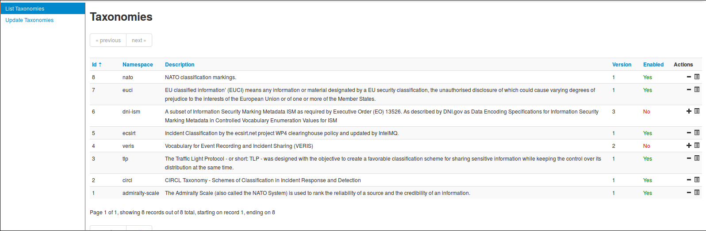
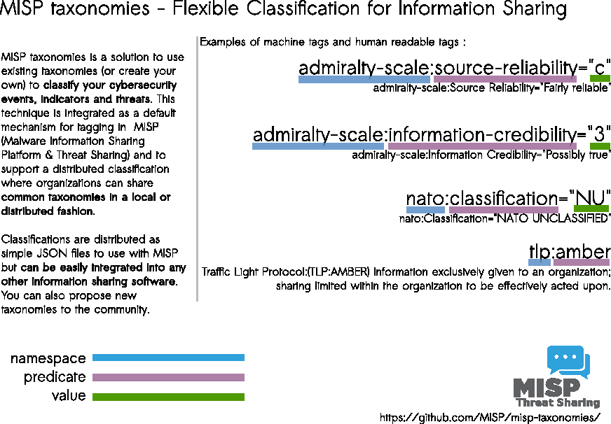
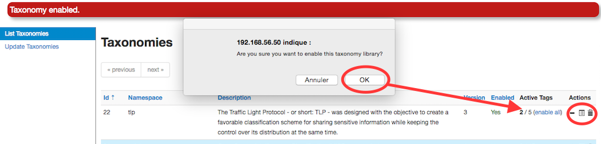
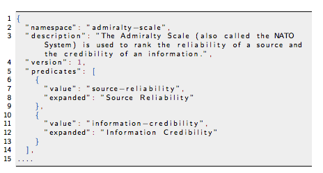
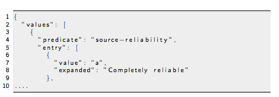
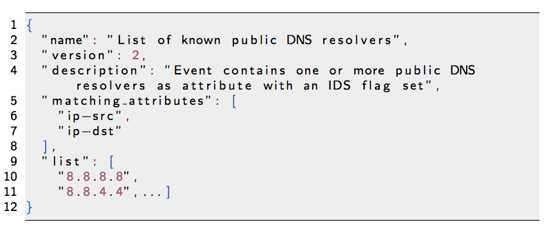

<!-- Hey You! -->
<!-- Please Donate https://www.razoo.com/us/story/Solitary-Watch-Lifelines-2016 -->

## Taxonomies

In MISP 2.4, a flexible mechanism has been introduced to support various [taxonomy of classification](https://github.com/MISP/misp-taxonomies).

You can access the taxonomy by going into 'Event Actions' and select 'List Taxonomies'.

The following taxonomies can be used in MISP (as local or distributed tags) or in other tools willing to share common taxonomies among security information sharing tools.
 

The following taxonomies are described:

1. [Admiralty Scale](./admiralty-scale): The Admiralty Scale (also called the NATO System) is used to rank the reliability of a source and the credibility of an information.

2. [adversary](./adversary) An overview and description of the adversary infrastructure.

3. CIRCL [Taxonomy - Schemes of Classification in Incident Response and Detection](./circl) CIRCL Taxonomy is a simple scheme for incident classification and area topic where the incident took place.

4. [Cyber Kill Chain](./kill-chain) from Lockheed Martin as described in [Intelligence-Driven Computer Network Defense Informed by Analysis of Adversary Campaigns and Intrusion Kill Chains](http://www.lockheedmartin.com/content/dam/lockheed/data/corporate/documents/LM-White-Paper-Intel-Driven-Defense.pdf).

5. DE German (DE) [Government classification markings (VS)](./de-vs) Taxonomy for the handling of protectively marked information in MISP with German (DE) Government classification markings (VS).

6. [DHS CIIP Sectors](./dhs-ciip-sectors) DHS critical sectors as described in https://www.dhs.gov/critical-infrastructure-sectors.

7. [eCSIRT](./ecsirt) eCSIRT incident classification Appendix C of the eCSIRT EU project including IntelMQ updates.

8. [ENISA](./enisa) ENISA Threat Taxonomy - A tool for structuring threat information [as published](https://www.enisa.europa.eu/topics/threat-risk-management/threats-and-trends/enisa-threat-landscape/etl2015/enisa-threat-taxonomy-a-tool-for-structuring-threat-information)

9. [Estimative Language](./estimative-language) Estimative language - including likelihood or probability of event based on the Intelligence Community Directive 203 (ICD 203) (6.2.(a)).

10. [EU critical sectors](./eu-critical-sectors) Market operators and public administrations that must comply to some notifications requirements under EU NIS directive.

11. [EUCI](./euci) EU classified information (EUCI) means any information or material designated by a EU security classification, the unauthorised disclosure of which could cause varying degrees of prejudice to the interests of the European Union or of one or more of the Member States [as described](http://eur-lex.europa.eu/legal-content/EN/TXT/PDF/?uri=CELEX:32013D0488&from=EN).

12. [Europol Incident](./europol-incident) EUROPOL class of incident taxonomy

13. [Europol Events](./europol-events) - EUROPOL type of events taxonomy

14. [FIRST CSIRT Case](./csirt_case_classification) FIRST CSIRT Case Classification.

15. [FIRST Information Exchange Policy (IEP)](./iep) framework

16. [Information Security Indicators](./information-security-indicators) Information security indicators have been standardized by the [ETSI Industrial Specification Group (ISG) ISI](http://www.etsi.org/technologies-clusters/technologies/information-security-indicators). These indicators provide the basis to switch from a qualitative to a quantitative culture in IT Security Scope of measurements: External and internal threats (attempt and success), user's deviant behaviours, nonconformities and/or vulnerabilities (software, configuration, behavioural, general security framework).

17. [Information Security Marking Metadata](./dni-ism) (ISM)  [V13](http://www.dni.gov/index.php/about/organization/chief-information-officer/information-security-marking-metadata) as described by DNI.gov.

18. [Malware](./malware) Malware classification based on a [SANS whitepaper about malware](https://www.sans.org/reading-room/whitepapers/incident/malware-101-viruses-32848).

19. [ms-caro-malware](./ms-caro-malware) Malware Type and Platform classification based on Microsoft's implementation of the Computer Antivirus Research Organization (CARO) Naming Scheme and Malware Terminology.

20. [NATO Classification Marking](./nato) Marking of Classified and Unclassified materials as described by the North Atlantic Treaty Organization, NATO.

21. [Open Threat Taxonomy v1.1 (SANS)](./open-threat) based on James Tarala of SANS (http://www.auditscripts.com/resources/open_threat_taxonomy_v1.1a.pdf).

22. [OSINT Open Source Intelligence - Classification](./osint)

23. [The Permissible Actions Protocol - or short: PAP](./pap) PAP was designed to indicate how the received information can be used. It's a protocol/taxonomy similar to TLP informing the recipients of information what they can do with the received information.

24. [TLP - Traffic Light Protocol](./tlp) The Traffic Light Protocol - or short: TLP - was designed with the objective to create a favorable classification scheme for sharing sensitive information while keeping the control over its distribution at the same time.

25. Vocabulary for Event Recording and Incident Sharing [VERIS](./veris)

A taxonomy contains a series of tags that can use as normal tags in your MISP instance.

Tagging is a simple way to attach a classification to an event. In the early version of MISP, tagging was local to an instance. Classification must be globally used to be efficient. After evaluating different solutions of classification, we build a new scheme using the concept of machine tags.

Taxonomy is a classification of informations. Her, we classified Tags. Taxonomies are implemented in a simple JSON format. Anyone can create their own taxonomy or reuse an existing one.

Taxonomys are in an independent git repository [https://github.com/MISP/misp-taxonomies]

These can be **freely reused** and **integrated** in other threat intel tools.

The advantage is that you even set a specific tag as being
exportable. This means that you can **export** your classification with other MISP instance and **share** the same taxonomies. Tagging is a simple way to attach a classification to an event.

**Classification must be globally used to be efficient.**

If you want to enable a specific taxonomy, you can click on the cross to enable it.

Then you can even cherry-pick the tags you want to use on the system. If you want to use the whole taxonomy, select all and then click on the cross in the top left.

## Contributing to Taxonomy

It is quite easy. Create a JSON file describing your taxonomy as triple tags.

 (e.g. check an existing one like [Admiralty Scale](https://github.com/MISP/misp-taxonomies/tree/master/admiralty-scale)), create a directory matching your name space, put your machinetag file in the directory and pull your request. Publishing your taxonomy is as easy as a simple git pull request on misp-taxonomies (https://github.com/MISP/misp-taxonomies). That's it. Everyone can benefit from your taxonomy and can be automatically enabled in information sharing tools like [MISP](https://www.github.com/MISP/MISP).

## Reserved Taxonomy

 The following taxonomy namespaces are reserved and used internally to MISP.

 - [galaxy](./galaxy/) mapping taxonomy with cluster:element:"value".

## Adding Taxonomy in MISP

How are taxonomies integrated in MISP?

MISP administrator have only to import (or even cherry pick) the namespace or predicates they want to use as tag.

Tags can be exported to other instances.

Tags are also accessible via the MISP REST API.

For more information, "[Information Sharing and Taxonomies Practical Classification of Threat Indicators using MISP](https://www.circl.lu/assets/files/misp-training/first2016/2-MISP-Taxonomies.pdf)" presentation given to the last MISP training in Luxembourg.

## Adding a private taxonomy

<!-- ========================== I don't know if this part is nor yet relevant? ================================================= -->

~~~~ shell
$ cd /var/www/MISP/app/files/taxonomies/
$ mkdir privatetaxonomy
$ vi machinetag.json
~~~~

Create a JSON file Create a JSON file describing your taxonomy as triple tags.

Once you are happy with your file go to MISP Web GUI taxonomies/index and update the taxonomies, the newly created taxonomy should be visible, now you need to activate the tags within your taxonomy.

## How using Taxonomy in MISP

### Filtering the distribution of events among MISP instances

Applying rules for distribution based on tags:
### Other use cases using MISP taxonomies

Tags can be used to set events for further processing by external tools (e.g. VirusTotal auto-expansion using Viper).

Ensuring a classification manager classes the events before release (e.g. release of information from air-gapped/classified networks).

Enriching IDS export with tags to fit your NIDS deployment.

## MISP warning lists: The dilemma of false-positive

- False-positive is a common issue in threat intelligence sharing.

- It’s often a contextual issue:
   - false-positive might be different per community of users sharing
information.

   - organization might have their own view on false-positive.

- Based on the success of the MISP taxonomy model, we build misp-warninglists. They are lists of well-known indicators that can be
associated to potential false positives, errors or mistakes. They are Simple JSON files.

The warning lists are integrated in MISP to display an info/warning box at the event and attribute level. This can be enabled at MISP instance level. Default warning lists can be enabled or disabled like known public
resolver, multicast IP addresses, hashes for empty values, rfc1918, TLDs or known google domains. The warning lists can be expanded or added in JSON locally or via
pull requests (https://github.com/MISP/misp-warninglists). Warning lists can be also used for critical or core infrastructure
warning, personally identifiable information...

## Future functionalities related to MISP taxonomies

- Sighting support (thanks to NCSC-NL) is integrated in MISP allowing to auto expire IOC based on user detection.

- Adjusting taxonomies (adding/removing tags) based on their score or visibility via sighting.

- Simple taxonomy editors to help non-technical users to create their
taxonomies.

- Filtering mechanisms in MISP to rename or replace taxonomies/tags at pull and push synchronisation.

- More public taxonomies to be included
