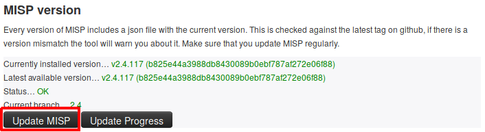

# Updating Python Dependencies

MISP requires a couple of python libraries to be installed for the entire set of functionalities to work properly.

These functionalities include for instance the different import and export tools, the binaries extraction from attachments or PyMISP.

------
## Installation

We started using virtual environments in MISP to make the installation and maintenance of the python versions easier.

Either using the [installation script](https://github.com/MISP/MISP/blob/2.4/INSTALL/INSTALL.sh) to setup a running MISP on your machine, or starting using the automatically generated [virtual machine](https://www.circl.lu/misp-images/latest/) will give you access to the latest version of the required python libraries installed within a virtual environment called `virtualenv`.

But if you are using an older MISP version, you may want to install the virtual environment

#### Set the virtual environment up
~~~~bash
# Create a python3 virtualenv
sudo -H -u www-data virtualenv -p python3 /var/www/MISP/venv

# Make pip happy
sudo mkdir /var/www/.cache
sudo chown www-data:www-data /var/www/.cache
~~~~
If you already have a `venv` directory, you can skip this step

------
## Updating MISP and its dependencies

Keeping MISP up-to-date as much as possible is the safest way to avoid most of the potential issues.

It can be done either by using the Update button in the diagnostic tool available with the MISP UI, or by using the command line.

### Updating MISP core

In order to update MISP dependencies, we first want to pull the latest MISP version, so we have the latest submodule references as well.

OR
~~~~bash
sudo -H -u www-data git pull origin 2.4
~~~~

Once we have the latest MISP update, we can start updating the python libraries.

### Updating the python dependencies

MISP is provided with a lot of submodules used to ensure all the additional functionalities work as expected. Thus it is important to keep those dependencies up-to-date.
~~~~bash
sudo -H -u www-data git submodule update --init --recursive
~~~~

#### Updating python dependencies

It is possible to check the status of all the python libraries required by MISP, using again the diagnostic tool.

If something is going wrong, updating the corresponding library will make the diagnostic happy.
~~~~bash
# Update PyMISP
cd /var/www/MISP/PyMISP
sudo -H -u www-data /var/www/MISP/venv/bin/pip install -U .

# Update the advanced attachment handler libraries (PICK THE ONE.S YOU NEED TO UPDATE)
# lief
sudo -H -u www-data /var/www/MISP/venv/bin/pip install -U lief
# python-magic
sudo -H -u www-data /var/www/MISP/venv/bin/pip install -U python-magic
# pydeep - WARNING: It requires libfuzzy-dev 
sudo -H -u www-data /var/www/MISP/venv/bin/pip install -U pydeep

# Update the STIX dependencies (PICK THE ONE.S YOU NEED TO UPDATE)
# STIX
cd /var/www/MISP/app/files/scripts/python-stix
sudo -H -u www-data /var/www/MISP/venv/bin/pip install -U .
# mixbox
cd /var/www/MISP/app/files/scripts/mixbox
sudo -H -u www-data /var/www/MISP/venv/bin/pip install -U .
# Cybox
cd /var/www/MISP/app/files/scripts/python-cybox
sudo -H -u www-data /var/www/MISP/venv/bin/pip install -U .
# MAEC
cd /var/www/MISP/app/files/scripts/python-maec
sudo -H -u www-data /var/www/MISP/venv/bin/pip install -U .
# STIX 2
cd /var/www/MISP/app/files/scripts/cti-python-stix2
sudo -H -u www-data /var/www/MISP/venv/bin/pip install -U .

# Update Yara python library
sudo -H -u www-data /var/www/MISP/venv/bin/pip install -U plyara
~~~~

Note that if any of the STIX, Cybox, mixbox or MAEC update fails because of a `No such file or directory` error, you just have to `git clone` them and start again the `pip` command above.
~~~~bash
cd /var/www/MISP/app/files/scripts
sudo -H -u www-data git clone https://github.com/CybOXProject/python-cybox.git
sudo -H -u www-data git clone https://github.com/STIXProject/python-stix.git
sudo -H -u www-data git clone https://github.com/MAECProject/python-maec.git
sudo -H -u www-data git clone https://github.com/CybOXProject/mixbox.git
~~~~

If you want to use / update the ZeroMQ functionality, you can also install / update the zmq python library.
~~~~bash
# Install zmq library
sudo -H -u www-data /var/www/MISP/venv/bin/pip install zmq
# Update zmq library
sudo -H -u www-data /var/www/MISP/venv/bin/pip install -U zmq
~~~~

#### Updating MISP modules

Another set of dependencies you may want to update are MISP modules.

MISP modules have their own dependencies that need to be up-to-date as well as the modules scripts themselves.

**Note that the following instructions consider your MISP modules are installed in the default path where we install them on our virtual machine or following the install script. Please change the path accordingly if needed.**

~~~~bash
# Change here the path if needed
cd /usr/local/src/misp-modules
# Update misp-modules requirements
sudo -H -u www-data /var/www/MISP/venv/bin/pip install -U -r REQUIREMENTS
# Update misp-modules scripts
sudo -H -u www-data /var/www/MISP/venv/bin/pip install -U .
~~~~

You will then need to restart the modules, please refer to the [documentation](https://github.com/MISP/misp-modules#how-to-install-and-start-misp-modules-in-a-python-virtualenv-recommended).
