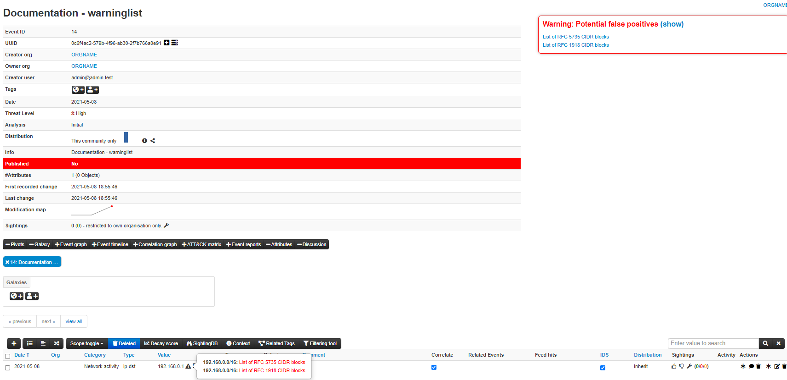
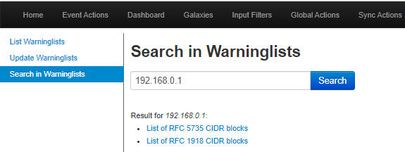

<!-- toc -->
# MISP warninglists
MISP warninglists are lists of well-known indicators that can be associated to potential false positives, errors or mistakes.
There is a Python module available to work with warninglists in a Pythonic way called [PyMISPWarningLists](https://github.com/MISP/PyMISPWarningLists).
[MISP warninglists GitHub Repo](https://github.com/MISP/misp-warninglists)

## MISP warning lists introduction: The dilemma of false-positive

- False-positives are a common issue in threat intelligence sharing.

- It’s often a contextual issue:
   - False-positives might be different per community of users sharing
information.
   - Organizations might have their own view on false-positives.

## Usage
By default MISP will only trigger hits for warninglists if the attribute IDS flag is set. This behaviour can be changed by setting the MISP config parameter MISP.warning_for_all to true.

When an attribute matches a warninglist entry, an info/warning box is displayed at the event and attribute level, as can be seen in the screenshot below.

Individual warninglists can be enabled or disabled at instance level using the warninglists index page. Examples of default warning lists are known public DNS resolvers, multicast IP addresses, hashes for empty values, rfc1918, TLDs or known google domains.

The warning lists can be expanded or added in JSON locally or via
pull requests (https://github.com/MISP/misp-warninglists). Warning lists can also be used for critical or core infrastructure or personally identifiable information.

### Warninglists and data export
The enforceWarninglist parameter of MISP restSearch can be used to exclude attributes that have a warninglist hit from the export. For more information on the MISP API, please refer to the [Automation and MISP API chapter](../sharing/).

### Check individual values for warning list hits
It is also possible to do a lookup for a specific value in the warninglists. This functionality is accessible by using the top menu "Input Filters" > "List Warninglists" and then using the link in the left side menu bar (or by browsing directly to [misp_base_url]/warninglists/checkValue). Only enabled warninglists will be searched.

### Updating warninglists
An update of the warninglists can be triggered via the GUI using the "Update Warninglists" button in the side menu bar when viewing any of the relevant warninglists pages, for example the index page.

Alternatively, it is also possible to trigger an update using a CLI command.
~~~
MISP/app/Console/cake Admin updateWarningLists
~~~

If you are updating an existing warninglist, make sure you incremented the version number before triggering the update on the MISP. You can also contribute to the existing warninglists by forking [MISP warninglists GitHub Repo](https://github.com/MISP/misp-warninglists), making changes and then creating a pull request.
### Creating a custom warninglist
1. Create a new directory for your warninglist in /var/www/MISP/app/files/warninglists.
2. Add a file called list.json to the newly created directory and add the content you want. You can use any of the existing warning lists in https://github.com/MISP/misp-warninglists as reference.
3. Trigger an update of the warning lists on the instance to load in your new warning list.

Example use cases are a list of domain names owned by you or your organisation or employee email addresses.