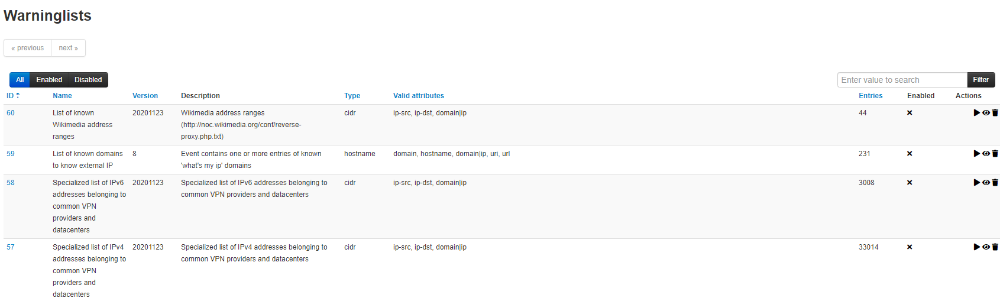

# MISP warninglists
MISP warninglists are lists of well-known indicators that can be associated to potential false positives, errors or mistakes.
There is a Python module available to work with warninglists in a Pythonic way called [PyMISPWarningLists](https://github.com/MISP/PyMISPWarningLists).
[MISP warninglists GitHub Repo](https://github.com/MISP/misp-warninglists)

## MISP warning lists: The dilemma of false-positive

- False-positive is a common issue in threat intelligence sharing.

- It’s often a contextual issue:
   - false-positive might be different per community of users sharing
information.

   - organization might have their own view on false-positive.

- Based on the success of the MISP taxonomy model, we build misp-warninglists. They are lists of well-known indicators that can be
associated to potential false positives, errors or mistakes. They are Simple JSON files.

The warning lists are integrated in MISP to display an info/warning box at the event and attribute level. This can be enabled at MISP instance level. Default warning lists can be enabled or disabled like known public
resolver, multicast IP addresses, hashes for empty values, rfc1918, TLDs or known google domains. The warning lists can be expanded or added in JSON locally or via
pull requests (https://github.com/MISP/misp-warninglists). Warning lists can be also used for critical or core infrastructure
warning, personally identifiable information...
